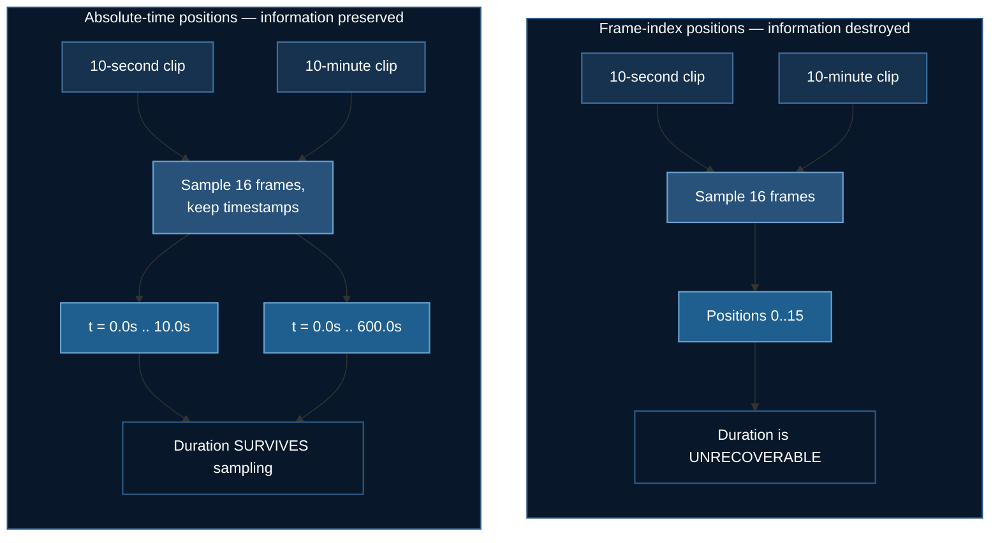

# Modern Video Models: Representing Time

The LLaVA trainer in [Video-Text Training](./video-text-training.md) is the right thing to read first — nothing is hidden. It is also 2024's architecture, and it carries a limitation that no amount of training can fix.

**Example:** `08_vtt/01_qwen25vl_baseline`

## 1. The Limitation That Cannot Be Trained Away

A fixed-frame model samples $N$ frames and numbers them $0, 1, \dots, N-1$. Consider two clips:

- a **10-second** clip of someone picking up a cup and drinking
- a **10-minute** clip of someone picking up a cup, doing other things, and drinking forty minutes later

Sample 16 frames from each. The model receives **identical position information** in both cases. The temporal positions are $\{0, 1, \dots, 15\}$ either way.

So it cannot distinguish *"he picked up the cup, then immediately drank"* from *"he picked up the cup, and much later drank"* — because the evidence was destroyed at the sampler, before the model saw anything.

Any question containing *how long*, *before*, or *after* is unanswerable **in principle**, not merely in practice.



## 2. What Qwen2.5-VL Changes

| | LLaVA (2024) | Qwen2.5-VL (2025) |
|---|---|---|
| Frames | fixed $N$ | dynamic FPS, capped |
| Resolution | fixed square (336×336) | native aspect ratio |
| Temporal position | frame index | **absolute timestamp** |
| Duration questions | impossible | possible |

**Absolute-time M-RoPE.** Qwen2.5-VL's multimodal rotary embedding decomposes position into temporal, height and width components. The temporal component is aligned to *timestamps in seconds*, not to sequence order. Frame 5 at $t = 2.0\text{s}$ and frame 5 at $t = 300.0\text{s}$ receive different positional encodings.

**Native dynamic resolution.** LLaVA letterboxes a widescreen frame into a square, spending visual tokens encoding black bars. Qwen2.5-VL keeps the native aspect ratio and emits a variable token count.

## 3. Two-Stage Sampling

Neither naive strategy works.

**Uniform-$N$** (the LLaVA approach) makes the effective frame rate depend on clip length: 16 frames from a 5-second clip is 3.2 fps; 16 frames from a 50-minute lecture is 0.005 fps. The same model is handed wildly different temporal densities with no way to know which it got.

**Fixed-rate sampling** fixes that and introduces the opposite problem: a long clip produces unboundedly many frames and OOMs.

So `sample_video_frames` does both, in order:

1. Sample at `target_fps` — constant temporal density, so motion looks the same whatever the clip length.
2. If that exceeds `max_frames`, uniformly subsample to the cap — a bounded token budget.

```python
wanted = max(min_frames, int(round(duration * target_fps)))   # stage 1
n_sample = min(wanted, max_frames, total)                     # stage 2
indices = np.linspace(0, total - 1, n_sample).astype(int)

for idx in indices:
    # The TRUE time of this frame, from its index in the SOURCE file --
    # not its position in our sampled sequence.
    timestamps.append(float(idx) / native_fps)
```

:::danger Timestamps must survive both stages
After stage 2 the frames are no longer evenly spaced in the way the model would assume from indices alone, and the timestamps are what tell it so.

Discard them here and the absolute-time encoding has nothing to encode — which is the single most common way this architecture gets silently reduced to the one it replaced. The code runs, the loss decreases, and you have quietly bought a 2024 model.
:::

## 4. Memory: The Weights Are Not the Problem

| Model | Setup | VRAM |
|---|---|---|
| Qwen2.5-VL-3B | LoRA + ZeRO-3 | ~16 GB (one consumer card) |
| Qwen2.5-VL-7B | LoRA + ZeRO-3 | ~40 GB |
| Qwen2.5-VL-72B | LoRA + ZeRO-3 | multiple 80 GB cards |

The dominant term is **the visual tokens, quadratically**. At 256 tokens per frame, a 64-frame clip is 16,384 visual tokens before the prompt — and attention is $O(N^2)$.

Three decisions follow from that.

**Freeze the vision tower.** It was trained on far more video than you have. Unfreezing it on a small dataset reliably makes things worse *and* costs a large slice of memory for its gradients and optimizer states.

**LoRA on attention projections only.** Including the MLP roughly triples adapter size for a marginal gain at this data scale.

**Gradient checkpointing, always.** For video this is not an optimisation — it is usually the difference between running and OOMing, because activations scale with the visual tokens that dominate.

**ZeRO-3, not ZeRO-2.** Stage 3 shards the parameters too, costing $3\Psi$ communication against stage 2's $2\Psi$ — 1.5× — and it is still the right call, because a video batch needs every spare byte for activations rather than a resident copy of the weights.

## 5. The Collator Bug Worth Knowing About

A generic seq2seq collator pads token fields and **silently drops `pixel_values`**, because it does not know the key. Training then runs, the loss decreases — on text alone — and nothing is ever raised.

This exact bug shipped in this repository's LLaVA trainer. So the collator asserts:

```python
if "pixel_values_videos" not in encoded and "pixel_values" not in encoded:
    raise RuntimeError(
        "processor returned no video pixels — the vision path is "
        "disconnected and training would silently proceed on text only"
    )
```

:::tip A loss that decreases proves nothing about your vision path
It proves the model is fitting *something*. The synthetic dataset here uses questions about direction of motion and duration — both unanswerable from any single frame — so a model ignoring the visual path cannot score above chance. That makes "is the vision tower actually wired up?" a question the loss curve can answer.
:::

## 6. Running It

Packages via **`uv`**, training via **`deepspeed`**.

```bash
uv venv && source .venv/bin/activate
uv pip install torch --index-url https://download.pytorch.org/whl/cu128
uv pip install deepspeed transformers accelerate peft datasets \
    qwen-vl-utils opencv-python-headless
```

**CoreWeave / any SLURM cluster:**

```bash
cd 08_vtt/01_qwen25vl_baseline
sbatch run_deepspeed.sh
MAX_FRAMES=32 NUM_GPUS=4 sbatch run_deepspeed.sh
```

Build the venv on a **login** node — compute nodes usually have no egress.

**RunPod** — no SLURM there, so the pod lifecycle is driven by API, including shutdown:

```bash
export RUNPOD_API_KEY=...
uv run runpod/runpod_ctl.py run 08_vtt/01_qwen25vl_baseline \
    --collect --wait --terminate --yes
uv run runpod/runpod_ctl.py pods     # confirm: "Nothing is billing."
```

`--terminate` deletes the pod in a `finally` block, so a crash, a network failure or Ctrl-C still stops the billing. An in-pod watchdog that needs no API key is the backstop.

## 7. Next

You now have a model that represents time correctly. It still loads every token.

**[Token Compression](./token-compression.md)** — the clip does not fit; what do you throw away?

## References

- Bai et al. *Qwen2.5-VL Technical Report* (2025). [arXiv:2502.13923](https://arxiv.org/abs/2502.13923)
- Wang et al. *Qwen2-VL: Enhancing Vision-Language Model's Perception of the World at Any Resolution* (2024). [arXiv:2409.12191](https://arxiv.org/abs/2409.12191)
