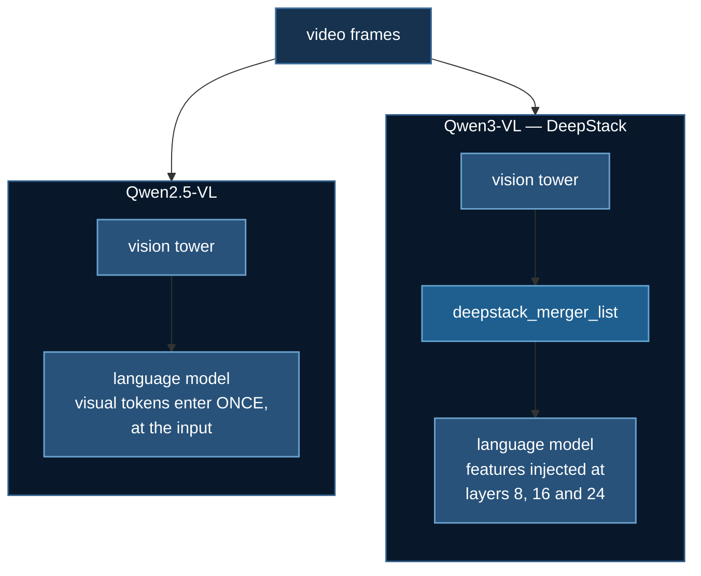

# Qwen3-VL: Two Sub-Models, One Name Space

LoRA fine-tuning of **Qwen3-VL-8B-Instruct**, and the measured memory curve that
tells you how many frames fit on your card.

**Example:** `04_video_text/06_qwen3vl`

This is the successor to [Qwen2.5-VL fine-tuning](./qwen-video-baseline.md), and
the comparison is the lesson. It is not a version bump.

:::info Scope
Qwen3-VL is **video/image + text in → text out**. If you want *speech* out, that
is a different family — see [Omni Models](./omni-thinker-talker.md), which takes
video **and audio** in and speaks back.
:::

## 1. What actually changed between the generations

| | Qwen2.5-VL-3B | Qwen3-VL-8B |
|---|---|---|
| class | `Qwen2_5_VLForConditionalGeneration` | `Qwen3VLForConditionalGeneration` |
| parameters | 3.75 B | **8.77 B** |
| bf16 weights | 7.5 GB | **17.5 GB** |
| vision tower | 0.67 B (17.8%) | 0.58 B (6.6%) |
| **DeepStack** | no | **yes** — layers 8, 16, 24 |
| MRoPE | `mrope` | **interleaved** |

**DeepStack** is the architectural one. Visual features are injected at several
depths of the language model rather than only at the input embedding: the config
carries `deepstack_visual_indexes: [8, 16, 24]`, and the module tree carries a
matching `visual.deepstack_merger_list` with one merger per index.



You can see all of this **without a GPU and without downloading weights**:

```bash
uv run verify_arch.py --compare      # ~8 seconds, meta device
```

## 2. The trap: a VL model is two sub-models with independent naming

peft matches LoRA targets **by name**. A vision-language model has two sub-models
that were named by different people, and the result is that the same target list
means different things on different models.

Measured on the meta device:

| target | Qwen2.5-VL | Qwen3-VL |
|---|---|---|
| `q_proj` `k_proj` `v_proj` `o_proj` | 36 lang, **0 vision** | 36 lang, **0 vision** |
| `gate_proj` `up_proj` `down_proj` | 36 lang + **32 VISION** | 36 lang only |

Two separate surprises in that table.

**Both vision towers use a fused `qkv`.** So the conventional attention target
list matches *zero* vision modules on either model. Freezing the vision tower is
usually the right call — but doing it because a name failed to match is not the
same as choosing it.

**The MLP names collide on one model and not the other.** Qwen2.5-VL's vision
MLP reuses the language model's `gate_proj`/`up_proj`/`down_proj`, so adding
those three targets unfreezes 32 vision modules you did not ask for. Qwen3-VL's
vision MLP is `linear_fc1`/`linear_fc2`, so it does not.

Nothing in either `config.json` says any of this, and **peft prints a plausible
trainable-parameter count either way**. Building the module tree on the meta
device is two seconds and turns a guess into a fact.

## 3. What it costs, measured

Not estimated — measured on one A40 (47.7 GB) by the lab's own `--sweep`:

| frames | visual tokens | peak VRAM | % of card |
|---:|---:|---:|---:|
| 4 | 276 | 22.1 GB | 46% |
| 8 | 540 | 25.3 GB | 53% |
| 16 | 1,068 | 31.6 GB | 66% |
| 24 | 1,596 | 37.9 GB | 79% |

Which is very nearly a straight line:

$$\text{peak} \approx 18.8\,\text{GB} + 11.97\,\text{GB} \times \frac{\text{visual tokens}}{1000}$$

At ~67 visual tokens per 224×224 frame:

| card | usable |
|---|---|
| 24 GB | ~4 frames — **not viable** |
| **48 GB** | **~33 frames** |
| 80 GB | ~70 frames |

**The 18.8 GB floor is the thing to remember.** It is the bf16 weights plus
fragmentation, it does not shrink with sequence length, and it is why this lab
wants one large card rather than two small ones. A 24 GB card cannot hold the
floor, let alone any frames.

## 4. Two ways this lab nearly lied, and what it does instead

Both were real bugs in the first version, and both are the failure mode this
course keeps returning to: **the run exits 0 and the number is meaningless.**

**A sweep that measured one input four times.** The first version passed frames
as `videos=`, so the processor resampled every clip to its default frame rate
and handed the model the same 128-token input at 4, 8, 16 and 24 frames. Peak
VRAM was a flat 14.2 GB down the column. It looked exactly like a memory
ceiling. The sweep now **raises** if the sequence length does not vary — a flat
column across a 6× change in input is not a result.

**A parameter count of zero.** Under ZeRO-3, `zero.Init` partitions every
parameter, so `p.numel()` returns **0** and summing it gives an 8.77 B model a
parameter count of zero. The lab found out by dividing by it. It now counts via
`ds_numel`, and the lesson generalises: *the moment `zero.Init` fires, every
naive bit of parameter accounting in your script changes meaning.*

Related, and the reason the config is loaded before the model: **the DeepSpeed
config must exist before `from_pretrained`**, or `zero.Init` never fires and
every rank materialises the whole model. Holding `HfDeepSpeedConfig` in a live
variable is what springs it.

## 5. Running it

```bash
cd 04_video_text/06_qwen3vl
uv sync

uv run verify_arch.py --compare                          # no GPU needed
uv run deepspeed --num_gpus=1 train_qwen3vl.py           # needs 48 GB
uv run deepspeed --num_gpus=1 train_qwen3vl.py --sweep 8,16,32,48
```

:::warning Multi-GPU is not verified
A 2-GPU run confirmed `zero.Init` fires and shards correctly, then hung in a
`broadcast` inside it until NCCL's watchdog aborted — the interconnect
signature `tests/gpu/diagnose_nccl.sh` exists to diagnose, on a rented
community-cloud box. Single-GPU is measured end to end; multi-GPU is not. Those
are different claims and this course does not blur them.
:::

## References

- [Qwen/Qwen3-VL-8B-Instruct](https://huggingface.co/Qwen/Qwen3-VL-8B-Instruct)
- Qwen team, *Qwen2.5-VL Technical Report*, [arXiv:2502.13923](https://arxiv.org/abs/2502.13923)
