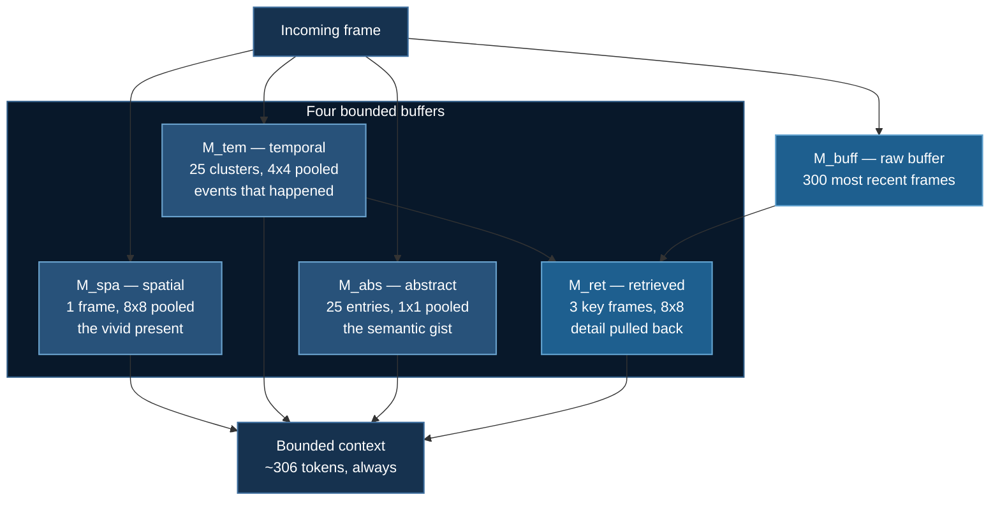

# Streaming: Watching Forever in O(1) Memory

[Token Compression](./token-compression.md) shrinks a clip by a constant **factor**. Halve the tokens and a two-hour video is still twice a one-hour video.

**For any fixed compression ratio there exists a video long enough to OOM you.**

A security camera does not have a length. A livestream does not have a length. A meeting recording has one, but you do not know it in advance.

**Example:** `08_vtt/03_streaming_memory`

## 1. A Strictly Harder Constraint

> Frames arrive forever, answers are needed **during** the stream, and memory must not grow.

Not "must grow slowly." A system whose per-frame cost creeps upward does not degrade gracefully at hour six — it dies.

Three things must be true:

1. **Write is $O(1)$.** Absorbing frame 1,000,000 costs the same as frame 1. If ingestion ever touches all previously seen frames, you have a batch system wearing a streaming costume.
2. **Read is bounded.** The context handed to the LLM has a fixed ceiling, so inference latency is flat and predictable.
3. **Decoupled clocks.** Ingestion runs at the camera's rate; questions arrive at the user's rate; neither blocks the other.

:::warning Point 3 is the one that gets designed away
If answering blocks ingestion, you drop frames — and the memory you are so carefully maintaining is now a memory of a video that did not happen.
:::

## 2. STAR Memory

*Flash-VStream (Zhang et al., 2024)* formalises the bargain your own memory makes: you cannot replay last Tuesday frame by frame, but you know what happened. **Detail decays; structure survives.**



| Buffer | Size | Pooling | Overflow rule |
|---|---|---|---|
| `M_spa` spatial | 1 frame | 8×8 | FIFO |
| `M_tem` temporal | 25 clusters | 4×4 | weighted $k$-means |
| `M_abs` abstract | 25 entries | 1×1 | momentum decay |
| `M_ret` retrieved | 3 frames | 8×8 | recomputed each step |

:::tip The gradient IS the algorithm
As the retention window gets longer, the spatial resolution gets coarser. One frame ago you keep 8×8. A thousand frames ago you keep a cluster centroid.
:::

## 3. Weighted $k$-Means, and Why the Weights Matter

Plain $k$-means treats every point equally — exactly wrong here. After a few consolidation rounds, some entries are single frames and others are centroids already standing for fifty. Unweighted clustering lets a one-frame blip drag a centroid as hard as a minute of footage: rare noise gets over-represented and the long steady event gets smeared.

Weights make every **original** frame count once, forever, no matter how many rounds it has survived. The same invariant that size-weighting enforces in ToMe.

$$
c_j = \frac{\sum_{i \in C_j} w_i x_i}{\sum_{i \in C_j} w_i}, \qquad w_j^{\text{new}} = \sum_{i \in C_j} w_i
$$

:::note Conservation is the test that catches a broken consolidation
After 2,000 frames, `temporal_w.sum()` must equal **2000**. A shortfall means consolidation is *discarding* frames rather than *merging* them — and a discarding consolidator still satisfies the boundedness requirement perfectly, so nothing else would catch it.
:::

Initialisation is **deterministic strided**, not random. Consolidation runs thousands of times over a stream, so a rare bad init would surface as an unreproducible glitch far from its cause. Strided init on a time-ordered buffer also spreads seeds across the whole time range — a genuinely good prior, since the clusters you want usually *are* temporally contiguous events.

## 4. Abstract Memory: Forgetting as a Gradient

The only buffer that never evicts. Every slot is a running exponential average:

$$
M_{\text{abs}} \leftarrow \alpha M_{\text{abs}} + (1 - \alpha)\, \mathrm{softmax}\!\left(\frac{M_{\text{abs}} F^\top}{\sqrt{d}}\right) F
$$

where $F$ are this frame's tokens. Old semantics **fade smoothly** rather than falling off a cliff. The effective horizon is about $\frac{1}{1-\alpha}$ frames — at $\alpha = 0.9$, roughly the last ten dominate any given slot, with an exponentially thinning tail of everything before.

Routing is attention, so a slot that has come to represent "person" pulls in person-ish tokens and ignores the rest. **Slots specialise on their own; nothing supervises them.**

## 5. Retrieved Memory: The Part That Is Easy to Miss

Buffers 1–3 alone have a fatal flaw: **consolidation is irreversible.** Once an event is a 4×4 centroid, the detail is gone, and *"what colour was the car that passed at 3pm?"* is unanswerable.

`M_ret` fixes it. Find the largest temporal clusters — the events that occupied the most frames — and pull the nearest **actual** frames back out of the raw buffer at full resolution.

> Compressed long-term structure tells you *where* to look; the raw buffer still has the pixels.

That is **retrieval over a lossy index** — the same move a RAG system makes over a vector store.

Salience is approximated by cluster weight: the thing on screen longest is usually the thing the question is about. Query-conditioned retrieval would be better and needs the question, which a streaming *writer* does not have yet.

## 6. It Actually Works

```
$ uv run 08_vtt/03_streaming_memory/stream_infer.py --frames 4000 --query-every 1000

  frame    1,000  |  write 1.664 ms (first 100 frames: 1.659 ms)
  frame    2,000  |  write 1.568 ms (first 100 frames: 1.659 ms)
  frame    3,000  |  write 1.523 ms (first 100 frames: 1.659 ms)
  frame    4,000  |  write 1.502 ms (first 100 frames: 1.659 ms)

  4,000 frames in 6.9s (583 frames/s)
  final context: 306 tokens
  a naive system would hold 256,000 tokens — 837x more
```

Write time flat. Context flat at 306 tokens. Push it to 20,000 frames — nearly three hours at 2 fps — and it is still 306.

## 7. Bounded Is Not Enough

A buffer that satisfies $O(1)$ by throwing everything away is trivially "bounded" and completely useless. So the test suite asserts **both**, and they fail in opposite directions:

| Requirement | What is asserted |
|---|---|
| **Bounded** | Context size byte-identical at 200 / 500 / 1,000 / 2,000 frames; every buffer within its cap; weights still sum to the true frame count |
| **Remembers** | An event written 1,500 frames ago is still recoverable above the noise floor, and beats a random direction |

:::info Passing one is easy. Passing both is the engineering.
```bash
uv run tests/test_star_memory.py    # 23 checks
```
The synthetic stream has *real temporal structure* — slow drift within scenes, hard cuts every ~500 frames — so clustering has genuine events to find. Pure noise would let a completely broken consolidation step look identical to a working one.
:::

## 8. Running It

The memory mechanics need **no GPU and no download**:

```bash
uv run 08_vtt/03_streaming_memory/stream_infer.py --frames 20000
uv run 08_vtt/03_streaming_memory/star_memory.py
```

With a real model, packages via **`uv`**:

```bash
uv venv && source .venv/bin/activate
uv pip install torch --index-url https://download.pytorch.org/whl/cu128
uv pip install deepspeed transformers accelerate opencv-python-headless
```

**CoreWeave / any SLURM cluster:**

```bash
cd 08_vtt/03_streaming_memory
sbatch run_deepspeed.sh
FRAMES=50000 sbatch run_deepspeed.sh
```

The job requests only 32 GB of host RAM, and that is part of the demonstration: if RSS climbs over the run, something is retaining frames and the $O(1)$ property is broken.

**RunPod** — creates the pod and shuts it down:

```bash
export RUNPOD_API_KEY=...
uv run runpod/runpod_ctl.py run 08_vtt/03_streaming_memory \
    --collect --wait --terminate --yes
uv run runpod/runpod_ctl.py pods     # confirm: "Nothing is billing."
```

:::note Why `python` and not the `deepspeed` launcher here
Streaming inference is inherently sequential — frames arrive in order — so there is no optimizer to shard and no gradient to reduce. The DeepSpeed launcher would set up a process group and buy nothing.

Scale by running **more streams**, not by sharding one. Using a distributed launcher where there is nothing to distribute is cargo cult, not rigour.
:::

## 9. The Honest Trade

Every technique in this course trades memory for something:

| Technique | Trades away | Buys |
|---|---|---|
| ZeRO | inter-GPU communication | model state per device |
| Token compression | fidelity | more frames per batch |
| **STAR memory** | **detailed recall of the distant past** | **running forever** |

You cannot ask this system what the licence plate was at minute 40. That information is genuinely gone. If you need it, you need a different system — one that writes frames to storage and indexes them, which is a database problem rather than a model problem.

## 10. Next

**[Video Evaluation](./video-evaluation.md)** — you have compressed and you have bounded. Did the model survive it? The loss curve will not tell you.

## Reference

Zhang et al. *Flash-VStream: Memory-Based Real-Time Understanding for Long Video Streams.* [arXiv:2406.08085](https://arxiv.org/abs/2406.08085)
