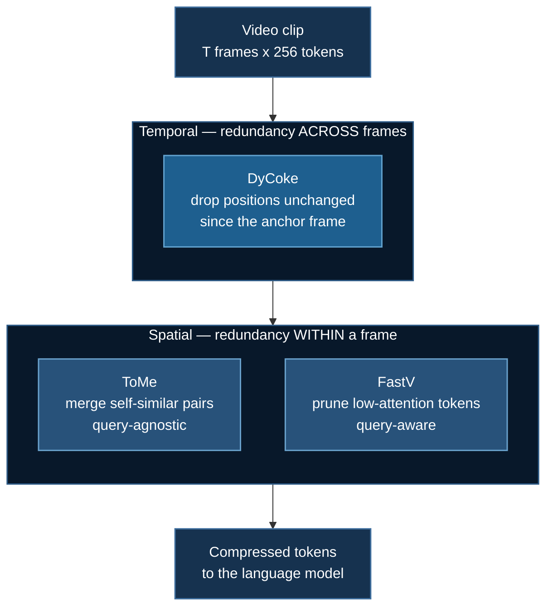

# Token Compression: ZeRO for Activations

:::tip The through-line of this course
**ZeRO shards what the model *is*** and pays in communication.
**Token compression shrinks what the model *looks at*** and pays in fidelity.

Different terms of the same memory equation — and they compose. If you are OOMing, the first question is always *which term dominates*, because optimising the other one is free effort.
:::

**Example:** `08_vtt/02_token_compression`

## 1. The Arithmetic That Forces the Issue

A 448×448 frame becomes $\left(\frac{448}{14}\right)^2 = 1024$ patches, which a 2×2 merger reduces to **256 visual tokens**. Attention is $O(N^2)$:

| Frames | Visual tokens | Attention cost vs 8 frames |
|---|---|---|
| 8 | 2,048 | 1× |
| 16 | 4,096 | 4× |
| 32 | 8,192 | 16× |
| 64 | 16,384 | 64× |
| 128 | 32,768 | 256× |

Doubling the frames quadruples the cost. This is why *"just sample more frames"* stops working almost immediately — and why every frontier video paper of the last two years is, underneath the branding, a **memory** paper.

:::warning Forgetting the patch merger is a 4× error
Without the 2×2 merge you would compute $64 \times 1024 = 65{,}536$ tokens for a 64-frame clip, conclude it cannot possibly fit, and reach for compression you did not need. `count_visual_tokens` models the merger explicitly, and the test suite asserts the 4× relationship.
:::

## 2. Three Families, Three Notions of "Important"



Temporal runs **first**: it is the cheaper filter — one dot product per position, no $N \times N$ matrix — and it removes whole-frame redundancy that spatial merging would otherwise waste its budget rediscovering once per frame.

## 3. ToMe — Bipartite Soft Matching

*Bolya et al., ICLR 2023.* The obvious approach — cluster the similar tokens — is expensive and iterative, and you cannot afford it inside every transformer block. ToMe's insight: you do not need a *good* clustering, you need a **cheap** one applied many times.

1. Split tokens into two sets by **alternating index**. Neighbouring image patches — the ones most likely to be redundant — land on opposite sides and can therefore be matched to each other.
2. Compute cosine similarity of every token in $A$ against every token in $B$. One matmul.
3. Each token in $A$ proposes an edge to its best partner in $B$. Merge the top $r$ edges globally.

Step 3 is the important one. A fixed **number** of merges per layer, not a threshold, keeps the sequence length deterministic — which is what lets the batch stay rectangular and the kernels stay fast. A threshold would give a different $N$ per sample and put you back to padding.

### Measure similarity on the keys

Not on the features. The keys $K$ already encode *"what information does this token offer to others"* — that is their job in attention — and they are far better behaved than raw features, whose magnitude swamps their direction.

### Size-weighted merging

A plain mean is wrong after the first merge. If token $P$ already represents 8 original patches and $Q$ represents 1, an unweighted average gives the lone patch the same say as all 8 combined — so a single outlier can hijack a token standing for a large uniform region.

Weight by size and every *original* patch contributes equally regardless of how many merge rounds it has been through. **This is what makes ToMe stackable across layers rather than degrading.**

$$
x_{\text{merged}} = \frac{\sum_i s_i x_i}{\sum_i s_i}, \qquad s_{\text{merged}} = \sum_i s_i
$$

The test suite asserts conservation directly: after several merge rounds, $\sum_i s_i x_i$ still equals the sum of the original tokens, and $\sum_i s_i$ still equals the original token count.

### Proportional attention — the step everyone skips

Merging changes the answer, quietly. If $P$ and $Q$ had identical keys and you merge them, that key now appears **once** in the softmax denominator instead of twice — so the region loses half its influence, purely as an artefact of compression.

Merge aggressively and large uniform regions (sky, walls, a static background) fade out *precisely because they were compressible*.

The fix is one add:

$$
\text{attn} = \mathrm{softmax}\!\left(\frac{qk^\top}{\sqrt{d}} + \log s\right)
$$

Since $\exp(\ell + \log s) = s \cdot \exp(\ell)$, this reproduces exactly the softmax you would have gotten from $s$ identical copies of the key.

:::note Verified numerically, not just derived
`tests/test_token_compression.py` builds a case with two identical keys, computes attention with and without merging, and asserts the corrected version matches the uncorrected mass **to $10^{-6}$**.

It also asserts the *naive* version is measurably wrong — otherwise the test would be proving nothing.
:::

## 4. FastV — Attention-Guided Pruning

*Chen et al., ECCV 2024.* The observation is slightly embarrassing: after roughly layer 2, visual tokens receive dramatically less attention per token than text tokens, with a very long tail. The model has already extracted what it needs from most patches; carrying them through the remaining 30 layers is waste.

So: run $K$ layers normally, rank visual tokens by the attention the **last query position** pays them, keep the top fraction, continue.

The last position is chosen because in a decoder it is the one about to generate — its query is the closest available proxy for *"what does the model need right now"*. Averaging over all text rows dilutes the signal with positions that have already been answered.

:::info ToMe and FastV are complementary, not competing
**ToMe merges what is self-similar.** It never sees the question.
**FastV keeps what the text is looking at.** It never checks for redundancy.

Different notions of importance. Use ToMe in the vision tower to cut redundancy, FastV in the LLM to cut irrelevance. The survey ([arXiv:2507.20198](https://arxiv.org/abs/2507.20198)) calls these the transformation-based and elimination-based families.
:::

**The cost nobody mentions:** ranking needs an explicit attention matrix, and FlashAttention never materialises one. In practice you run layer $K$ with eager attention purely to get the scores. That is a real slowdown at one layer, traded against a shorter sequence for every layer after it — worth it when the sequence is long, which for video it always is.

**Sorting is load-bearing.** The returned indices must be ascending: positional embeddings and causal masks both assume monotone order, and an unsorted gather silently scrambles the sequence. The test asserts strict monotonicity.

## 5. Temporal Merging

The redundancy spatial methods structurally cannot see: patch $(i,j)$ at time $t$ is usually near-identical to patch $(i,j)$ at $t+1$. Nothing moved. Flatten the clip into one sequence and that structure is gone, because you have discarded the time axis.

Inside a sliding window, keep the first frame whole as an **anchor** and drop only positions that changed relative to it.

:::warning Anchor, do not chain
Comparing each frame to its immediate predecessor sounds better and is worse. Slow drift — a gradual pan, a fade — is below threshold at *every single step*, so every frame gets dropped and the accumulated change goes unrecorded.

Anchoring to a fixed reference bounds the error you can accumulate inside a window by construction.
:::

**The engineering annoyance:** unlike ToMe's fixed $r$, this is content-adaptive. A static lecture recording compresses enormously; a fast sports clip barely at all. That is right for quality and awkward for batching — the output length now varies per sample, and padding gives back exactly what compression just saved.

## 6. Measure. Do Not Estimate.

`train_compressed.py` runs a real DeepSpeed step with compression on and off and reports `torch.cuda.max_memory_allocated()`.

This is not ceremony. **Three ways the predicted win fails to materialise — all common, all reading identically from the outside as *"compression didn't help"*:**

| Symptom | Real cause | Where the fix lives |
|---|---|---|
| Cut tokens 2×, memory barely moved | Optimizer states dominated, not activations | ZeRO — earlier in this course |
| Cut tokens 2×, step time barely moved | MLP (linear in $N$) dominated attention (quadratic) | Nowhere — you were not far enough along the curve |
| Cut tokens 4×, loss degraded | Ratio tuned on more static video than yours | [Video Evaluation](./video-evaluation.md) |

`TokenBudget` reports the two terms **separately** for exactly this reason:

$$
\text{attention cost} \propto \rho^2, \qquad \text{MLP cost} \propto \rho
$$

where $\rho$ is the keep ratio. At short sequences the MLP dominates and compression underdelivers against the quadratic intuition. That single fact explains most disappointing benchmarks.

```
ToMe r=25%/layer
  tokens          16,384 ->   12,288  (75.0% kept)
  attention     56.2% of original (quadratic term)
  mlp           75.0% of original (linear term)
  kv cache      1.64 GB freed @ bf16, 28 layers

FastV keep 50%
  tokens          16,384 ->    8,192  (50.0% kept)
  attention     25.0% of original (quadratic term)
  mlp           50.0% of original (linear term)
  kv cache      3.29 GB freed @ bf16, 28 layers
```

## 7. Why This Is CPU-Testable — and Why That Matters

The algorithms are pure PyTorch on plain tensors. No model, no GPU, no download:

```bash
uv run 08_vtt/02_token_compression/token_compression.py
uv run tests/test_token_compression.py    # 30 checks
```

:::danger Compression code fails in a uniquely nasty way — it always "works"
Drop the wrong tokens and the model still runs, the loss still decreases, and the only symptom is a benchmark score a few points below the paper's — which you will blame on the learning rate. **Nothing raises.**

So the tests assert mathematical *properties*, not shapes: that ToMe merges the genuinely most-similar pair, that weighted merging conserves feature mass exactly, that the log-size identity holds to $10^{-6}$, that FastV returns sorted indices, that temporal merging drops static background and preserves motion.

These are the things you can prove on a laptop. Prove them there, before renting an 80 GB card.
:::

## 8. Running the Measurement

Packages via **`uv`**, training via **`deepspeed`**.

```bash
uv venv && source .venv/bin/activate
uv pip install torch --index-url https://download.pytorch.org/whl/cu121
uv pip install deepspeed transformers accelerate peft opencv-python-headless
```

**CoreWeave / any SLURM cluster:**

```bash
cd 08_vtt/02_token_compression
sbatch run_deepspeed.sh          # sweeps 8, 16, 32 frames
FRAMES=64 sbatch run_deepspeed.sh
```

One GPU on purpose — sharding across devices would mix ZeRO's saving into a number meant to isolate the effect of sequence length. The `ds_config.json` here uses **ZeRO-2, not 3**, for the same reason: stage 3 gathers and releases parameters during the forward pass, adding memory dynamics on top of the effect being measured.

**RunPod** — creates the pod and shuts it down:

```bash
export RUNPOD_API_KEY=...
uv run runpod/runpod_ctl.py run 08_vtt/02_token_compression \
    --collect --wait --terminate --yes
uv run runpod/runpod_ctl.py pods     # confirm: "Nothing is billing."
```

Cheapest subsection in the topic — one 24 GB card, roughly $0.22/hr.

## 9. Where This Runs Out

Everything here shrinks cost by a constant **factor**. Halve the tokens and a two-hour video is still twice a one-hour video. **For any fixed compression ratio there exists a video long enough to OOM you.**

**[Streaming Memory](./streaming-video.md)** — when the video has no length at all, a factor is not enough. You need a *bound*.

## References

- Bolya et al. *Token Merging: Your ViT But Faster.* ICLR 2023. [arXiv:2210.09461](https://arxiv.org/abs/2210.09461)
- Chen et al. *An Image is Worth 1/2 Tokens After Layer 2.* ECCV 2024. [arXiv:2403.06764](https://arxiv.org/abs/2403.06764)
- Shao et al. *A Survey of Multimodal Long-Context Token Compression.* TMLR 2026. [arXiv:2507.20198](https://arxiv.org/abs/2507.20198)
