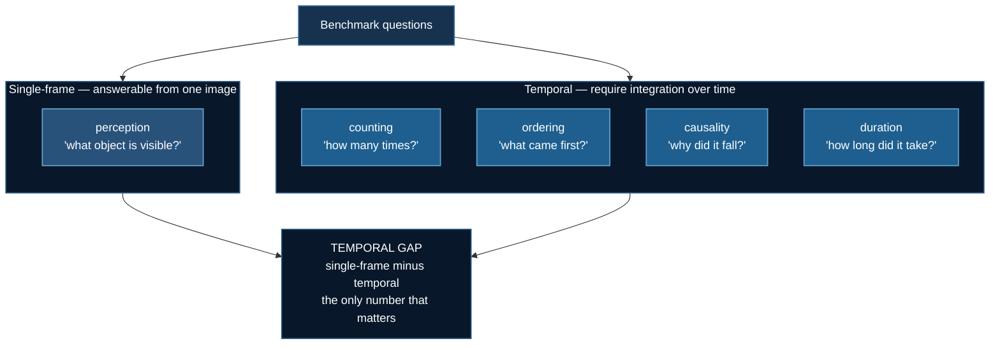
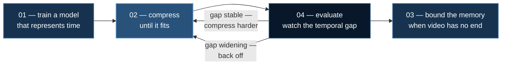

# Video Evaluation: Did Compression Break Understanding?

[Token Compression](./token-compression.md) and [Streaming Memory](./streaming-video.md) both promise the same thing: *you can now fit more video.* **Neither can tell you whether the model still understands it.**

Compression is lossy by construction, and the loss curve will not warn you. A model trained on over-compressed video converges perfectly happily — to a worse model.

> Training loss measures fit to your data. It cannot measure whether you deleted the evidence.

**Example:** `04_video_text/05_video_eval`

## 1. The Failure Mode That Shapes Everything Here

Video benchmarks have a notorious problem: **many questions are answerable from one frame.** *"What colour is the car?"* needs no video at all.

A model that ignores time entirely — or a compressor that has thrown all of it away — can post a respectable Video-MME score. Video-MME's own authors report the single-frame baseline for exactly this reason.

So this harness splits questions into two buckets and reports them **apart**:



```
  overall             52.6%   (chance is 25.0%)

  single-frame        70.2%   (8 questions)
  temporal            35.1%   (32 questions)
  TEMPORAL GAP       +35.1%   <- the number that matters
```

:::danger The overall average hides the failure this exists to find
A model at 70% single-frame and 35% temporal has a broken vision-time pipeline. Its **52% average** conceals that completely.

That average is the number people publish.
:::

### `duration` is the sharpest diagnostic in the set

And it is precisely what motivates [Modern Video Models](./qwen-video-baseline.md).

A model with frame-*index* positions rather than absolute-time positions **cannot** answer duration questions: sampling 16 frames from a 10-second clip and a 10-minute clip produces identical position information, so the evidence was destroyed before the model saw anything.

Near-chance duration accuracy alongside healthy perception accuracy is that architecture, diagnosed.

## 2. The Bug This File Shipped With

The first version of this harness scored a **random-guess baseline at 100%**.

`build_synthetic_questions` seeds `random.Random(0)` and draws one value per question to place the correct answer. The evaluation loop also seeded `random.Random(0)`. Both drew from identical streams in lockstep, so **every "random" guess landed exactly on the correct letter.**

Nothing crashed. Nothing warned. The only reason it was caught is that `--dry-run` printed a number that was obviously impossible.

:::danger Always establish the chance floor first
If random guessing does not land near $1/k$, the harness is leaking answers and every number after it is meaningless.

Correlated RNG seeds between data generation and evaluation are a classic silent leak. The real-world equivalent is an eval script that reuses the dataset's shuffle seed.
:::

The fix is one line and a long comment explaining why the seed is not zero. `tests/test_video_eval.py` now regresses it across four independent seeds, and additionally checks that no constant-guess strategy ("always answer B") beats chance — which would mean the answer key itself is lopsided.

## 3. Answer Parsing Is Not a Detail

Models say:

```
Looking at option A, that seems wrong. The answer is C.
```

A naive `if "A" in response` scores that as **A**, and silently costs you real accuracy the model actually earned.

`parse_answer` is deliberately **strict-then-lenient**:

| Order | Pattern | Matches |
|---|---|---|
| 1 | `answer\s*(is\|:)\s*\(?([A-D])\)?` | "the answer is (C)" |
| 2 | `^\s*\(?([A-D])\)?\s*[.:)]` | "C." at the start |
| 3 | `^\s*\(?([A-D])\)?\s*$` | exactly "C" |
| 4 | `\(([A-D])\)` | "(C)" anywhere |
| 5 | last standalone capital | fallback only |

Genuinely unparseable responses return `None` and are **counted and warned about**, never silently scored:

```
  WARNING: 47 responses had no parseable answer letter.
           These were scored WRONG. If the count is large the model is
           failing to follow the format, not failing the task — fix the
           prompt before believing any number above.
```

An unparsed rate above a few percent means you are measuring **format compliance, not comprehension**.

## 4. What Is Real and What Is Synthetic

**Real:** the bucketing, the scoring, the answer parsing, the report. This is what you point at Video-MME.

**Synthetic:** the bundled questions, so the whole thing runs offline with no gated dataset and no download.

Point `--dataset` at the real benchmark when you have it; nothing else changes:

```json
[{"qid": "1", "category": "ordering", "question": "...",
  "options": ["...", "..."], "answer": "B",
  "duration_bucket": "long", "video": "clips/1.mp4"}]
```

:::note Unknown categories default to temporal — deliberately
Mis-bucketing a temporal question as single-frame **inflates** the single-frame score and **shrinks** the gap, hiding the very failure this harness exists to expose. When in doubt, the conservative direction is the one that keeps the gap honest.
:::

## 5. Runs on CPU

```bash
uv run 04_video_text/05_video_eval/video_mme_eval.py --dry-run   # the chance baseline
uv run tests/test_video_eval.py                           # 39 checks
```

## 6. Running Against a Real Model

Packages via **`uv`**:

```bash
uv venv && source .venv/bin/activate
uv pip install torch --index-url https://download.pytorch.org/whl/cu128
uv pip install deepspeed transformers accelerate opencv-python-headless
```

**CoreWeave / any SLURM cluster:**

```bash
cd 04_video_text/05_video_eval
sbatch run_deepspeed.sh
MODEL=Qwen/Qwen2.5-VL-7B-Instruct DATASET=videomme.json sbatch run_deepspeed.sh
```

The script runs the chance baseline **first**, then sweeps frame budgets (8, 16, 32, 64).

**RunPod** — creates the pod and shuts it down:

```bash
export RUNPOD_API_KEY=...
uv run runpod/runpod_ctl.py run 04_video_text/05_video_eval \
    --collect --wait --terminate --yes
uv run runpod/runpod_ctl.py pods     # confirm: "Nothing is billing."
```

:::note Why `python` and not the `deepspeed` launcher here
Evaluation is a series of short `generate()` calls — no optimizer, no gradients, nothing to shard. The win comes from batching questions, not from sharding the model.
:::

## 7. The Workflow This Completes



> **The compression ratio is not a setting you pick once. It is a dial you turn while watching the gap.**

## References

- Fu et al. *Video-MME: The First-Ever Comprehensive Evaluation Benchmark of Multi-modal LLMs in Video Analysis* (2024). [arXiv:2405.21075](https://arxiv.org/abs/2405.21075)
- Wu et al. *LongVideoBench: A Benchmark for Long-context Interleaved Video-Language Understanding* (2024). [arXiv:2407.15754](https://arxiv.org/abs/2407.15754)
