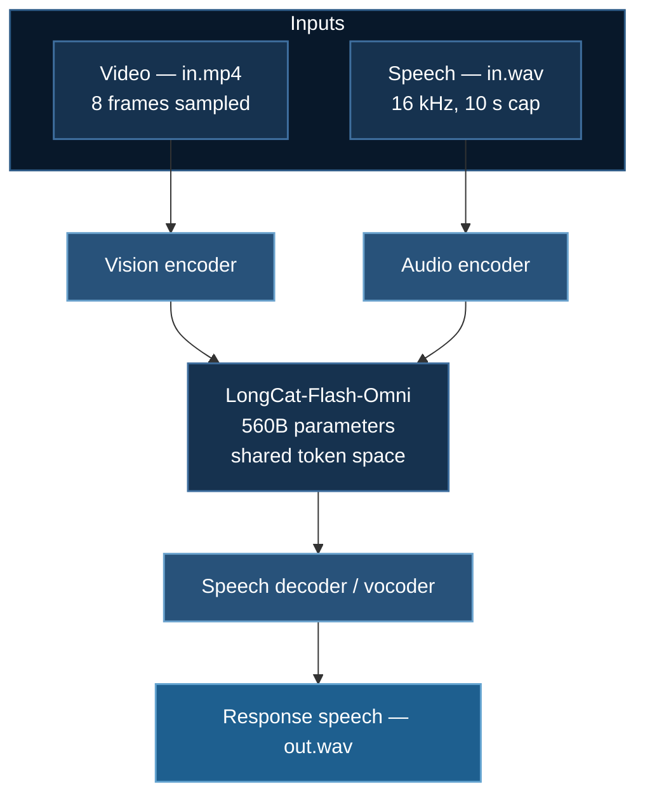

# Video-Speech Training

Fine-tuning **LongCat-Flash-Omni**, a 560-billion-parameter omni-modal model, for video-speech-to-speech on two GPUs. This is the largest example in the course, and the only one where DeepSpeed is not an optimization but the sole reason the run is possible at all.

**Model:** `meituan-longcat/LongCat-Flash-Omni` · **Example:** `09_vss`

## 1. The Task

Video-speech-to-speech: given a video **and** a spoken utterance, produce a spoken response. The dataset layout makes the structure explicit:

```
09_vss/data/train/
├── 01/
│   ├── in.mp4     # or in.MOV — visual context
│   ├── in.wav     # input speech
│   └── out.wav    # target speech
├── 02/
└── ... (8 samples)
```

Three modalities, two of them as *input* and one as *output*. That last part is what makes it hard: the model must **generate** audio, not merely consume it, which is a strictly harder problem than the video-text case.



Traditional pipelines chain ASR → LLM → TTS. An omni-modal model collapses this into one network, which removes the error compounding between stages and — more importantly — preserves **paralinguistic** information (tone, emphasis, hesitation) that a transcript discards.

## 2. The Memory Problem

Apply the [$16\Psi$ accounting](/docs/getting-started/deepspeed-zero-stages#12-where-the-memory-actually-goes) at $\Psi = 5.6\times10^{11}$:

| Quantity | Size |
|---|---|
| BF16 weights alone, $2\Psi$ | **1.12 TB** |
| Full fine-tuning model states, $16\Psi$ | **8.96 TB** |
| Available on 2× B200 | 384 GB |

Full fine-tuning would need roughly **112 B200s** just to hold model states. Two B200s provide 384 GB — the weights alone are **three times** the entire GPU memory of the node.

Two mechanisms make the run possible, and neither is optional:

**LoRA** reduces trainable parameters to a negligible fraction, so the $16\Psi$ optimizer term nearly vanishes. The frozen $2\Psi$ base remains.

**ZeRO-3 with aggressive CPU offload** partitions and offloads that base. This is exactly the case ZeRO-Infinity was designed for — see [the offload family](/docs/getting-started/deepspeed-zero-stages#5-beyond-the-gpu-the-offload-family). The node's **3 TB of system RAM** is doing the heavy lifting; the GPUs are a compute window onto a model that lives in host memory.

:::danger This example has hard infrastructure prerequisites
From `README_2xB200.md` and the checks in `run_2xB200.sh`:

| Resource | Required | Why |
|---|---|---|
| GPU | 2× B200 (192 GB each) | 384 GB total |
| **System RAM** | **3 TB** | Holds the offloaded parameters and optimizer state (~1.1–1.5 TB in use) |
| **Storage** | **2 TB** | Model weights are ~1.1 TB on disk |

`run_2xB200.sh` preflights GPU count, free disk, and total RAM before launching, and warns on each. **Those warnings are load-bearing.** Under-provisioned RAM does not degrade gracefully — the host begins swapping, and throughput does not slow, it effectively stops.

Budget download time too: 1.1 TB of weights is hours on most connections, and `HF_HOME` must point somewhere with the space.
:::

Expected per-GPU usage from the example's own analysis: ~110 GB of 192 GB, leaving ~82 GB margin; CPU RAM grows to 1–1.5 TB. **Watch both.**

## 3. Quick Start

```bash
cd 09_vss

./check_storage.sh      # verify disk before downloading ~1.1 TB
./run_2xB200.sh         # preflight checks, then launch
```

`run_2xB200.sh` is the non-SLURM launcher pattern — direct execution with guard rails, suitable for a single-tenant pod rather than a scheduled cluster. See the [platform distinction](/docs/guides/slurm-deployment).

## 4. Configuration

### LoRA

```python
peft_config = LoraConfig(
    r=16,               # reduced from 32 for memory
    lora_alpha=32,
    target_modules=[...],
)
```

$r = 16$ with $\alpha = 32$ gives an effective scaling of $\alpha/r = 2$. The comment records that $r$ was reduced from 32 — at this scale even adapter memory and its gradients matter, and $r$ is the most direct lever.

Training: 3 epochs, learning rate **5e-5** (the code notes this was reduced from 1e-4). Lower rates are prudent here: with 8 samples, a large model, and expensive steps, an unstable run is very costly to discover.

### Input caps

```python
def load_video_frames(video_path: str, max_frames: int = 8):
    """Load and preprocess video frames (REDUCED to 8 frames for memory)."""

def load_audio(audio_path: str, sample_rate: int = 16000, max_duration: float = 10.0):
    """Load and preprocess audio file (REDUCED to 10s for memory)."""
```

Both caps are memory decisions, and the [quadratic-in-sequence-length argument](/docs/tutorials/multimodal/video-text-training#3-video-is-a-sequence-length-problem) applies with an extra term, since audio contributes tokens too:

$$
s \approx \underbrace{N_{\text{frames}}\cdot T_{\text{frame}}}_{\text{visual}} + \underbrace{d_{\text{audio}}\cdot T_{\text{sec}}}_{\text{speech}} + T_{\text{text}}
$$

At 16 kHz, a typical speech tokenizer emits on the order of 25–50 tokens per second, so 10 seconds is a few hundred tokens — small next to the visual budget, but it compounds. **Raise these caps only with headroom to spare**, and remember the attention cost grows as $s^2$.

16 kHz is the standard rate for speech models: it captures the ~8 kHz of spectrum that carries phonetic content (Nyquist), while 44.1 kHz would nearly triple the sample count for information speech recognition does not use.

### DeepSpeed

From `ds_config_2xB200.json`:

```json
{
  "train_batch_size": "auto",
  "train_micro_batch_size_per_gpu": "auto",
  "gradient_accumulation_steps": "auto",
  "gradient_clipping": 1.0,
  "fp16": { "enabled": false },
  "bf16": { "enabled": true },
  "zero_optimization": {
    "stage": 3,
    "offload_optimizer": {
      "device": "cpu", "pin_memory": true, "buffer_count": 4, "fast_init": false
    },
    "offload_param": {
      "device": "cpu", "pin_memory": true,
      "buffer_count": 5, "buffer_size": 1e8, "max_in_cpu": 1e9
    },
    "overlap_comm": true,
    "contiguous_gradients": true,
    "reduce_bucket_size": 5e7,
    "stage3_prefetch_bucket_size": 5e7,
    "stage3_param_persistence_threshold": 1e5,
    "stage3_max_live_parameters": 5e8,
    "stage3_max_reuse_distance": 5e8,
    "stage3_gather_16bit_weights_on_model_save": true,
    "memory_efficient_linear": true
  }
}
```

| Setting | Why |
|---|---|
| **Stage 3** | The only stage whose memory scales as $16\Psi/N_d$ without bound. Stages 1–2 cap out at $2\Psi = 1.12$ TB, still 3× the node |
| `offload_param` **and** `offload_optimizer` | Both must go to host RAM; this is the ZeRO-Infinity regime |
| `pin_memory: true` | Page-locked host memory enables DMA. Essential when transfers dominate |
| `stage3_max_live_parameters: 5e8` | Caps how many parameters may be simultaneously materialized on GPU. **The primary OOM control at Stage 3** — lower it if you OOM, at a throughput cost |
| `stage3_param_persistence_threshold: 1e5` | Tensors below this are never partitioned. LayerNorm gains are tiny and numerous; an `all-gather` on them is pure latency |
| `reduce_bucket_size`, `prefetch` at 5e7 | Deliberately small. Large buckets need large contiguous staging buffers, which is the wrong trade when GPU memory is the binding constraint |
| `memory_efficient_linear: true` | Reduces temporaries in linear layers |
| `stage3_gather_16bit_weights_on_model_save` | Without it the checkpoint is shards. Under LoRA you should save adapters anyway — see below |
| BF16, FP16 explicitly off | No loss scaling, no $g^2$ overflow. Correct at this scale |

:::note Expect this to be slow, and understand why
The example reports **30–60 minutes per epoch** for 4 steps on 8 samples.

That is not a bug. [Stage 3 costs $3\Psi$ of communication](/docs/getting-started/deepspeed-zero-stages#43-stage-3-costs-15) versus $2\Psi$ for standard data parallelism, and here every parameter gather additionally crosses **PCIe from host RAM**, which is roughly two orders of magnitude slower than HBM. With a micro-batch of 1 there is very little compute to hide that transfer behind — precisely the small-batch pathology that motivates ZeRO++.

The correct mental model: **this configuration optimizes for feasibility, not throughput.** It converts an impossible run into a slow one. If you need speed, the answer is more GPUs so that less is offloaded, not different flags.
:::

## 5. Eight Samples

The dataset is eight examples. That is not a training set in any statistical sense, and the page should say so plainly.

What eight samples *can* establish:

- The 1.1 TB model loads and shards across 2 GPUs without OOM
- LoRA adapters attach to a 560B omni-modal architecture
- Video, audio-in, and audio-out preprocessing all run
- ZeRO-3 with double offload is stable on this hardware
- A forward and backward pass completes, and loss is finite

That is genuinely valuable — at this scale, **validating the pipeline is most of the engineering work**, and doing it on 8 samples instead of 8,000 saves days. Treat it as the smoke test it is, then scale the data.

What it cannot do is teach the model anything generalizable. With 3 epochs over 8 samples, you will memorize them.

## 6. Scaling Up

| Step | Note |
|---|---|
| More data | Hundreds of hours of paired speech is the realistic floor for speech-to-speech |
| More GPUs | The highest-value change. Fewer offloaded parameters means less PCIe traffic; 8 GPUs would transform throughput |
| Raise `stage3_max_live_parameters` | If memory allows, more resident parameters means fewer gathers |
| NVMe offload | [ZeRO-Infinity](/docs/getting-started/deepspeed-zero-stages#52-zero-infinity) if RAM is the constraint. **Local NVMe only** — pointing `nvme_path` at NFS is catastrophic |
| Longer audio / more frames | Only with headroom; the cost is quadratic |
| Evaluation | Speech output needs speech metrics: WER via ASR on the generated audio, plus MOS or a learned proxy for quality. Token cross-entropy tells you very little |

## 7. Troubleshooting

**OOM on GPU.** Lower `stage3_max_live_parameters` first (5e8 → 2e8), then `stage3_prefetch_bucket_size`, then frames and audio duration. Do not raise micro-batch.

**OOM on host / machine unresponsive.** Swapping. Check `free -g`; RAM should reach 1–1.5 TB. Below 3 TB total this configuration is not viable — offload to NVMe or add GPUs.

**Download fails or fills the disk.** 1.1 TB. Run `./check_storage.sh` first and confirm `HF_HOME` points at the large volume.

**Extremely slow steps.** Expected — §4. Confirm `pin_memory: true`, and verify offload is going to RAM rather than a swap file.

**Checkpoint will not reload.** Under LoRA, save adapters with `model.save_pretrained()`; there is no reason to write 1.1 TB of unchanged base weights.

**`run_2xB200.sh` warns about GPU count.** The config is tuned for exactly 2 B200s. On different hardware the offload buffer sizes need retuning, not just a different `--num_gpus`.

## Next Steps

- [Video-Text Training](/docs/tutorials/multimodal/video-text-training) — the same frame-budget problem without audio
- [ZeRO Stages](/docs/getting-started/deepspeed-zero-stages) — Stage 3, offload, and ZeRO-Infinity in full
- [Hardware Requirements](/docs/guides/hardware-requirements)

## References

**Omni-modal and speech-language models**

1. Meituan LongCat Team (2025). LongCat-Flash-Omni. [Model card](https://huggingface.co/meituan-longcat/LongCat-Flash-Omni)
2. Défossez, A., Mazaré, L., Orsini, M., et al. (2024). Moshi: a speech-text foundation model for real-time dialogue. [arXiv:2410.00037](https://arxiv.org/abs/2410.00037)
3. Zhang, D., Li, S., Zhang, X., et al. (2023). SpeechGPT: Empowering Large Language Models with Intrinsic Cross-Modal Conversational Abilities. *EMNLP 2023 Findings*. [arXiv:2305.11000](https://arxiv.org/abs/2305.11000)
4. Chu, Y., Xu, J., Zhou, X., et al. (2023). Qwen-Audio: Advancing Universal Audio Understanding via Unified Large-Scale Audio-Language Models. [arXiv:2311.07919](https://arxiv.org/abs/2311.07919)
5. Radford, A., Kim, J. W., Xu, T., et al. (2023). Robust Speech Recognition via Large-Scale Weak Supervision. *ICML 2023*. [arXiv:2212.04356](https://arxiv.org/abs/2212.04356) — Whisper; the standard audio encoder.
6. Défossez, A., Copet, J., Synnaeve, G., & Adi, Y. (2023). High Fidelity Neural Audio Compression. *TMLR*. [arXiv:2210.13438](https://arxiv.org/abs/2210.13438) — EnCodec; discrete audio tokenization.
7. Borsos, Z., Marinier, R., Vincent, D., et al. (2023). AudioLM: a Language Modeling Approach to Audio Generation. *IEEE/ACM TASLP*. [arXiv:2209.03143](https://arxiv.org/abs/2209.03143)

**Systems**

8. Rajbhandari, S., Rasley, J., Ruwase, O., & He, Y. (2020). ZeRO. *SC '20*. [arXiv:1910.02054](https://arxiv.org/abs/1910.02054)
9. Rajbhandari, S., Ruwase, O., Rasley, J., Smith, S., & He, Y. (2021). ZeRO-Infinity. *SC '21*. [arXiv:2104.07857](https://arxiv.org/abs/2104.07857)
10. Ren, J., Rajbhandari, S., Aminabadi, R. Y., et al. (2021). ZeRO-Offload. *USENIX ATC '21*. [arXiv:2101.06840](https://arxiv.org/abs/2101.06840)
11. Hu, E. J., Shen, Y., Wallis, P., et al. (2022). LoRA. *ICLR 2022*. [arXiv:2106.09685](https://arxiv.org/abs/2106.09685)
