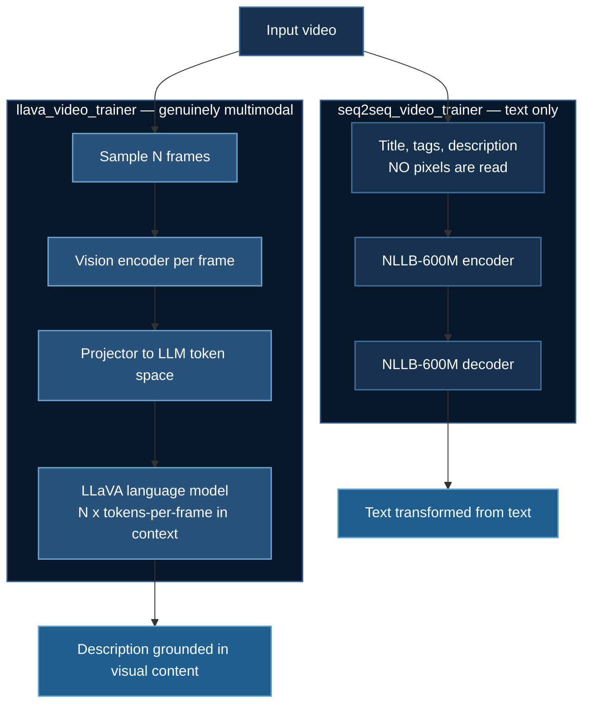

# Video-Text Training

Two contrasting approaches to video understanding, in the same example directory: a **vision-language model** that actually looks at frames, and a **sequence-to-sequence model** that only reads metadata. The comparison is the lesson.

**Example:** `08_vtt/hf_ds_vtt_test2`

## 1. Two Architectures, Two Problems



| | LLaVA video trainer | Seq2Seq video trainer |
|---|---|---|
| Base model | LLaVA (7B class) | `facebook/nllb-200-distilled-600M` |
| Reads pixels | **Yes** | **No** |
| Architecture | Decoder-only + vision tower | Encoder–decoder |
| Input | $N$ sampled frames + prompt | Video metadata text |
| Memory driver | Visual token count | Text sequence length (128) |
| DeepSpeed config | Auto-generated in-script | External `ds_config.json` |
| Right for | "What is happening in this video?" | "Rewrite/translate this title" |

:::warning These are not two solutions to one problem
The seq2seq model never sees the video. It cannot answer any question about visual content — it transforms text into text. That is a perfectly legitimate task (normalizing titles, translating descriptions, generating tags from existing tags), and it is far cheaper, but calling it "video-text training" invites a category error.

**If your task requires knowing what is in the frames, only the LLaVA path can do it.** Choose deliberately.
:::

## 2. Quick Start

```bash
cd 08_vtt/hf_ds_vtt_test2

# Vision-language
cd llava_video_trainer && ./run_training.sh

# Text-only seq2seq
cd seq2seq_video_trainer && ./run_training.sh
```

Both scripts push results to the Hub, so `HF_TOKEN` and a user ID must be set.

## 3. Video Is a Sequence-Length Problem

Everything in [the VLM memory analysis](/docs/tutorials/huggingface/ocr-vision-language#3-the-memory-problem-is-sequence-length-not-parameters) applies here, multiplied by the frame count.

If one frame produces $T_{\text{frame}}$ visual tokens, then $N$ frames produce

$$
s \approx N \cdot T_{\text{frame}} + T_{\text{text}}
$$

and attention activation memory scales as

$$
M_{\text{attn}} \;\propto\; s^{2} \;\approx\; N^{2}\,T_{\text{frame}}^{2}
$$

**Quadratic in the number of frames.** At a realistic 576 tokens per frame, 8 frames is 4,608 visual tokens; 16 frames is 9,216, and the attention term is **four times** larger. This is why the example defaults to `num_frames=5` and why video models are so much harder to train than image models.

The tension is fundamental: temporal understanding needs many frames, and many frames is quadratically expensive. Every practical video model is a different answer to it.

| Strategy | Approach | Trade-off |
|---|---|---|
| Uniform sparse sampling | $N$ evenly spaced frames — what this example does | Simple; misses events between samples |
| Keyframe selection | Sample where the content changes | Better coverage per token; needs a detector |
| Token pooling / merging | Merge redundant tokens across adjacent frames | Exploits the high redundancy between neighbouring frames |
| Temporal pooling | Average frame features before the LLM | Cheap; discards fine temporal ordering |
| Q-Former / resampler | Learned fixed-size query set per frame | Constant tokens per frame regardless of resolution |

:::note Why sparse sampling works better than it should
Adjacent video frames are enormously redundant — at 30 fps, consecutive frames are nearly identical. Most of the *semantic* content of a short clip survives sampling 5–8 frames.

Where it breaks is anything requiring fine temporal resolution: distinguishing "picking up" from "putting down", counting repetitions, reading motion direction. If your task is action recognition rather than scene description, uniform sparse sampling is the wrong tool and you need denser sampling with token merging.
:::

## 4. The LLaVA Trainer

Frames are represented as **repeated image tokens** in a single conversation:

```python
# Create content with multiple image tokens for video frames
for _ in range(self.num_frames):
    # ... append an image token per frame ...
```

This is the standard trick for adapting an image VLM to video: a video *is* a sequence of images, and the LLM's positional encoding provides the ordering. It works because the model already knows how to attend across image tokens; it just now has $N$ images instead of one.

:::tip Fixed — frame extraction is now real
The extractor **used to** be a placeholder. It has been replaced with real
OpenCV decoding, wired into `preprocess_function` (it was previously never
called at all), and `tests/test_video_frames.py` verifies that sampled frames
are genuinely distinct and correctly colour-converted:

```bash
uv run tests/test_video_frames.py
```

The description below is kept because "the pipeline runs and the loss decreases,
but the data carries no signal" is a failure mode worth recognizing.
:::

:::note What the placeholder used to do
`download_and_process_video_frames()` did **not** decode video. Its own docstring said so:

> *"This is a simplified implementation. In practice, you'd use opencv-python or similar to extract actual video frames."*

It returned `[image] * num_frames` — **the same image repeated `num_frames` times** — falling back to a fixed COCO photograph for non-image URLs, or a solid grey 224×224 square on error. Worse, it was never invoked: `preprocess_function` tokenized text only, so no pixels reached the model at all.

The consequence was that every "video" was $N$ identical frames. The pipeline ran end to end and the loss decreased, but there was **zero temporal signal**.

The replacement, now shipped:

```python
import cv2
from PIL import Image

def extract_frames(video_path: str, num_frames: int) -> list[Image.Image]:
    """Uniformly sample num_frames frames from a video."""
    cap = cv2.VideoCapture(video_path)
    total = int(cap.get(cv2.CAP_PROP_FRAME_COUNT))
    if total <= 0:
        cap.release()
        raise ValueError(f"No frames decoded from {video_path}")

    idxs = [int(i * (total - 1) / max(num_frames - 1, 1)) for i in range(num_frames)]
    frames = []
    for i in idxs:
        cap.set(cv2.CAP_PROP_POS_FRAMES, i)
        ok, frame = cap.read()
        if ok:
            frames.append(Image.fromarray(cv2.cvtColor(frame, cv2.COLOR_BGR2RGB)))
    cap.release()

    while len(frames) < num_frames and frames:      # pad short videos
        frames.append(frames[-1])
    return frames
```

Note `cv2` returns BGR; forgetting the conversion feeds colour-swapped images to a model pretrained on RGB — a silent accuracy loss rather than an error. The shipped version also **raises** on undecodable input rather than substituting placeholders: a crash is a bug report, a silently degenerate dataset is a wasted GPU-week.

Batching required a companion change. `DataCollatorForSeq2Seq` handles only token
fields and silently drops `pixel_values`, so a `LlavaVideoCollator` now pads the
token fields and stacks the visual features.
:::

The dataset in the example is **four samples**, which is consistent with its purpose as a smoke test.

## 5. The Seq2Seq Trainer

```python
model = AutoModelForSeq2SeqLM.from_pretrained("facebook/nllb-200-distilled-600M")
```

NLLB-200 ("No Language Left Behind") is a multilingual **translation** model covering 200 languages. Using it here means the task is framed as translation-like: map an input text to an output text.

Encoder–decoder is a reasonable fit for this shape of problem. Unlike a decoder-only LLM, the encoder sees the input **bidirectionally** — every input token attends to every other — which suits transformation tasks where the whole input is available up front, as opposed to open-ended continuation.

```python
tokenizer(..., padding="max_length", max_length=128)
```

:::tip `padding="max_length"` wastes compute
Every sequence is padded to 128 tokens whether it needs it or not, so short titles cost the same as long ones. `padding="longest"` with a `DataCollatorForSeq2Seq` pads only to the longest item *in each batch* — typically a large saving when lengths vary, and it composes well with length-grouped batching (`group_by_length=True`).

The counter-argument is that fixed shapes avoid recompilation and reduce allocator fragmentation. At `max_length=128` the waste is small; at 2048 it would not be.
:::

For NLLB specifically, remember to set the source and target language codes (`src_lang`, `forced_bos_token_id`) — omitting them means the model guesses the target language, which is a common and confusing failure.

Its DeepSpeed config is external and conventional:

```json
{
  "bf16": { "enabled": true },
  "optimizer": {
    "type": "AdamW",
    "params": { "lr": 5e-05, "betas": [0.9, 0.999], "eps": 1e-08, "weight_decay": 0.01 }
  },
  "scheduler": {
    "type": "WarmupLR",
    "params": { "warmup_min_lr": 0, "warmup_max_lr": 5e-05, "warmup_num_steps": 100 }
  },
  "zero_optimization": { "stage": 2, "overlap_comm": true, "contiguous_gradients": true }
}
```

At 600M parameters, model states are $16\Psi \approx 9.6$ GB — comfortable on one modern GPU, so ZeRO-2 is demonstrative rather than necessary. Training config: 3 epochs, LR 5e-5.

## 6. Choosing Between Them

| Your task | Use |
|---|---|
| Describe/caption what happens in a video | **LLaVA** — requires pixels |
| Answer questions about visual content | **LLaVA** |
| Detect actions or events | **LLaVA**, with denser frame sampling |
| Translate or rewrite titles and descriptions | **Seq2Seq** — 10× cheaper |
| Generate tags from existing metadata | **Seq2Seq** |
| Both visual grounding and multilingual output | LLaVA with a multilingual base |

The honest framing: **seq2seq is not a cheap approximation to video understanding — it is a different task.** If a text-only model performs well on your benchmark, that is strong evidence your benchmark is solvable from metadata alone, which is worth knowing before you spend on a VLM. Running the seq2seq model first as a **baseline** is genuinely good practice, in the same spirit as the [persistence baseline](/docs/tutorials/intermediate/stock-prediction#the-baseline-now-reported) for time series.

## 7. DeepSpeed Notes

**LLaVA path.** LoRA plus ZeRO-2, as in the [OCR example](/docs/tutorials/huggingface/ocr-vision-language#7-deepspeed-configuration). Gradient checkpointing is essential given §3, and the micro-batch will usually be 1 — one sample can be many thousands of tokens. Cap frames and per-frame resolution before touching the ZeRO stage.

**Seq2Seq path.** Encoder–decoder models retain activations for both stacks plus cross-attention, so their activation footprint is somewhat higher than a decoder-only model of equal size. Still small at 600M.

**Both.** Variable-length inputs cause allocator fragmentation — see the [step-200 OOM note](/docs/tutorials/basic/neural-network#93-reading-the-error-message). Bucketing by length helps both paths.

## 8. Troubleshooting

**Model learns nothing about the video.** This was the placeholder-extractor symptom, now fixed (§4). If it recurs, run `uv run tests/test_video_frames.py`.

**OOM with more frames.** Quadratic, not linear (§3). Halving frames roughly quarters attention memory. Reduce per-frame resolution too.

**Colour looks wrong / accuracy poor after adding real extraction.** `cv2` gives BGR; convert to RGB.

**Hub push fails.** `HF_TOKEN` must be set and have write scope, and the target repo must exist or be creatable.

**NLLB outputs the wrong language.** Set `src_lang` on the tokenizer and `forced_bos_token_id` on generation.

**Padding warnings / slow steps in seq2seq.** §5 — switch to dynamic padding.

## Next Steps

- [Video-Speech Training](/docs/tutorials/multimodal/video-speech-training) — adding audio, at 560B parameters
- [OCR Vision-Language](/docs/tutorials/huggingface/ocr-vision-language) — the single-image case in more depth
- [ZeRO Stages](/docs/getting-started/deepspeed-zero-stages)

## References

1. Liu, H., Li, C., Wu, Q., & Lee, Y. J. (2023). Visual Instruction Tuning. *NeurIPS 2023*. [arXiv:2304.08485](https://arxiv.org/abs/2304.08485) — LLaVA.
2. Lin, B., Ye, Y., Zhu, B., et al. (2023). Video-LLaVA: Learning United Visual Representation by Alignment Before Projection. [arXiv:2311.10122](https://arxiv.org/abs/2311.10122)
3. Zhang, H., Li, X., & Bing, L. (2023). Video-LLaMA: An Instruction-tuned Audio-Visual Language Model for Video Understanding. *EMNLP 2023*. [arXiv:2306.02858](https://arxiv.org/abs/2306.02858)
4. Maaz, M., Rasheed, H., Khan, S., & Khan, F. S. (2024). Video-ChatGPT. *ACL 2024*. [arXiv:2306.05424](https://arxiv.org/abs/2306.05424)
5. Li, J., Li, D., Savarese, S., & Hoi, S. (2023). BLIP-2: Bootstrapping Language-Image Pre-training with Frozen Image Encoders and Large Language Models. *ICML 2023*. [arXiv:2301.12597](https://arxiv.org/abs/2301.12597) — the Q-Former resampler.
6. Arnab, A., Dehghani, M., Heigold, G., et al. (2021). ViViT: A Video Vision Transformer. *ICCV 2021*. [arXiv:2103.15691](https://arxiv.org/abs/2103.15691) — temporal tokenization strategies.
7. NLLB Team, Costa-jussà, M. R., Cross, J., et al. (2022). No Language Left Behind: Scaling Human-Centered Machine Translation. [arXiv:2207.04672](https://arxiv.org/abs/2207.04672)
8. Vaswani, A., Shazeer, N., Parmar, N., et al. (2017). Attention Is All You Need. *NeurIPS 2017*. [arXiv:1706.03762](https://arxiv.org/abs/1706.03762) — the encoder–decoder architecture.
