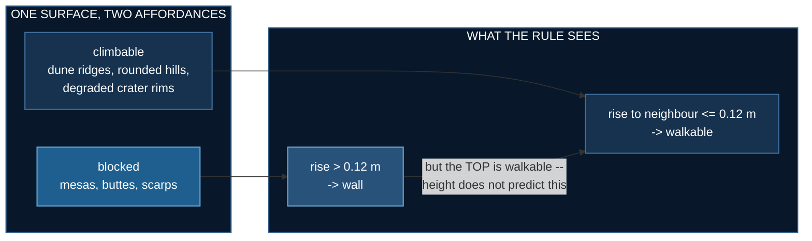

# Mars Terrain (Part 1)

## Abstract

This lab builds a Martian surface and then tries to catch it lying.
There is **no robot in it** — no policy, no reward, no success rate.
That is deliberate: the previous lab published a result that turned
out to be wrong, and the faults were in its world, its renderer and
its measurement rather than in anything the robot learned. So terrain
gets its own lab, built first and measured on its own terms. What
follows is a generator at two scales, six animations, seven properties
that can fail, and three bugs found by checking rather than looking.


## Problem Statement

Procedural noise will give you something that looks like a planet in
about twenty lines. The hard question is different:

> What has to be **true** of a generated world before you are entitled
> to believe anything you measure on it?

Terrain is unusually good at hiding mistakes, because the only check
most people run is whether it looks right — and a height field almost
always looks right. One of the bugs below produced a surface with
**46 m of relief inside a 60 m box**, a near-vertical cliff-world, and
it still rendered as perfectly reasonable ground.

### Two scales, because the famous landforms do not fit

Olympus Mons is roughly 600 km across and 22 km tall. Valles Marineris
runs about 4,000 km. A robot arena is tens of metres across. Neither
fits, and a two-metre bump labelled "Olympus Mons" would be a lie told
with geometry.

| preset | extent | purpose |
|---|---|---|
| `regional` | 20 km | shield volcano, rift canyon, graben swarms, cratered highlands, the crustal dichotomy. **For looking at.** |
| `rover` | 60 m | dune ridges, scarps, boulder fields, small craters, fractured bedrock. **Part 2 walks here.** |

The rover map is a *local sample of a Martian-looking surface*, not a
scale model of Mars. Saying so is cheaper than pretending otherwise
and being caught by anyone who knows the numbers.


## Solution

### What is modelled

Each of these changes the **shape** of the ground, which is the test
for whether it belongs in a height field at all:

- the **crustal dichotomy** — smooth low northern plains against high,
  rough, ancient southern highlands. Regional only: a 60 m patch does
  not straddle a hemispheric boundary, and applying it there produced
  a "dichotomy" of 0.7 m, which is not a dichotomy, it is a slope.
- **impact craters** with raised rims, bowls and ejecta, drawn from a
  power-law size distribution and each carrying an **age** — sharp
  young bowls superimposed on soft, half-filled old ones. A plain
  where every crater is fresh looks like a golf ball.
- a **shield volcano**, far flatter than anyone draws it, with a
  summit caldera rather than a cone
- a **rift canyon** with terraced walls, plus **swarms of parallel
  graben**. Fossae come in sets sharing one orientation, because they
  are extensional fractures from a common stress field — the
  parallelism is the part that reads as real.
- **dendritic dry channels** that run downhill and join
- **aeolian ripples**, transverse to one prevailing wind
- surface rock as angular **platy slabs**, not spheres
- patches of exposed, **fractured bedrock pavement**

### What is not

Polar ice caps — a square tile has no pole in it, and a white blob in
the corner would be decoration. Atmospheric scattering. Real MOLA
elevation data. Regolith mechanics: the ground here is rigid, and
sinkage and slip are a much harder lab.

### The two affordance classes

A surface without a decision in it is scenery. Mars supplies both
shapes needed to make it a task:



The mesa is the interesting obstacle. Its top is as traversable as the
open plain — only the shoulder stops you — so **height alone does not
tell a robot whether it can be there.** It has to read the edge. The
0.12 m threshold is inherited from [lab 2](./biped-stairs), which
measured a two-legged robot climbing 0.04–0.10 m treads reliably and
failing above that.

$$
\text{walkable}(c) \;=\; \bigwedge_{c' \in \mathcal{N}_4(c)}
\big[\, h(c') - h(c) \;\le\; 0.12\ \text{m} \,\big]
$$

## Experiments and Results

Twenty seeds at both scales, via `uv run mars.py --check 20`:

| | rover (60 m) | regional (20 km) |
|---|---|---|
| relief | 2.7–4.0 m | ~4.2 km |
| slope, mean | 6–10° | 22° |
| walkable (rise ≤ 0.12 m) | **96%** | — |
| crater exponent *b* | ~1.9 | **2.02** |
| edge blocked, **climbable** class | **4–6%** | — |
| edge blocked, **cliff** class | **17–24%** | — |

The classes separate by about **3×** at the edge. That separation is
the property this lab exists to produce, and it is measured rather
than asserted — the constants that generate it could be right by
accident, and twice they were not.


Craters are drawn from $N(>D) \propto D^{-b}$ and the fitted exponent
comes back at **2.02**, against the ~2 seen in real crater counts.
That fit is a test, not a decoration: a uniform sample fits
$b = 0.92$, and the suite asserts that such a sample is **rejected**.
A check you have not watched fail is not a check.


### What does not work yet

:::warning The routing decision is weak, and Part 2 inherits it
Refusing to climb saves a median of **+1.24 m**, and only **5 of 10
seeds** save more than a metre. Lab 4's arena — a quarter of the area
— reached **+3.40 m**.

With 96% of cells walkable, a route can usually avoid every obstacle
for free. The fix is probably not more obstacles but **goal
placement**: lab 4 found that where you put A and B decides whether
the terrain's decision actually binds. That is a Part 2 question and
it is listed here rather than discovered there.
:::


Relief is invisible at noon and obvious at low sun. That is not only
atmosphere: shadow length is how a human reads terrain, and it is what
a vision-based policy would key on too.


## What Went Wrong, and What It Taught Us

Three failures while building this. **None of them crashed**, and each
produced output that looked entirely reasonable.

**A carve that accumulated.** The channel walker subtracted its depth
at each of 150 overlapping steps, so a channel asked for 0.15 m was cut
tens of metres deep. The result was 46 m of relief inside a 60 m box
— and it still looked like terrain. Fixed by accumulating the deepest
cut per cell and applying it once; relief is now asserted against the
preset, because eyeballing does not distinguish 3 m from 46 m.

**A measurement that answered the wrong question.** Traversability was
averaged over each landform's bounding box, which reported mesas as
86% walkable. True, and useless: the box is mostly the flat top and the
surrounding plain. The obstacle is the shoulder, so the measurement now
samples a **ring** at the landform's own radius.

:::danger A silent zero is the worst possible failure value
`climbing_pays` blocked every cell above the median elevation — 38% of
the arena — which walled the map off completely. Every route in the
counterfactual came back infinite, every sample was dropped, the list
ended up empty, and the function returned **`0.0`**.

Eight seeds in a row read `+0.00 m`. That looks exactly like *this
terrain contains no decision in it*, and it actually meant *nothing
was measured at all*. The number was plausible, in range, and pointed
at entirely the wrong culprit — so the natural next move would have
been to redesign terrain that was fine.

It now returns `NaN` and reports how many samples it actually got.
Zero and no-data are different facts and must not share a
representation.
:::

## What This Lab Does Not Claim

- **This is not Mars.** It is procedural terrain matched to published
  descriptions and surface imagery. MOLA data exists; this is not it.
- **No robot has walked here.** Traversability is computed from a gait
  rule, not demonstrated. Part 2 is where that claim gets earned.
- **The routing decision is weak** — +1.24 m median, 5 of 10 seeds.
- **The palette is a presentation choice, not a result.** Nothing here
  simulates scattering. The sky is butterscotch because fine suspended
  dust reddens transmitted light and surface imagery shows it that
  way; rendering a blue sky over red ground is the single most common
  way a "Mars" picture announces that nobody checked.

## Running It

```bash
cd 07_physical_ai/05_mars_terrain
uv sync

uv run mars.py --check 20             # the measurements
uv run mars.py --scale rover --ascii  # one map, in text
uv run render_mars.py --all           # six animations

uv run ../../tests/test_mars_terrain.py   # 17 checks, no GPU
```

There is no `deepspeed` call in this lab's launcher and no GPU is
requested for the generator. It trains nothing — no parameters, no
gradients, nothing for ZeRO to shard — so a distributed launcher would
be cargo cult. Only the renderer needs an OpenGL context.
