# A robot learns to climb a step

The first lab in `07_physical_ai`, and the first in this course where the
model acts on a **world** rather than on tokens. A three-link hopper stands
in a 3D MuJoCo environment. Ahead of it is a box. The box is a different
height every episode. It has to get past.

Everything is real: real contact physics, PPO written out rather than
imported, real training on measured hardware. Nothing is pretrained and
nothing is downloaded — the world is sixty lines of XML inside the source
file.

The headline result is that **the experiment this lab was designed around
failed**, and that turned out to be the most useful thing in it.

## The world


That is the actual simulation, rendered from the actual model — a floor, an
orange step, and a three-link hopper: torso, thigh, shin, foot. The three
panels are the *same world* at three draws of the obstacle height. On the
left a 0.03 m lip you could stroll over; on the right a 0.17 m step that
has to be climbed.

**It is not a humanoid, and it does not walk on two legs.** It has one leg
and the torso is locked upright — with a free torso rotation this becomes
the bipedal-balance problem, which is a famously hard benchmark and not
what the lab is teaching. So it hops and lunges. Freeing that joint is the
obvious next lab.

```mermaid
flowchart LR
    subgraph OBS["What the policy sees — 11 numbers"]
        direction TB
        J["4 joint positions"]
        V["5 velocities"]
        D["distance to the box"]
        H["HEIGHT of the box"]
    end

    subgraph SIM["MuJoCo, 3D contact physics"]
        direction TB
        R["hopper<br/>torso · thigh · shin · foot"]
        B["the step<br/>0.02 m to 0.17 m, redrawn each episode"]
    end

    subgraph POL["Policy — 10,119 parameters"]
        direction TB
        PI["actor<br/>3 joint torques"]
        VF["critic<br/>value estimate"]
    end

    subgraph LEARN["PPO"]
        direction TB
        G["GAE advantages"]
        C["clipped objective"]
        G --> C
    end

    SIM --> OBS --> POL --> SIM
    POL --> LEARN --> POL

    classDef deep   fill:#08182a,stroke:#2d5a86,stroke-width:1.5px,color:#ffffff
    classDef dark   fill:#0a1f33,stroke:#2d5a86,stroke-width:1.5px,color:#ffffff
    classDef base   fill:#16324f,stroke:#3f6f9f,stroke-width:1.5px,color:#ffffff
    classDef bright fill:#1e5f8f,stroke:#63a3d0,stroke-width:1.5px,color:#ffffff
    classDef steel  fill:#28527a,stroke:#6aa2cd,stroke-width:1.5px,color:#ffffff

    class OBS,SIM,POL,LEARN deep
    class J,V,D,PI,VF,G,R base
    class C steel
    class H,B bright
```



The two highlighted boxes are the premise. The obstacle height **varies**,
and the policy **can see it**. A fixed obstacle would teach one gait; a
range should force the robot to look and adapt.

Should.

## The falsifier, stated first

> **If a policy that cannot see the obstacle height performs as well as one
> that can, then height perception is not what solves this task, and the
> headline claim of this lab is wrong.**

`--blind-to-height` zeroes exactly that one input and changes nothing else.
It is the same construction as
[`test_omni_eval`](/docs/tutorials/multimodal/omni-evaluation), which builds a
model that ignores a modality on purpose and requires the harness to catch
it. A claim that a robot "sees" something is worth nothing until blinding
it costs something.

## Training works

**Baseline:** a random policy, measured before every run — return 129, and
it never even reaches the step.
**Budget:** 600,000 environment steps, three seeds per arm, ~8 minutes each
on CPU.


Both arms climb from 129 to roughly 1,000 — about **7×** the baseline. The
shape matters more than the number. There is a long plateau near return 670
where the robot has learned to stand and shuffle without going anywhere,
then an abrupt breakthrough into real locomotion.

**Every seed breaks through at a different time** — 200k, 230k, 380k, 430k
steps — and one `seeing` seed never breaks through at all. That flat blue
line at the bottom of the right-hand panel is a run that trained for 600,000
steps and learned to stand still.

## What training looks like

Same obstacle, same seed, same starting state. The only difference between
these two clips is 600,000 steps of PPO. The panel is read from the live
simulation every frame — nothing in it is pre-baked.

### Before training — the random policy


It topples almost immediately. Watch `torso height` fall from 0.99 m and
the status flip to **FALLEN** when it crosses 0.55 m, which is the
termination condition. `distance` never passes about 0.2 m, so the robot
does not come close to the step at 1.05 m, and the progress bar barely
leaves the left edge.

This is not a hand-picked bad run. It is the random policy — the measured
baseline every number on this page is quoted against, return ≈ 114 against
the trained policy's ≈ 1112.

### After training — 600k steps of PPO


It drives forward, gets over the step, and keeps going. Three things in the
panel are worth watching together: `to the step` counts down and then reads
**past**; the status chip turns **CLEARED**; and `return` climbs steadily
instead of flatlining, because the alive bonus keeps paying while the robot
stays up.

The orange box scrolling off to the left is the camera tracking the robot —
the step moving behind it *is* the robot clearing it.

Be precise about what this is and is not. The gait is a forward lunge, not
smooth walking: one leg and a locked torso leave no other option. And on a
0.15 m step it gets past and then stalls rather than striding away — the
sweep further down shows exactly where that limit sits.

## Build one yourself

If you write software but have never touched reinforcement learning, this
is the part to read. There is less to it than the vocabulary suggests, and
nothing below is pseudocode — it is the lab, quoted.

### An environment is a class with two methods

That is genuinely the whole interface. If you have written a state machine
or a game loop, you already know this shape:

```python
obs, info = env.reset(seed=0)            # start an episode
obs, reward, terminated, truncated, info = env.step(action)
```

- **observation** — what the agent is allowed to see this tick. An array of
  floats. Here, 11 of them.
- **action** — what it is allowed to do. Also an array of floats. Here, 3
  joint torques in `[-1, 1]`.
- **reward** — one number per tick saying how that went. This is the only
  channel through which you express what you want.
- **terminated** — it failed (the robot fell). **truncated** — it ran out
  of time. They are separate because the first is the agent's fault and the
  second is not.

A *policy* is just a function `obs -> action`. Training is the process of
improving that function. Everything else is machinery.

### The world is a scene graph, written in XML

This is the part people assume is hard. It is a tree of bodies, each with a
shape and a joint, and MuJoCo does the physics. The entire world in this
lab, trimmed to its skeleton:

```xml
<mujoco model="obstacle_hopper">
  <option integrator="RK4" timestep="0.002"/>
  <worldbody>
    <geom name="floor" type="plane" size="40 2 0.1"/>
    <geom name="step"  type="box" pos="1.2 0 0.05" size="0.15 0.6 0.05"/>

    <body name="torso" pos="0 0 1.0">
      <joint name="rootx" type="slide" axis="1 0 0"/>   <!-- move forward -->
      <joint name="rootz" type="slide" axis="0 0 1"/>   <!-- move up      -->
      <geom type="capsule" fromto="0 0 0 0 0 0.35" size="0.06"/>

      <body name="thigh">
        <joint name="thigh_joint" type="hinge" axis="0 -1 0" range="-150 0"/>
        <geom type="capsule" fromto="0 0 0 0 0 -0.42" size="0.05"/>
        <!-- shin and foot nest the same way -->
      </body>
    </body>
  </worldbody>

  <actuator>
    <motor joint="thigh_joint" ctrlrange="-1 1" gear="150"/>
  </actuator>
</mujoco>
```

Four concepts and you can build any world you like:

| tag | what it is |
|---|---|
| `geom` | a shape that collides. `plane`, `box`, `capsule`, `sphere`, `mesh` |
| `body` | a frame that moves. Nest them and you have a kinematic chain |
| `joint` | how a body may move relative to its parent. `hinge` rotates, `slide` translates |
| `actuator` | a motor the policy can command. One entry per controllable joint |

There is **no `rooty` hinge** in this model, and that omission is the
single most consequential line in the file. Add it and the torso can
rotate; the robot now has to learn balance before it can learn anything
about obstacles, and 1M steps of training produced something that dived
forward and fell over at one second.

### The reward is four lines

```python
forward = (x_after - x_before) / self.dt

reward = forward + 1.0 - 1e-3 * float(np.sum(np.square(action)))
if self.cleared() and not self._cleared_awarded:
    reward += 5.0                      # once, on clearing
    self._cleared_awarded = True
```

Read it as four separate instructions: *go forward*, *stay alive* (the
`+1.0` every surviving tick), *do not flail* (a small penalty on torque),
and *a bonus for getting past the box*.

The `+1.0` is doing more work than it looks. Without it the policy learns
to fall over immediately, because falling ends the episode and ends the
accumulating control cost. Reward design is mostly this: noticing which
degenerate strategy you have accidentally made optimal.

The one-off bonus must be one-off. Pay it every tick and standing on the
box forever beats crossing it.

### What the policy sees

```python
return np.concatenate([
    q[1:],                        # torso height + 3 joint angles   (4)
    np.clip(v, -10.0, 10.0),      # 5 velocities                    (5)
    [BOX_FRONT_X - q[0]],         # distance to the box             (1)
    [height],                     # how tall the box is this episode(1)
]).astype(np.float64)
```

Note what is **excluded**: the absolute `x` position, `q[0]`. Plain
locomotion is translation-invariant — a gait is the same wherever you are —
so feeding the world coordinate invites the policy to memorise a position
instead of learning a behaviour. The *relative* distance to the box is the
useful form of the same information.

Velocities are clipped because an early, bad policy can produce enormous
ones, and a single outlier observation will wreck the running normaliser
that everything downstream depends on.

### The loop, in outline

```python
for iteration in range(...):
    # 1. collect: run the current policy for N steps across 16 envs
    # 2. score:   compute_gae(rewards, values, dones, ...) -> advantages
    # 3. improve: a few epochs of clipped_policy_loss on that batch
```

That is PPO. Step 2 asks *was that action better or worse than expected?*
and step 3 nudges the policy toward the better ones — but only within a
trust region, so a single strange batch cannot destroy a working policy.
Both are a dozen lines each in `ppo.py`, and both are
[exactly testable](#what-is-exactly-testable-here) without a simulator.

### Things to change first

In rough order of how much you learn per minute spent:

1. **`BOX_HEIGHT_MAX`** — push it past 0.17 and watch the clear rate
   collapse. This is the fastest way to see a task become unlearnable.
2. **The reward.** Delete the `+1.0` alive bonus and watch the policy
   discover that falling over immediately is optimal.
3. **A second box**, further along — one more `<geom>` line.
4. **Un-comment the `rooty` joint.** The robot can now tip over. This is a
   genuinely hard problem; budget millions of steps, and expect it to need
   reward shaping you have not thought of yet.
5. **Swap the robot.** Gymnasium ships standard MuJoCo models (Ant,
   Half-Cheetah, Walker2d) whose XML you can drop in and point this same
   training loop at.

### What will go wrong

Not *might* — will. These cost hours each while building this lab:

- **It trains to something, and the something is nothing.** Always measure
  a random baseline first and keep it on the chart. `train_ppo.py` runs 20
  random episodes before every training run for exactly this reason.
- **Your obstacle does nothing.** This lab shipped a 100% clear rate
  against a box the robot was never touching. Test the physics directly,
  not through a policy.
- **Normalisation.** Observations mixing radians near zero with velocities
  in the tens will not train. If a correct-looking PPO learns nothing at
  all, suspect this before suspecting the algorithm.
- **One run means nothing.** See the entire next section.

## The result: the ablation failed

| arm | seed 0 | seed 1 | seed 2 | mean |
|---|---|---|---|---|
| sees height | 1060 | 1112 | 692 | **955** |
| blind to height | 1119 | 1086 | 756 | **987** |


The blind policy scored marginally **higher**. The honest reading is not
"blindness helps" — it is that the seed spread (692 to 1119) is an order of
magnitude larger than the gap between arms, so there is **no measurable
effect**.

:::warning One run per arm would have produced a confident wrong answer
And did, twice, in opposite directions, before the seeds were run. The
first comparison showed the seeing policy ahead; the second showed the
blind policy ahead by more. Both were single runs. Both were noise.
:::

### Why it failed, most likely


Both policies behave almost identically across the height range, and both
fall off the same cliff between 0.08 m and 0.11 m. Below it they travel
about 8 m. Above it they stop at 1.65 m — just past the step, and then
nothing.

So the task does not appear to *require* perception. One robust hopping gait
clears everything below the cliff, and nothing clears what is above it. If
there is no behaviour worth adapting, seeing the height buys nothing.

That is a statement about **this height range on this robot**, not about
obstacle perception in general. Widening the range until adaptation is
forced is lab 2's business.

## The bug that looked exactly like success

An earlier version of this lab trained to a **100% clear rate at every
obstacle height**. Every metric looked right.

Running the same policy with the obstacle **removed entirely** gave an
identical distance, an identical episode length, and `climbed` was 0/8
throughout. The robot was diving forward and falling over at one second,
and the box never impeded it at all.

The clear rate was real, reproducible, and measured nothing.

:::tip The check that catches it
`test_the_obstacle_actually_obstructs` tests the physics directly rather
than through a policy: a robot resting over the box must sit higher than one
on open floor, by the height of the box. Measured +0.049 m for a 0.05 m box
and +0.099 m for a 0.10 m one.

It took three attempts to write. The first left the foot 0.15 m *inside* the
box, so MuJoCo ejected the robot. The second lifted both placements, so they
settled identically. The third ran for 250 steps — long enough for an
unactuated robot to collapse under gravity in both arms, landing in a heap
at the same height regardless of what was underneath it.

All three reported exactly `0.000`. A test that keeps reporting zero is
usually measuring its own setup.
:::

## Where DeepSpeed is, and is not

The policy is **10,119 parameters**. ZeRO partitions optimizer state,
gradients and parameters; all three are rounding errors at this size. There
is nothing to shard.

Measured, rather than assumed:

| configuration | CPU | CUDA (RTX 3080 Ti) | CPU faster by |
|---|---|---|---|
| 4 envs (`--dry-run`) | **682** steps/s | 341 steps/s | **2.0×** |
| 16 envs (the default) | **2,513** steps/s | 1,480 steps/s | **1.7×** |

Median of repeated paired runs; CPU won **5 of 5** with no overlap between
the two sets. Note the gap *narrows* as the environment count rises, which
is the whole story — see below.

The policy is **10,119 parameters**. The matrix multiplications are
trivial; the cost is MuJoCo stepping environments, which happens on the CPU
either way, so moving a 10k-parameter forward pass to a GPU adds a
host-device transfer to the part that was never the bottleneck.

**The ratio is scoped to the environment count, and that matters more than
the ratio.** At 4 environments the GPU is 2.0× behind; at 16 it is 1.7×.
Extrapolating the trend rather than the number: with enough parallel
environments the GPU should win, which is exactly why GPU-resident
simulators exist. The useful conclusion is not *"CPU is faster"* but
*"the policy was never the bottleneck — parallelism in the SIMULATOR is
the lever."*

So `--device auto` resolves to CPU here. `--device cuda` is supported and
reported, not recommended. This lab is the **seventh** declared
`launcher="python"` exception.

That is not an apology for the category. It is the first rung.

This paragraph used to predict that *"lab 2 is a 7B vision-language-action
policy needing ~27 GB for LoRA"*. That never happened —
[lab 2](./biped-stairs) is another small-policy study (11,597 parameters)
and [lab 3](./terrain-vision) is a 193k-parameter vision student, which is
the first place in this category a GPU wins at all (13.6×) and is *still*
not a sharding problem. The direction is right and the timetable was
invented; VLA models at 7B are genuine ZeRO territory, the same shape as
[`gpt_oss_lora`](/docs/tutorials/llms/gpt-oss-finetuning), and this course
has not reached them. A page that predicts the future dates badly.

`tests/test_obstacle_hopper.py` fails if the policy ever exceeds 1M
parameters, so that justification cannot go stale quietly.

## What is exactly testable here

PPO's two components are pure tensor arithmetic, so they are checkable on a
CPU with no simulator attached. GAE has two derived limits:

$$
\begin{aligned}
\lambda = 1 &\;\Rightarrow\; \text{discounted Monte-Carlo return} - V(s) \\[2pt]
\lambda = 0 &\;\Rightarrow\; r + \gamma V(s') - V(s)
\end{aligned}
$$

An off-by-one in the backward recursion, a dropped `(1 - done)` mask, or a
flipped sign all still produce plausible advantages and a run that trains to
*something*. None of them survive those two limits, which the suite asserts
to 1e-6 against independently computed references.

The clipped objective has one too: past the clip boundary, in the direction
that would improve the objective, the gradient must be exactly **zero**.
That is the entire trust region, and taking `max` instead of `min` leaves a
loss that still descends with the constraint quietly removed.

## Relation to the RLHF thread

[`03_llms/06_grpo`](/docs/tutorials/llms/grpo-training) is this algorithm
with the **critic deleted** — in that setting rewards are sparse, verifiable
and comparable within a group of samples for one prompt, so a learned value
function earns nothing.

Here rewards are dense and shaped: forward velocity on every step. The
critic has real work to do and stays. Same algorithm family, opposite call,
for a stated reason.

## Next step: how this scales to real humanoid work

The obvious guesses are *more data*, *more GPU*, *a bigger network*. For
this kind of work the first two are mostly wrong and the third is almost
always wrong, which is worth knowing before spending money on any of them.

**Data is free and that is not the bottleneck.** A simulator generates
infinite fresh experience — this lab produced 600,000 transitions in eight
minutes on a laptop. Reinforcement learning from scratch is not
data-limited the way supervised learning is. It is limited by *exploration*:
whether the policy ever stumbles into the behaviour you are paying it for.
Doubling the steps on a task the robot cannot discover changes nothing, and
the flat seed on the learning curve above is a 600,000-step run that
learned to stand still.

**The GPU story is real, but it is about the simulator, not the policy.**
Measured here: CPU beat an RTX 3080 Ti by 1.7–2.0× depending on the
environment count, because a 10k-parameter network is not work. What *is* work is stepping physics for thousands of
environments at once — and that is exactly what GPU-resident simulators
exist for. [MuJoCo Playground](https://github.com/google-deepmind/mujoco_playground)
(`pip install playground`) runs MJX on-device and reports most of its
environments training in under ten minutes on one GPU; Isaac Lab and Brax
occupy the same niche. Moving from 16 CPU environments to thousands of GPU
ones is the single biggest practical speed-up available, and it changes
nothing about the algorithm.

So the honest ordering of what to change:

| change | what it actually costs you | worth it when |
|---|---|---|
| **Degrees of freedom** | exploration difficulty, super-linearly | always — it is the real curriculum |
| **GPU-parallel simulator** | a rewrite into JAX (MJX/Brax) or Isaac | the moment one run takes more than an hour |
| **Reward shaping** | your afternoons | constantly; it is where most of the work is |
| **Bigger policy** | almost nothing, and it rarely helps | only once observations become pixels |
| **More steps on the same task** | time | only if the curve is still climbing |

### Degrees of freedom are the real difficulty axis

This robot has **three actuated joints and a torso that cannot rotate**.
Gymnasium's `Walker2d` has six and can fall over; `Humanoid` has
seventeen and must balance in three dimensions. Each step along that
ladder is a large jump in how long a policy flails before it finds
anything, because the space of things to try grows with every joint while
the fraction of them that help shrinks.

Concretely, in increasing order of pain, and all of them runnable from
what is already in this folder:

1. **Un-comment the `rooty` hinge.** One line. The torso can now tip, and
   you have a genuinely hard balance problem. Expect millions of steps and
   expect to need reward terms you have not thought of yet.
2. **Swap the XML for `Walker2d` or `Ant`.** Gymnasium ships the models;
   the training loop here does not care which robot it is driving.
3. **Add obstacles, then randomise them.** A second box, then varying
   spacing as well as height. This is domain randomisation, and the
   obstacle-height range in this lab is already a one-variable version of
   it.
4. **Move to a GPU-parallel simulator** once a run stops fitting in a
   coffee break.

### Where data finally becomes the answer

Everything above is reinforcement learning from scratch, where the
simulator is the data source and human effort goes into rewards. There is
a second path, and it is where the field has moved for manipulation:
**learn from demonstrations instead of from reward.**

That flips every constraint. Demonstrations are scarce and expensive —
somebody teleoperates a real robot — so now data really is the bottleneck,
and reward engineering largely disappears.
[LeRobot](https://huggingface.co/docs/lerobot/en/il_sim) is the open
ecosystem for it: a shared dataset format, pretrained policies, and
simulated environments on the Hub.

And it is where the subject of this course finally bites. A
vision-language-action model such as
[OpenVLA-7B](https://arxiv.org/abs/2406.09246) needs roughly 27 GB for
LoRA fine-tuning at minimum and 60–72 GB at a useful batch size. That does
not fit on one consumer card, and it is the same ZeRO-plus-LoRA problem as
[`gpt_oss_lora`](/docs/tutorials/llms/gpt-oss-finetuning) — a 7B policy
instead of a 10k one.

That is the arc of this category: **toy physics → more joints → parallel
simulation → learned-from-demonstration policies that do not fit on one
card.** This page is the first rung, and the honest reason it needs no
GPU is that the first rung does not.

## Run it

Cold start to a trained robot, with nothing installed. The whole thing is
CPU-only — no GPU, no model download, no graphics stack.

### 1. Get the repo and the toolchain

```bash
git clone https://github.com/yiqiao-yin/deepspeed-course.git
cd deepspeed-course/07_physical_ai/01_obstacle_hopper
```

Everything here uses [uv](https://docs.astral.sh/uv/). If you do not have
it:

```bash
curl -LsSf https://astral.sh/uv/install.sh | sh
```

```bash
uv sync      # reads the committed uv.lock; ~1 min the first time
```

### 2. Look at the world before training anything

```bash
uv run obstacle_env.py
```

```
BASELINE, random policy, low  (walk over)  [0.02, 0.06] m
  mean return  130.58   mean max x  0.530 m   cleared 0/10
BASELINE, random policy, high (must climb)  [0.12, 0.17] m
  mean return  115.56   mean max x  0.475 m   cleared 0/10
```

`cleared 0/10` is the point. A random policy never gets past the step, so
there is something to learn. Run this before trusting any trained number.

### 3. Check the algorithm without a simulator

```bash
uv run ppo.py                               # the two GAE limits
uv run ../../tests/test_obstacle_hopper.py  # 28 property checks
```

```
lambda=1 matches Monte-Carlo minus baseline : max err 4.77e-07
lambda=0 matches the one-step TD residual   : max err 0.00e+00
policy+value parameters: 10,119
...
28/28 checks passed
```

Both run in seconds. If the second one fails, stop — the physics or the
advantages are wrong and no amount of training will fix it.

### 4. Train

```bash
uv run train_ppo.py --dry-run     # 30 s: proves the pipeline assembles
uv run train_ppo.py               # the real run, ~8 min on CPU
```

Watch the `cleared` column. It sits at 0% for a long while — the robot is
learning to stand before it can learn to travel — and then moves sharply.
Expect something like:

```
  565,248 steps  return   986.7  max_x  4.30m  cleared  100%  (low 100% / high 100%)   438s
```

against the baseline's `return 129, cleared 0%`. **If it is still at 0%
after 600k steps, that is a legitimate outcome, not a broken install** —
one of the three seeds on the chart above never breaks through either.
Re-run with `--seed 1`.

### 5. The ablation, and the figures

```bash
uv run train_ppo.py --total-steps 600000 --seed 0 --name seeing_s0
uv run train_ppo.py --total-steps 600000 --seed 0 --name blind_s0 --blind-to-height
uv run make_figures.py
```

`make_figures.py` needs **both** arms for the comparison plots, and tells
you which run is missing if you only have one. For the seed-spread chart
on this page, repeat with `--seed 1` and `--seed 2`; six runs is about
forty-five minutes, or eight if you run them in parallel — they are
independent processes.

### 6. Pictures of the robot (optional)

```bash
uv run render.py            # the world stills and both HUD animations
```

This is the only part that needs OpenGL, and it is deliberately separate:
training uses state observations and never opens a graphics context. If no
backend is available the script says so and exits cleanly rather than
breaking anything else. It probes `glfw`, `egl` and `osmesa` in that order
and reports which one worked.

### What you end up with

```
runs/<name>/curve.csv      every evaluation during training
runs/<name>/summary.json   baseline, final scores, wall time, device
runs/<name>/policy.pt      the trained weights + observation normaliser
```

Every figure on this page is generated from those files, so nothing here
can show a result a run did not produce.

## References

- Schulman et al., [Proximal Policy Optimization](https://arxiv.org/abs/1707.06347), 2017
- Schulman et al., [Generalized Advantage Estimation](https://arxiv.org/abs/1506.02438), 2015
- [MuJoCo](https://mujoco.readthedocs.io/) · [Gymnasium](https://gymnasium.farama.org/)
- Kim et al., [OpenVLA](https://arxiv.org/abs/2406.09246), 2024 — where this category is heading
