# A robot learns to climb a step

The first lab in `07_physical_ai`, and the first in this course where the
model acts on a **world** rather than on tokens. A three-link hopper stands
in a 3D MuJoCo environment. Ahead of it is a box. The box is a different
height every episode. It has to get past.

Everything is real: real contact physics, PPO written out rather than
imported, real training on measured hardware. Nothing is pretrained and
nothing is downloaded — the world is sixty lines of XML inside the source
file.

The headline result is that **the experiment this lab was designed around
failed**, and that turned out to be the most useful thing in it.

## The world


That is the actual simulation, rendered from the actual model — a floor, an
orange step, and a three-link hopper: torso, thigh, shin, foot. The three
panels are the *same world* at three draws of the obstacle height. On the
left a 0.03 m lip you could stroll over; on the right a 0.17 m step that
has to be climbed.

**It is not a humanoid, and it does not walk on two legs.** It has one leg
and the torso is locked upright — with a free torso rotation this becomes
the bipedal-balance problem, which is a famously hard benchmark and not
what the lab is teaching. So it hops and lunges. Freeing that joint is the
obvious next lab.

```mermaid
flowchart LR
    subgraph OBS["What the policy sees — 11 numbers"]
        direction TB
        J["4 joint positions"]
        V["5 velocities"]
        D["distance to the box"]
        H["HEIGHT of the box"]
    end

    subgraph SIM["MuJoCo, 3D contact physics"]
        direction TB
        R["hopper<br/>torso · thigh · shin · foot"]
        B["the step<br/>0.02 m to 0.17 m, redrawn each episode"]
    end

    subgraph POL["Policy — 10,119 parameters"]
        direction TB
        PI["actor<br/>3 joint torques"]
        VF["critic<br/>value estimate"]
    end

    subgraph LEARN["PPO"]
        direction TB
        G["GAE advantages"]
        C["clipped objective"]
        G --> C
    end

    SIM --> OBS --> POL --> SIM
    POL --> LEARN --> POL

    classDef deep   fill:#08182a,stroke:#2d5a86,stroke-width:1.5px,color:#ffffff
    classDef dark   fill:#0a1f33,stroke:#2d5a86,stroke-width:1.5px,color:#ffffff
    classDef base   fill:#16324f,stroke:#3f6f9f,stroke-width:1.5px,color:#ffffff
    classDef bright fill:#1e5f8f,stroke:#63a3d0,stroke-width:1.5px,color:#ffffff
    classDef steel  fill:#28527a,stroke:#6aa2cd,stroke-width:1.5px,color:#ffffff

    class OBS,SIM,POL,LEARN deep
    class J,V,D,PI,VF,G,R base
    class C steel
    class H,B bright
```



The two highlighted boxes are the premise. The obstacle height **varies**,
and the policy **can see it**. A fixed obstacle would teach one gait; a
range should force the robot to look and adapt.

Should.

## The falsifier, stated first

> **If a policy that cannot see the obstacle height performs as well as one
> that can, then height perception is not what solves this task, and the
> headline claim of this lab is wrong.**

`--blind-to-height` zeroes exactly that one input and changes nothing else.
It is the same construction as
[`test_omni_eval`](/docs/tutorials/multimodal/omni-evaluation), which builds a
model that ignores a modality on purpose and requires the harness to catch
it. A claim that a robot "sees" something is worth nothing until blinding
it costs something.

## Training works

**Baseline:** a random policy, measured before every run — return 129, and
it never even reaches the step.
**Budget:** 600,000 environment steps, three seeds per arm, ~8 minutes each
on CPU.


Both arms climb from 129 to roughly 1,000 — about **7×** the baseline. The
shape matters more than the number. There is a long plateau near return 670
where the robot has learned to stand and shuffle without going anywhere,
then an abrupt breakthrough into real locomotion.

**Every seed breaks through at a different time** — 200k, 230k, 380k, 430k
steps — and one `seeing` seed never breaks through at all. That flat blue
line at the bottom of the right-hand panel is a run that trained for 600,000
steps and learned to stand still.

## What training looks like


Both panels are the same obstacle (0.10 m) and the same seed. The only
difference is 600,000 steps of PPO.

**Top — the random policy.** It folds up and collapses in about a second.
That is not a hand-picked bad run; it is the lab's measured baseline, the
same one every number on this page is quoted against. The episode
terminates when the torso drops below 0.55 m, so the clip freezes on the
collapse rather than hiding it.

**Bottom — after training.** It stands, drives forward, gets over the step,
and is still upright when the clip ends. Watch the orange box scroll off to
the left: the camera tracks the robot, so the step moving behind it *is* the
robot clearing it.

It is worth being precise about what this is not. The gait is a forward
lunge rather than smooth walking — with one leg and a locked torso there is
no other option — and on a 0.15 m step it gets past and then stalls rather
than striding away. The sweep below shows exactly where that limit sits.

## The result: the ablation failed

| arm | seed 0 | seed 1 | seed 2 | mean |
|---|---|---|---|---|
| sees height | 1060 | 1112 | 692 | **955** |
| blind to height | 1119 | 1086 | 756 | **987** |


The blind policy scored marginally **higher**. The honest reading is not
"blindness helps" — it is that the seed spread (692 to 1119) is an order of
magnitude larger than the gap between arms, so there is **no measurable
effect**.

:::warning One run per arm would have produced a confident wrong answer
And did, twice, in opposite directions, before the seeds were run. The
first comparison showed the seeing policy ahead; the second showed the
blind policy ahead by more. Both were single runs. Both were noise.
:::

### Why it failed, most likely


Both policies behave almost identically across the height range, and both
fall off the same cliff between 0.08 m and 0.11 m. Below it they travel
about 8 m. Above it they stop at 1.65 m — just past the step, and then
nothing.

So the task does not appear to *require* perception. One robust hopping gait
clears everything below the cliff, and nothing clears what is above it. If
there is no behaviour worth adapting, seeing the height buys nothing.

That is a statement about **this height range on this robot**, not about
obstacle perception in general. Widening the range until adaptation is
forced is lab 2's business.

## The bug that looked exactly like success

An earlier version of this lab trained to a **100% clear rate at every
obstacle height**. Every metric looked right.

Running the same policy with the obstacle **removed entirely** gave an
identical distance, an identical episode length, and `climbed` was 0/8
throughout. The robot was diving forward and falling over at one second,
and the box never impeded it at all.

The clear rate was real, reproducible, and measured nothing.

:::tip The check that catches it
`test_the_obstacle_actually_obstructs` tests the physics directly rather
than through a policy: a robot resting over the box must sit higher than one
on open floor, by the height of the box. Measured +0.049 m for a 0.05 m box
and +0.099 m for a 0.10 m one.

It took three attempts to write. The first left the foot 0.15 m *inside* the
box, so MuJoCo ejected the robot. The second lifted both placements, so they
settled identically. The third ran for 250 steps — long enough for an
unactuated robot to collapse under gravity in both arms, landing in a heap
at the same height regardless of what was underneath it.

All three reported exactly `0.000`. A test that keeps reporting zero is
usually measuring its own setup.
:::

## Where DeepSpeed is, and is not

The policy is **10,119 parameters**. ZeRO partitions optimizer state,
gradients and parameters; all three are rounding errors at this size. There
is nothing to shard.

Measured, rather than assumed:

| device | 8,192 environment steps |
|---|---|
| **CPU** | **14.2 s** |
| CUDA (RTX 3080 Ti) | 32.0 s |

**CPU is 2.3× faster.** The matrix multiplications are trivial and the cost
is MuJoCo stepping sixteen environments, which happens on the CPU either
way — the GPU only adds a transfer to the part that was never the
bottleneck. So `--device auto` resolves to CPU, and this lab is the
**seventh** declared `launcher="python"` exception.

That is not an apology for the category. It is the first rung. Lab 2 is a
7B vision-language-action policy that needs ~27 GB for LoRA fine-tuning at
minimum and 60–72 GB at a useful batch size — genuine ZeRO territory, the
same shape as [`gpt_oss_lora`](/docs/tutorials/llms/gpt-oss-finetuning).
The progression is *toy physics → learned control → robot foundation models
that do not fit on one card*, and pretending the first rung needs sharding
would be the cargo cult this course argues against everywhere else.

`tests/test_obstacle_hopper.py` fails if the policy ever exceeds 1M
parameters, so that justification cannot go stale quietly.

## What is exactly testable here

PPO's two components are pure tensor arithmetic, so they are checkable on a
CPU with no simulator attached. GAE has two derived limits:

$$
\begin{aligned}
\lambda = 1 &\;\Rightarrow\; \text{discounted Monte-Carlo return} - V(s) \\[2pt]
\lambda = 0 &\;\Rightarrow\; r + \gamma V(s') - V(s)
\end{aligned}
$$

An off-by-one in the backward recursion, a dropped `(1 - done)` mask, or a
flipped sign all still produce plausible advantages and a run that trains to
*something*. None of them survive those two limits, which the suite asserts
to 1e-6 against independently computed references.

The clipped objective has one too: past the clip boundary, in the direction
that would improve the objective, the gradient must be exactly **zero**.
That is the entire trust region, and taking `max` instead of `min` leaves a
loss that still descends with the constraint quietly removed.

## Relation to the RLHF thread

[`03_llms/06_grpo`](/docs/tutorials/llms/grpo-training) is this algorithm
with the **critic deleted** — in that setting rewards are sparse, verifiable
and comparable within a group of samples for one prompt, so a learned value
function earns nothing.

Here rewards are dense and shaped: forward velocity on every step. The
critic has real work to do and stays. Same algorithm family, opposite call,
for a stated reason.

## Run it

```bash
cd 07_physical_ai/01_obstacle_hopper
uv sync

uv run obstacle_env.py       # the world + the random baseline, 10 s
uv run ppo.py                # the two GAE limits, no simulator
uv run ../../tests/test_obstacle_hopper.py    # 22 property checks

uv run train_ppo.py --dry-run                 # 30 s smoke test
uv run train_ppo.py                           # ~8 min, CPU
uv run train_ppo.py --blind-to-height         # the ablation
uv run make_figures.py                        # every figure on this page
```

No GPU, no download, no rendering stack. Training uses state observations,
so MuJoCo's headless-OpenGL problems never arise.

## References

- Schulman et al., [Proximal Policy Optimization](https://arxiv.org/abs/1707.06347), 2017
- Schulman et al., [Generalized Advantage Estimation](https://arxiv.org/abs/1506.02438), 2015
- [MuJoCo](https://mujoco.readthedocs.io/) · [Gymnasium](https://gymnasium.farama.org/)
- Kim et al., [OpenVLA](https://arxiv.org/abs/2406.09246), 2024 — where this category is heading
