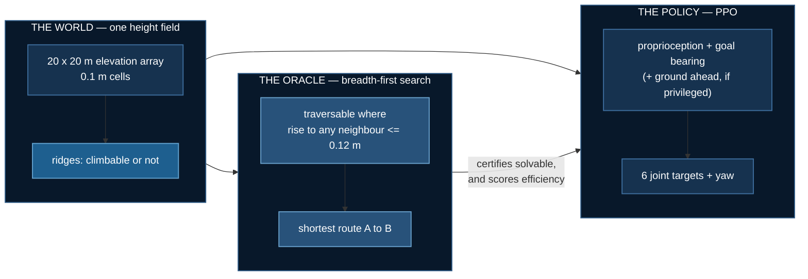
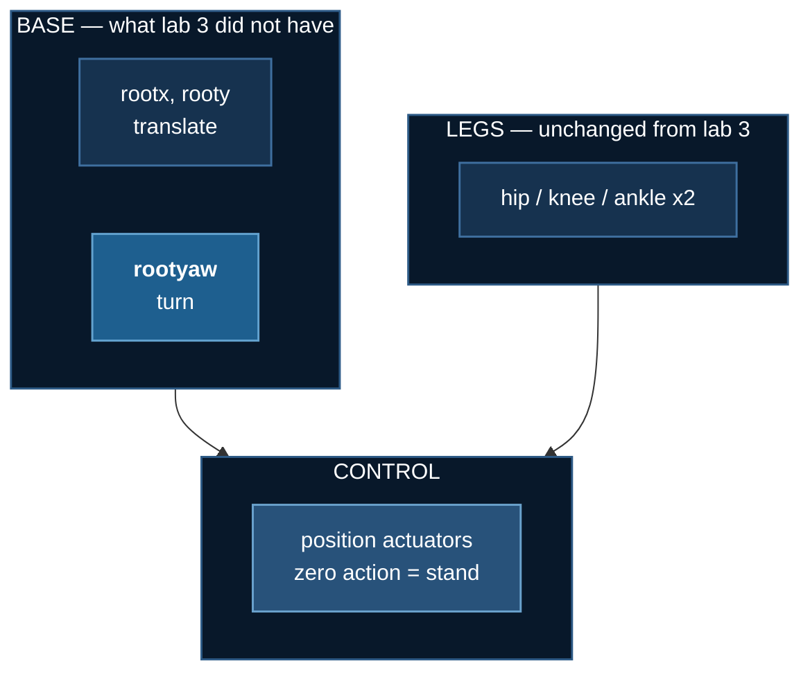

# Climb it or walk around it

Labs 1–3 were **planar**. The robot had two base joints — forward and
up — so the terrain was a profile along a line, every obstacle arrived
head-on, and there was never a choice to make. Lab 3 ended with a
camera that helped on ascent and nothing else, because on a corridor
there is nothing to decide.

This lab adds the missing dimension. A 20 × 20 m arena, a random start
**A** and goal **B**, and ridges of two kinds that demand opposite
responses:


| | rise | the right response |
|---|---|---|
| **climbable** | ≤ 0.12 m | go straight over — detouring costs distance |
| **impassable** | ≥ 0.45 m | walk to its end — trying to climb wastes the episode |

The threshold is not arbitrary: [lab 2](./biped-stairs) measured a
two-legged robot climbing 0.04–0.10 m treads reliably and failing above
that, so the boundary sits where that lab's evidence puts it.

## Everything this page said before was measured in a broken frame

This page previously reported that the privileged policy beat the
blind one on **7 of 9 seeds, Wilcoxon p = 0.022**. That result is
**withdrawn**, and the correction reverses its direction.

`rootx` and `rooty` are **slide** joints. The torso body was declared
in the XML at `pos="(start_x, start_y)"` while `reset()` *also* wrote
the start into `qpos` — and a slide joint displaces from wherever the
body is declared. So the robot spawned at **twice its start
coordinates**, frequently off the height field altogether.

$$
p_{\text{world}} \;=\; \underbrace{(s_x, s_y)}_{\text{XML body pos}}
\;+\; \underbrace{(s_x, s_y)}_{\texttt{reset() writes qpos}}
\;=\; 2\,(s_x, s_y)
$$

Every distance, every terrain probe and the arrival test then ran in a
frame shifted by the start offset: `to_goal()` read 10.44 m where the
true distance was 14.78 m. **Eighteen property checks passed
throughout**, because not one of them compared the lab's own idea of
position against MuJoCo's.

Both arrival rates are about **five times higher** in the corrected
frame, because a robot that starts on the map can actually cross it.
Every figure and every animation below was regenerated.

## The result: information helps, width hurts, and they were confounded

Three arms, **nine seeds each**, 120 evaluation episodes per checkpoint
on identical maps.


| arm | obs dims | pooled arrival | range | **collapsed** (&lt;10%) | mean of seeds that trained |
|---|---|---|---|---|---|
| blind — proprioception + goal bearing | 21 | **41.1%** | 32–56% | **0 / 9** | 41.1% |
| **privileged** — plus the ground ahead | 27 | 27.3% | 0–52% | **4 / 9** | **47.3%** |
| **padded control** — plus six zeros | 27 | 31.3% | 0–53% | **2 / 9** | 39.2% |

Paired blind against privileged: ahead on **3 of 9 seeds**, mean
**−13.8 points**, Wilcoxon exact **p = 0.250**, sign test 0.508. There
is no arrival advantage.

But look at the per-seed numbers rather than the means. They are not
scattered around a centre — they are **bimodal, and only in one arm**.
The privileged policy either reaches 44–52% or sits at 0–5%, with
nothing in between. The blind policy never does it.

:::warning A mean over a bimodal arm describes no run in it
"Privileged averages 27.3%" is true and useless. No privileged seed
scored anywhere near 27%. Four scored under 5% and five scored over
44%. Reporting the mean alone would have hidden the only interesting
thing in the data.
:::

### The control this lab should have run first

Two explanations fit that bimodality equally well, and **blind against
privileged cannot separate them**, because it changes the information
and the dimensionality at the same time:

- the six extra **dimensions** destabilise PPO at this scale, or
- those particular **features** are harmful.

One experiment tells them apart. Widen the blind observation to 27 with
**six constant zeros** — identical width, zero information:

$$
o_{\text{padded}} \;=\; \big[\, o_{\text{blind}} \;,\; \underbrace{0,0,0,0,0,0}_{\text{carries nothing}} \,\big]
\in \mathbb{R}^{27}
$$


**Six constant zeros collapsed 2 of 9 seeds.** Blind collapsed none.
Observation width destabilises this policy on its own, carrying no
information whatsoever.

| comparison | Fisher exact |
|---|---|
| blind 0/9 vs privileged 4/9 | p = 0.082 |
| blind 0/9 vs **padded 2/9** | p = 0.471 |
| padded 2/9 vs privileged 4/9 | p = 0.620 |

The control lands **between** the two arms and is not statistically
separable from either. So the claim this lab can defend is narrow, and
stated narrowly:

> Adding six inputs to a 12k-parameter policy costs reliability **even
> when those inputs carry nothing**. The terrain features do look
> useful *conditional on the run surviving* — privileged is the best
> arm at 47.3% among seeds that trained, in the tightest band of the
> three — but this experiment cannot attribute the extra collapses to
> the features rather than to the width.

:::danger The study is not powered to finish this argument
Separating a 22% collapse rate from a 44% one at 80% power needs about
**70 seeds per arm**. Separating 0% from 22% needs about 40. This has
**nine**. The blind-against-privileged collapse gap is a **trend**
(p = 0.082), not a result, and the width-versus-features question is
left open rather than resolved in whichever direction reads better.
:::

### Path efficiency

Scored only on seeds that trained, as `geodesic / distance walked to B`:

| arm | efficiency | fell |
|---|---|---|
| blind | 82.6% (69–91%) | 28.1% |
| privileged | 77.6% (66–85%) | 16.1% |
| padded | 84.3% (72–91%) | 24.1% |


No efficiency advantage either. Privileged falls least — the one axis
on which the terrain channel shows an unambiguous benefit.

:::tip This was caught by watching the animation
A reader asked why the orange track reaches the flag while the robot
is somewhere else. That is the bug, visible: the robot arrives, the
clip keeps running, and the odometer keeps counting. A figure that
disagrees with the thing it describes is worth more than a figure that
merely looks plausible.
:::

## How it is put together



The oracle **certifies** each map is solvable — an unsolvable arena
scores every policy at zero and reads as a hard task rather than a
broken one, which this repository has shipped twice. It also walks B
back along its own route to set the goal range.

It is **not** the denominator for efficiency, and the reason is a bug
worth keeping. That search is 4-connected, so it cannot move
diagonally: it staircases, and a straight diagonal of length $L$ comes
back as $L\sqrt{2}$. Across 59 maps it overstates the true shortest
distance by **mean 1.199×, max 1.424×** against a $\sqrt{2} = 1.414$
ceiling. Efficiency is scored against a separate 8-connected Dijkstra
instead, and `solve()` is left alone precisely because changing it
would move the goals and redefine the task.

### What the robot observes

Goal is given in the robot's own frame — range and the sine and cosine
of relative bearing:

$$
g_t = \Big[\tfrac{\lVert \mathbf{b} - \mathbf{p}_t \rVert}{20},\;
\sin(\beta_t - \psi_t),\; \cos(\beta_t - \psi_t)\Big]
$$

where $\beta_t$ is the world bearing to **B** and $\psi_t$ the robot's
yaw. A world-frame goal invites memorising positions in a fixed arena;
a relative one is the same problem wherever you put it.

The privileged channel is **six numbers**, probing three directions:

$$
\Delta_k = \max_{r \in [0.6,\,3.0]}
\big[h(\mathbf{p}_t + r\,\hat{u}_{\psi_t + \phi_k}) - h(\mathbf{p}_t)\big],
\qquad \phi_k \in \{0,\, +0.7,\, -0.7\}
$$

paired with a climbable flag $\mathbb{1}[\Delta_k > 0.12]$ for each.
Rises are measured **relative to the ground underfoot**, because the
decision is about the step to clear, not the altitude.

:::danger The first version used 121 numbers, and it broke the arm
An 11 × 11 raw height patch gave a 142-dimensional observation to a
2 × 64 MLP. All three seeds sat at **exactly 0% arrival** for the entire
run while blind reached 17%.

That is a broken arm, not a finding. Reporting "more information made
it worse" from it would have been wrong, and the only reason it was
caught is that three identical zeros are impossible by chance. Six
summary features — which is also the shape a real perception stack
emits — train fine.
:::

### The reward

$$
r_t = \underbrace{10\,(d_{t-1} - d_t)}_{\text{progress toward B}}
\;+\; \underbrace{1.5}_{\text{alive}}
\;-\; 10^{-3}\lVert a_t \rVert^2
\;+\; \underbrace{100 \cdot \mathbb{1}[\text{first arrival}]}_{\text{once}}
$$

Progress toward **B**, not forward velocity. Every earlier lab paid for
velocity, which on a corridor is the same thing; here it is not —
sprinting north when the goal is east is worth nothing.

:::warning Arriving used to END the episode, which made success the worst outcome
With a 2000-step cap, standing still earned $1.5 \times 2000 = 3000$.
Walking 7 m and arriving at step ~700 earned $1050 + 70 + 50 = 1170$.
Terminating on success forfeited ~1300 steps of alive bonus, so
**arriving was worth 2.5× less than loitering** — and the policy,
correctly, learned not to arrive. 75% of episodes ended in a fall after
1.4 m.

[Lab 1](./obstacle-hopper) documents the mirror of this: *"the one-off
bonus must be one-off. Pay it every tick and standing on the box
forever beats crossing it."* Same arithmetic, opposite direction. The
episode now continues after arrival.
:::

## The robot, and one simplification stated plainly



**Torso pitch and roll stay locked.** The robot turns and translates but
cannot tip over. That is inherited from measurement, not convenience:
lab 1 found that freeing the torso produces the bipedal-balance
problem — 1M steps gave something that dived forward and fell at one
second — and lab 2's 2×2 found that with two legs, freeing it costs a
lot of return and buys no extra climbing.

What it buys is that the hard part here is **navigation** rather than
balance. What it costs is stated rather than hidden: nothing in this lab
measures recovery, and yaw is actuated directly because a planar biped
with locked roll cannot generate yaw torque through contact.

:::tip Position actuators, not torque
Labs 1–3 used torque control. It does not survive the jump to
navigation: this body needs a specific sustained torque pattern just to
stand — measured at hip 0.6 / knee 1.0, with anything less collapsing
in under 50 steps — and random exploration almost never finds it. **A
1M-step run on flat ground reached 0% arrival** because the policy spent
its entire budget failing to stand.

With position control a zero action holds the standing pose and the
policy learns deviations from it.
:::

## Watch it


Green is the oracle's shortest route, orange is where the robot actually
went. Both are drawn as **scene geometry**, not painted onto the frame —
see the note below.


### From an angle

Overhead reads the route; it flattens the terrain. These show the
relief the robot is actually dealing with — and they only work because
the route and track are **scene geometry**, so they project correctly
at any camera angle.


The HUD on these carries a **terrain compass** — the same three probes
the privileged policy receives, with each reading red when the rise
exceeds the 0.12 m climbable threshold. On the blind arm the panel is
greyed and marked *not observed*, because a HUD that looked identical
for both arms would quietly imply they see the same thing.


**This is the common case.** The best arm reaches B in about four
episodes in ten, so a reel of successes would misrepresent the lab.
This clip is a policy that walks competently into the wrong side of a
ridge and times out 4.1 m short — not one that falls over, which would
teach nothing about navigation.

:::warning The overlay was wrong by 21%, and it looked like bad art
The route and track were first *painted* onto the finished frame, which
means projecting world metres to pixels by hand — reimplementing
MuJoCo's camera. The hand version was wrong: rendered terrain spanned
591 px where the projection predicted 487. Every route line sat a fifth
of a frame from the thing it described.

They are now MuJoCo scene geometry, rendered through the same camera as
the terrain, so they cannot disagree at any angle. Two follow-on fixes
were needed — the default headlight was bleaching the height field, and
emission at 0.85 washed a green marker and an orange one into the same
yellow, which is exactly the distinction the figure exists to make.
:::

## What this lab does not claim


- **The task is not solved.** The best arm reaches B in about four
  episodes in ten.
- **There is no arrival advantage for terrain information**, and the
  collapse difference between the arms is a trend (p = 0.082), not a
  result.
- **The width-versus-features question is open.** Settling it needs
  roughly 70 seeds per arm; this has nine, and says so rather than
  picking whichever reading sounds better.
- **Every run peaks mid-training and sags.** 1.5M steps is short here,
  and there may be late instability. The final checkpoint is what is
  scored; the *peak* is not, because the peak of ~60 noisy 12-episode
  evaluations is max-of-noise and selecting on it would manufacture an
  advantage.
- **This is a privileged channel, not a camera.** A depth arm would need
  distillation, as in [lab 3](./terrain-vision).
- **Four privileged seeds of nine failed outright**, and all four stay
  in the table.

## The measurement lessons

**The ruler was coarser than the effect.** The in-training evaluation
uses 12 episodes, which quantises to 8.3% — so it once reported two
arms as *exactly* 8.3% versus 8.3%. Everything published here comes
from `evaluate.py` at 120 episodes, never from the training log. The
*peak* of a training curve is equally unusable: it is the maximum of
~60 noisy 12-episode evaluations, and selecting on it manufactures an
advantage out of noise.

**An impossible number is evidence — do not clamp it.** Efficiency was
computed as `route / distance`, and three episodes came back at 133%,
136% and 144%: a policy beating the optimum, which cannot happen. The
code wrapped the ratio in `min(..., 1.0)`, so every one of them was
silently rewritten to *exactly 100%*. The clamp did not just hide the
symptom; it destroyed the only signal that the denominator was wrong.
The √2 bug above survived behind it.

**A figure and a number that disagree are not a rendering quirk.** The
runs never recorded `goal_range`, so the renderer rebuilt the world
without one and filmed goals at the map's own endpoints — a harder
task than any policy here was trained on. The clips showed the robot
stranded 14 m out beside a table reporting 42% arrival. Each run now
records the task it was trained on, and the renderer reads it.

**An asset nothing generates cannot be corrected.** One animation on
this page had been rendered once by hand and orphaned. When the lab was
re-rendered after the frame fix, that file **silently survived from the
broken world**, sitting here beside eight corrected clips and
indistinguishable from them. There is now a check that every image
these pages show is produced by a shipped command.

## Running it

```bash
cd 07_physical_ai/04_terrain_navigation
uv sync

uv run world.py --check 200         # are the maps solvable, and do they detour?
uv run robot.py                     # the body, dropped on a map
uv run nav_env.py                   # random baseline

uv run train_nav.py --flat --name gate_flat   # the LOCOMOTION GATE, first

# three arms, nine seeds. blind and privileged are the experiment;
# padded is the control that makes the comparison interpretable at all.
for s in 0 1 2 3 4 5 6 7 8; do
  for m in blind privileged padded; do
    uv run train_nav.py --mode $m --seed $s --goal-range 7 --name nav5_${m}_s$s
  done
done

uv run evaluate.py --prefix nav5_ --episodes 120   # the published numbers
uv run make_figures.py && uv run render.py --all
```

`--flat` comes first and is not part of the experiment. It removes the
terrain and asks only whether the body can walk to a point and turn to
face it. If that fails, nothing measured on rough ground means anything
— and it *did* fail, twice, before the position-actuator and start-pose
fixes.

```bash
uv run ../../tests/test_terrain_navigation.py    # 18 checks, no GPU
```

## References

- Schulman et al., [PPO](https://arxiv.org/abs/1707.06347), 2017 ·
  [GAE](https://arxiv.org/abs/1506.02438), 2015
- Lee et al., [Learning quadrupedal locomotion over challenging terrain](https://arxiv.org/abs/2010.11251),
  Science Robotics 2020
- Miki et al., [Learning robust perceptive locomotion](https://arxiv.org/abs/2201.08117),
  Science Robotics 2022
- Agarwal et al., [Deep RL at the Edge of the Statistical Precipice](https://arxiv.org/abs/2108.13264),
  NeurIPS 2021 — why a handful of seeds and a mean are not enough
- [MuJoCo height fields](https://mujoco.readthedocs.io/en/stable/XMLreference.html#asset-hfield)
