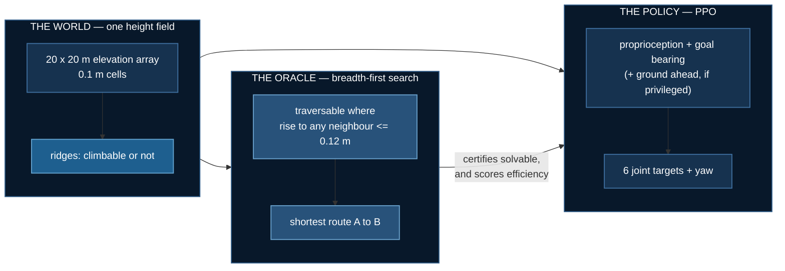
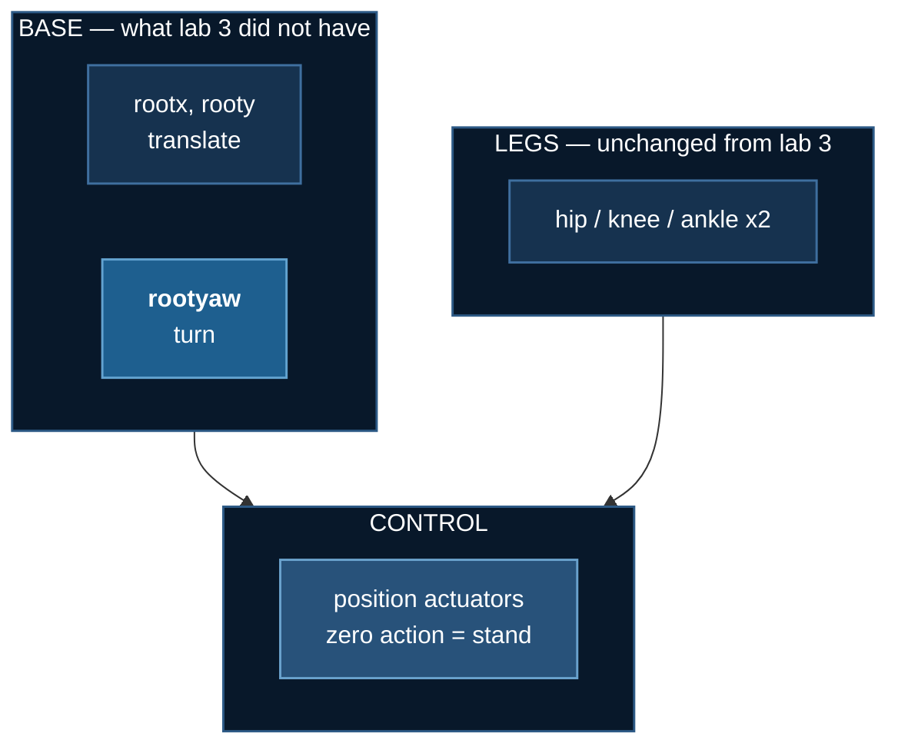

# Terrain Navigation

## Abstract

A two-legged robot is dropped at a random point **A** in a 20 × 20 m
arena and has to reach a random point **B**. Between them lie long
ridges of two kinds: low ones it should walk straight over, and high
ones it must walk around. We asked a question that sounds like it has
an obvious answer — *does telling the robot what the ground ahead
looks like help it get there?* — and measured it across 27 training
runs. The answer was no, and the reason turned out to be more
interesting than a yes would have been: the extra information made
training **less reliable**, and a control experiment showed that
feeding the robot six numbers that were *always zero* did much of the
same damage. This page walks through the task, the result, the three
bugs we had to fix before the result meant anything, and the limits of
what nine random seeds can actually establish.

## Problem Statement

### Labs 1–3 could not ask this question

The three labs before this one were **planar**. The robot had two base
joints — forward and up — so terrain was a profile along a line, every
obstacle arrived head-on, and there was never a choice to make. You
could go over the thing in front of you or you could stop. [Lab
3](./terrain-vision) ended by giving the robot a camera, and the camera
helped on ascent and nowhere else, for exactly this reason: on a
corridor, there is nothing to decide.

Routing only becomes a question when the robot can go *around*
something. That needs a second dimension.

### The arena, and the two kinds of obstacle


| | rise | the right response |
|---|---|---|
| **climbable** | ≤ 0.12 m | go straight over — detouring costs distance |
| **impassable** | ≥ 0.45 m | walk to its end — trying to climb wastes the episode |

The threshold is not arbitrary: [lab 2](./biped-stairs) measured a
two-legged robot climbing 0.04–0.10 m treads reliably and failing above
that, so the boundary sits where that lab's evidence puts it.

The two classes look different to a planner and identical to a blind
robot, which is what makes the experiment possible: we can give one
policy a description of the ground ahead, withhold it from another,
and see whether it matters.

### The question, stated so it can lose

> If a policy handed the ground profile ahead does not beat a blind one
> on arrival rate, then terrain information is not what this task
> needs.

Writing it this way matters. A claim phrased so that any outcome
confirms it is not a finding. This one could lose, and it did.

## Solution

### How it is put together



The oracle **certifies** each map is solvable — an unsolvable arena
scores every policy at zero and reads as a hard task rather than a
broken one, which this repository has shipped twice. It also walks B
back along its own route to set the goal range.

It is **not** the denominator for efficiency, and the reason is a bug
worth keeping. That search is 4-connected, so it cannot move
diagonally: it staircases, and a straight diagonal of length $L$ comes
back as $L\sqrt{2}$. Across 59 maps it overstates the true shortest
distance by **mean 1.199×, max 1.424×** against a $\sqrt{2} = 1.414$
ceiling. Efficiency is scored against a separate 8-connected Dijkstra
instead, and `solve()` is left alone precisely because changing it
would move the goals and redefine the task.

### What the robot observes

Goal is given in the robot's own frame — range and the sine and cosine
of relative bearing:

$$
g_t = \Big[\tfrac{\lVert \mathbf{b} - \mathbf{p}_t \rVert}{20},\;
\sin(\beta_t - \psi_t),\; \cos(\beta_t - \psi_t)\Big]
$$

where $\beta_t$ is the world bearing to **B** and $\psi_t$ the robot's
yaw. A world-frame goal invites memorising positions in a fixed arena;
a relative one is the same problem wherever you put it.

The privileged channel is **six numbers**, probing three directions:

$$
\Delta_k = \max_{r \in [0.6,\,3.0]}
\big[h(\mathbf{p}_t + r\,\hat{u}_{\psi_t + \phi_k}) - h(\mathbf{p}_t)\big],
\qquad \phi_k \in \{0,\, +0.7,\, -0.7\}
$$

paired with a climbable flag $\mathbb{1}[\Delta_k > 0.12]$ for each.
Rises are measured **relative to the ground underfoot**, because the
decision is about the step to clear, not the altitude.

:::danger The first version used 121 numbers, and it broke the arm
An 11 × 11 raw height patch gave a 142-dimensional observation to a
2 × 64 MLP. All three seeds sat at **exactly 0% arrival** for the entire
run while blind reached 17%.

That is a broken arm, not a finding. Reporting "more information made
it worse" from it would have been wrong, and the only reason it was
caught is that three identical zeros are impossible by chance. Six
summary features — which is also the shape a real perception stack
emits — train fine.
:::

### The reward

$$
r_t = \underbrace{10\,(d_{t-1} - d_t)}_{\text{progress toward B}}
\;+\; \underbrace{1.5}_{\text{alive}}
\;-\; 10^{-3}\lVert a_t \rVert^2
\;+\; \underbrace{100 \cdot \mathbb{1}[\text{first arrival}]}_{\text{once}}
$$

Progress toward **B**, not forward velocity. Every earlier lab paid for
velocity, which on a corridor is the same thing; here it is not —
sprinting north when the goal is east is worth nothing.

:::warning Arriving used to END the episode, which made success the worst outcome
With a 2000-step cap, standing still earned $1.5 \times 2000 = 3000$.
Walking 7 m and arriving at step ~700 earned $1050 + 70 + 50 = 1170$.
Terminating on success forfeited ~1300 steps of alive bonus, so
**arriving was worth 2.5× less than loitering** — and the policy,
correctly, learned not to arrive. 75% of episodes ended in a fall after
1.4 m.

[Lab 1](./obstacle-hopper) documents the mirror of this: *"the one-off
bonus must be one-off. Pay it every tick and standing on the box
forever beats crossing it."* Same arithmetic, opposite direction. The
episode now continues after arrival.
:::

### The robot, and one simplification stated plainly



**Torso pitch and roll stay locked.** The robot turns and translates but
cannot tip over. That is inherited from measurement, not convenience:
lab 1 found that freeing the torso produces the bipedal-balance
problem — 1M steps gave something that dived forward and fell at one
second — and lab 2's 2×2 found that with two legs, freeing it costs a
lot of return and buys no extra climbing.

What it buys is that the hard part here is **navigation** rather than
balance. What it costs is stated rather than hidden: nothing in this lab
measures recovery, and yaw is actuated directly because a planar biped
with locked roll cannot generate yaw torque through contact.

:::tip Position actuators, not torque
Labs 1–3 used torque control. It does not survive the jump to
navigation: this body needs a specific sustained torque pattern just to
stand — measured at hip 0.6 / knee 1.0, with anything less collapsing
in under 50 steps — and random exploration almost never finds it. **A
1M-step run on flat ground reached 0% arrival** because the policy spent
its entire budget failing to stand.

With position control a zero action holds the standing pose and the
policy learns deviations from it.
:::

## Experiments and Results

### First attempt: a clean result that was entirely wrong

Our first run of this experiment produced exactly the answer we
expected. The privileged policy beat the blind one on **7 of 9 seeds**,
Wilcoxon **p = 0.022** — information helps, significant, done. We
published it.

It was wrong, and nothing in the code said so. The arrival rates were
plausible, every test passed, and the figures looked clean. What
eventually gave it away was somebody watching an animation and asking
why the robot was standing in the middle of the map while the orange
trail showing its path had already reached the goal flag.

The robot was being spawned in the wrong place. `rootx` and `rooty`
are **slide** joints. The torso body was declared
in the XML at `pos="(start_x, start_y)"` while `reset()` *also* wrote
the start into `qpos` — and a slide joint displaces from wherever the
body is declared. So the robot spawned at **twice its start
coordinates**, frequently off the height field altogether.

$$
p_{\text{world}} \;=\; \underbrace{(s_x, s_y)}_{\text{XML body pos}}
\;+\; \underbrace{(s_x, s_y)}_{\texttt{reset() writes qpos}}
\;=\; 2\,(s_x, s_y)
$$

Every distance, every terrain probe and the arrival test then ran in a
frame shifted by the start offset: `to_goal()` read 10.44 m where the
true distance was 14.78 m. **Eighteen property checks passed
throughout**, because not one of them compared the lab's own idea of
position against MuJoCo's.

Both arrival rates turned out about **five times higher** once this
was fixed, because a robot that starts on the map can actually cross
it. Every figure and animation on this page was regenerated afterwards,
and the result below is what the corrected experiment says.

The lesson we took from it is not "check your coordinates". It is that
**a test suite proves things about the questions it asks, and nothing
about the ones it does not.** Eighteen checks were watching this lab
and none of them compared the two numbers that disagreed.

### What the corrected experiment found

Three arms, **nine seeds each**, 120 evaluation episodes per checkpoint
on identical maps.


| arm | obs dims | pooled arrival | range | **collapsed** (&lt;10%) | mean of seeds that trained |
|---|---|---|---|---|---|
| blind — proprioception + goal bearing | 21 | **41.1%** | 32–56% | **0 / 9** | 41.1% |
| **privileged** — plus the ground ahead | 27 | 27.3% | 0–52% | **4 / 9** | **47.3%** |
| **padded control** — plus six zeros | 27 | 31.3% | 0–53% | **2 / 9** | 39.2% |

Paired blind against privileged: ahead on **3 of 9 seeds**, mean
**−13.8 points**, Wilcoxon exact **p = 0.250**, sign test 0.508. There
is no arrival advantage.

But look at the per-seed numbers rather than the means. They are not
scattered around a centre — they are **bimodal, and only in one arm**.
The privileged policy either reaches 44–52% or sits at 0–5%, with
nothing in between. The blind policy never does it.

:::warning A mean over a bimodal arm describes no run in it
"Privileged averages 27.3%" is true and useless. No privileged seed
scored anywhere near 27%. Four scored under 5% and five scored over
44%. Reporting the mean alone would have hidden the only interesting
thing in the data.
:::

### Why we changed direction: the comparison was not valid

At this point we had what looked like a tidy story — *extra
information destabilises training* — and we were ready to write it up
that way. Then we noticed the comparison could not support it.

Going from blind to privileged changes **two things at once**: the
robot gains six numbers describing the terrain, and its observation
vector grows from 21 entries to 27. Those are different causes with
the same symptom, and the experiment as designed could not tell them
apart:

- the six extra **dimensions** destabilise PPO at this scale, or
- those particular **features** are harmful.

So we ran a third arm that we had not originally planned. Take the
blind observation and pad it out to 27 entries with **six constant
zeros** — the same width as privileged, carrying no information at
all. If width is the culprit, this arm should break too. If the
terrain features are the culprit, it should be as stable as blind:

$$
o_{\text{padded}} \;=\; \big[\, o_{\text{blind}} \;,\; \underbrace{0,0,0,0,0,0}_{\text{carries nothing}} \,\big]
\in \mathbb{R}^{27}
$$


**Six constant zeros collapsed 2 of 9 seeds.** Blind collapsed none.
Observation width destabilises this policy on its own, carrying no
information whatsoever.

| comparison | Fisher exact |
|---|---|
| blind 0/9 vs privileged 4/9 | p = 0.082 |
| blind 0/9 vs **padded 2/9** | p = 0.471 |
| padded 2/9 vs privileged 4/9 | p = 0.620 |

The control lands **between** the two arms and is not statistically
separable from either. So the claim this lab can defend is narrow, and
stated narrowly:

> Adding six inputs to a 12k-parameter policy costs reliability **even
> when those inputs carry nothing**. The terrain features do look
> useful *conditional on the run surviving* — privileged is the best
> arm at 47.3% among seeds that trained, in the tightest band of the
> three — but this experiment cannot attribute the extra collapses to
> the features rather than to the width.

:::danger Why we stopped here instead of picking an answer
It would be easy to read the table above as "width explains about half
of it" and move on. We nearly did. Then we worked out how much
evidence that claim would actually need.

To distinguish the padded arm's 22% collapse rate from the privileged
arm's 44% — with an 80% chance of detecting a difference that real —
takes roughly **70 seeds per arm**. Distinguishing blind's 0% from
padded's 22% takes about **40**. We have **nine**, which is already
27 training runs and about eleven hours of compute.

So two statements on this page are deliberately weaker than the
numbers appear to allow. The blind-versus-privileged collapse gap is a
**trend** (p = 0.082), not a result. And whether the damage comes from
the width or from the features is **left open**, because we can show
width does *some* of it and we cannot show it does *all* of it.

This is the uncomfortable version. The comfortable version — picking
whichever reading sounded better and reporting it as the finding — is
how the first result on this page came to be wrong.
:::

### Did it at least walk shorter routes?

Scored only on seeds that trained, as `geodesic / distance walked to B`:

| arm | efficiency | fell |
|---|---|---|
| blind | 82.6% (69–91%) | 28.1% |
| privileged | 77.6% (66–85%) | 16.1% |
| padded | 84.3% (72–91%) | 24.1% |


No efficiency advantage either. Privileged falls least — the one axis
on which the terrain channel shows an unambiguous benefit.

:::tip One number here moved for a boring reason worth knowing
"Distance walked" originally kept counting after the robot reached B.
Because the episode deliberately runs on past arrival, a policy that
walked a near-optimal route and then idled near the goal for another
1,300 steps was scored at roughly half its true efficiency. Frozen at
arrival, every arm came out far better than first reported — and the
ranking between them changed. Efficiency above is measured to the
moment of arrival.
:::

### Watch it


Green is the oracle's shortest route, orange is where the robot actually
went. Both are drawn as **scene geometry**, not painted onto the frame —
see the note below.


#### From an angle

Overhead reads the route; it flattens the terrain. These show the
relief the robot is actually dealing with — and they only work because
the route and track are **scene geometry**, so they project correctly
at any camera angle.


The HUD on these carries a **terrain compass** — the same three probes
the privileged policy receives, with each reading red when the rise
exceeds the 0.12 m climbable threshold. On the blind arm the panel is
greyed and marked *not observed*, because a HUD that looked identical
for both arms would quietly imply they see the same thing.


**This is the common case.** The best arm reaches B in about four
episodes in ten, so a reel of successes would misrepresent the lab.
This clip is a policy that walks competently into the wrong side of a
ridge and times out 4.1 m short — not one that falls over, which would
teach nothing about navigation.

:::warning The overlay was wrong by 21%, and it looked like bad art
The route and track were first *painted* onto the finished frame, which
means projecting world metres to pixels by hand — reimplementing
MuJoCo's camera. The hand version was wrong: rendered terrain spanned
591 px where the projection predicted 487. Every route line sat a fifth
of a frame from the thing it described.

They are now MuJoCo scene geometry, rendered through the same camera as
the terrain, so they cannot disagree at any angle. Two follow-on fixes
were needed — the default headlight was bleaching the height field, and
emission at 0.85 washed a green marker and an orange one into the same
yellow, which is exactly the distinction the figure exists to make.
:::

### Scaling it up: a 40 m world

Everything above is a 20 x 20 m arena with 14 ridges and goals 7 m
away. The obvious question is whether any of it survives a bigger
world, so here is the same experiment at **four times the area**:

| | standard | large |
|---|---|---|
| arena | 20 x 20 m | **40 x 40 m** |
| ridges | 14 | **42** |
| A to B | 7 m | **20 m** |
| episode | 20 s | **60 s** |
| cost of refusing to climb | mean +5.94 m | mean **+13.80 m** |


The robot walks **26.9 m against a 21.6 m shortest path — 95%
efficient** — across an arena three times the width of the one it was
originally built for.

#### What the scale-up shows, and what it does not

**It works:** the task is learnable at 4x the area. Pooled arrival is
25.0% blind and 30.0% privileged over 60 episodes per checkpoint, and
path efficiency is **89–95%**, noticeably tighter than the small
world's 83%. Nothing about the method broke when the box got bigger.

**It proves nothing about the arms.** Three seeds per arm, intervals
that overlap heavily, and the ordering is the *opposite* of the
nine-seed result above. That is what three seeds buy you. It is
reported here as evidence the task scales, not as a comparison.

**The routing story is weaker than it looks.** Capping the goal at
20 m pulls B back along the oracle's route onto a straight segment, so
the detour ratio in these clips is only **1.08** — the robot covers
real distance but is not forced into the dramatic go-around the small
world's clips show. The uncapped big world has a 1.36 detour ratio,
but filming that would mean showing a policy a task it was never
trained on, which is the exact mistake documented above. The honest
clip is the one the policy was actually trained for.

:::tip A policy that beats the oracle is telling you the oracle is wrong
Three of nineteen arriving episodes scored **over 100% efficiency** —
one walked 19.8 m where the "shortest path" was 21.6 m. That is not a
measurement bug this time. `traversable()` blocks a cell when the rise
to any neighbour exceeds 0.12 m, but a physical body can clip the
corner of a ridge the grid forbids, so the oracle is a **conservative
lower bound** on what the robot can do.

Which is exactly why the `min(..., 1.0)` clamp had to go. Last time
an impossible number meant a broken denominator; this time it means a
real capability the planner cannot express. Both are worth knowing and
the clamp would have erased both.
:::

## What This Lab Does Not Claim


- **The task is not solved.** The best arm reaches B in about four
  episodes in ten.
- **There is no arrival advantage for terrain information**, and the
  collapse difference between the arms is a trend (p = 0.082), not a
  result.
- **The width-versus-features question is open.** Settling it needs
  roughly 70 seeds per arm; this has nine, and says so rather than
  picking whichever reading sounds better.
- **Every run peaks mid-training and sags.** 1.5M environment steps is
  short for this task,
  and there may be late instability. The final checkpoint is what is
  scored; the *peak* is not, because the peak of ~60 noisy 12-episode
  evaluations is max-of-noise and selecting on it would manufacture an
  advantage.
- **This is a privileged channel, not a camera.** A depth arm would need
  distillation, as in [lab 3](./terrain-vision).
- **Four privileged seeds of nine failed outright**, and all four stay
  in the table.

## What Went Wrong, and What It Taught Us

Building this lab took several attempts, and the failures were more
instructive than the result. What they have in common is that **none
of them crashed**. Every one produced plausible numbers, passed the
tests that existed at the time, and would have been published as a
finding if nobody had looked twice. They are collected here because
the same shapes recur in any measurement-heavy project.

**The ruler was coarser than the effect.** The in-training evaluation
uses 12 episodes, which quantises to 8.3% — so it once reported two
arms as *exactly* 8.3% versus 8.3%. Everything published here comes
from `evaluate.py` at 120 episodes, never from the training log. The
*peak* of a training curve is equally unusable: it is the maximum of
~60 noisy 12-episode evaluations, and selecting on it manufactures an
advantage out of noise.

**An impossible number is evidence — do not clamp it.** Efficiency was
computed as `route / distance`, and three episodes came back at 133%,
136% and 144%: a policy beating the optimum, which cannot happen. The
code wrapped the ratio in `min(..., 1.0)`, so every one of them was
silently rewritten to *exactly 100%*. The clamp did not just hide the
symptom; it destroyed the only signal that the denominator was wrong.
The √2 bug above survived behind it.

**A figure and a number that disagree are not a rendering quirk.** The
runs never recorded `goal_range`, so the renderer rebuilt the world
without one and filmed goals at the map's own endpoints — a harder
task than any policy here was trained on. The clips showed the robot
stranded 14 m out beside a table reporting 42% arrival. Each run now
records the task it was trained on, and the renderer reads it.

**An asset nothing generates cannot be corrected.** One animation on
this page had been rendered once by hand and orphaned. When the lab was
re-rendered after the frame fix, that file **silently survived from the
broken world**, sitting here beside eight corrected clips and
indistinguishable from them. There is now a check that every image
these pages show is produced by a shipped command.

## Running It

```bash
cd 07_physical_ai/04_terrain_navigation
uv sync

uv run world.py --check 200         # are the maps solvable, and do they detour?
uv run robot.py                     # the body, dropped on a map
uv run nav_env.py                   # random baseline

uv run train_nav.py --flat --name gate_flat   # the LOCOMOTION GATE, first

# three arms, nine seeds. blind and privileged are the experiment;
# padded is the control that makes the comparison interpretable at all.
for s in 0 1 2 3 4 5 6 7 8; do
  for m in blind privileged padded; do
    uv run train_nav.py --mode $m --seed $s --goal-range 7 --name nav5_${m}_s$s
  done
done

uv run evaluate.py --prefix nav5_ --episodes 120   # the published numbers
uv run make_figures.py && uv run render.py --all
```

`--flat` comes first and is not part of the experiment. It removes the
terrain and asks only whether the body can walk to a point and turn to
face it. If that fails, nothing measured on rough ground means anything
— and it *did* fail, twice, before the position-actuator and start-pose
fixes.

```bash
uv run ../../tests/test_terrain_navigation.py    # 18 checks, no GPU
```

## References

- Schulman et al., [PPO](https://arxiv.org/abs/1707.06347), 2017 ·
  [GAE](https://arxiv.org/abs/1506.02438), 2015
- Lee et al., [Learning quadrupedal locomotion over challenging terrain](https://arxiv.org/abs/2010.11251),
  Science Robotics 2020
- Miki et al., [Learning robust perceptive locomotion](https://arxiv.org/abs/2201.08117),
  Science Robotics 2022
- Agarwal et al., [Deep RL at the Edge of the Statistical Precipice](https://arxiv.org/abs/2108.13264),
  NeurIPS 2021 — why a handful of seeds and a mean are not enough
- [MuJoCo height fields](https://mujoco.readthedocs.io/en/stable/XMLreference.html#asset-hfield)
