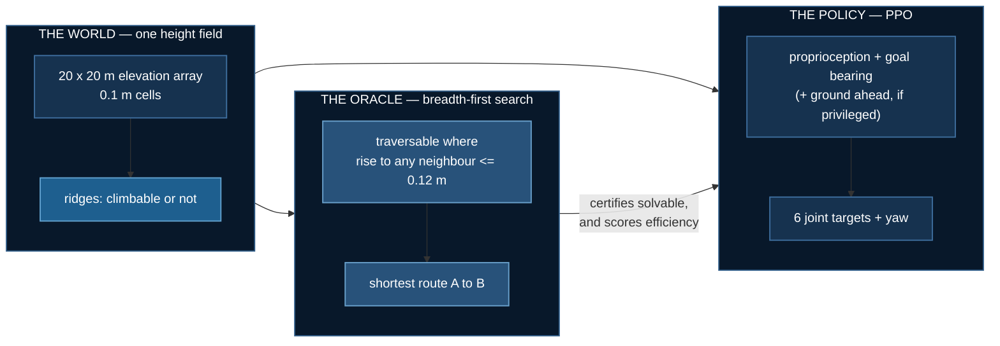
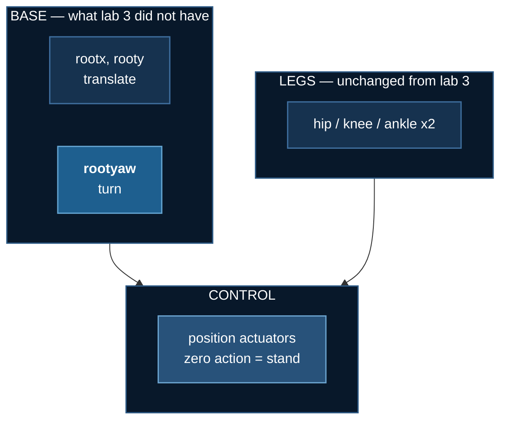

# Climb it or walk around it

Labs 1–3 were **planar**. The robot had two base joints — forward and
up — so the terrain was a profile along a line, every obstacle arrived
head-on, and there was never a choice to make. Lab 3 ended with a
camera that helped on ascent and nothing else, because on a corridor
there is nothing to decide.

This lab adds the missing dimension. A 20 × 20 m arena, a random start
**A** and goal **B**, and ridges of two kinds that demand opposite
responses:


| | rise | the right response |
|---|---|---|
| **climbable** | ≤ 0.12 m | go straight over — detouring costs distance |
| **impassable** | ≥ 0.45 m | walk to its end — trying to climb wastes the episode |

The threshold is not arbitrary: [lab 2](./biped-stairs) measured a
two-legged robot climbing 0.04–0.10 m treads reliably and failing above
that, so the boundary sits where that lab's evidence puts it.

## The result

**Terrain information helps, and it replicated.** Two independent
sweeps, three seeds each, 120 evaluation episodes per checkpoint on
identical maps:


| | arrival | per seed |
|---|---|---|
| blind — proprioception + goal bearing | 8.1% | 8, 15, 0, 4, 19, 1, 1, 12, 14 % |
| **privileged** — plus the ground ahead | **12.1%** | 16, 16, 4, 6, 18, 11, 12, 14, 13 % |

Privileged ahead on **7 of 9 seeds**, mean **+4.0 points**.

| test | 6 seeds | **9 seeds** |
|---|---|---|
| Wilcoxon signed-rank | 0.063 | **0.022** |
| paired t | 0.089 | **0.017** |
| sign test | 0.016 | 0.090 |
| pooled Fisher *(upper bound)* | 0.016 | 0.003 |

The two tests that use effect **magnitude** both strengthened and are
now below 0.05. The sign test weakened, and the reason is worth
knowing: it counts only wins and losses, and the two new losses were
tiny (−1 and −5 points) while the wins were larger. A sign test throws
away exactly the information that distinguishes those. **Wilcoxon is
the headline here.**

Pooling is an upper bound — episodes within a seed share a policy, so
they are not independent.

**The effect size barely moved: +3.9 points at six seeds, +4.0 at
nine.** Three more seeds shifted the estimate by a tenth of a point.

### It also removes the catastrophic runs

Across nine seeds the blind arm produced **0%, 1% and 1%** — three
near-total failures. The privileged arm's worst seed is **4%**. The
information does not only raise the mean; on this evidence it removes
the floor.

### The stronger signal is the route, not the arrival

On maps **both** arms solve, the one that can see the ground walks a
much shorter path:


| seed pair | maps both solved | blind | privileged |
|---|---|---|---|
| sweep 2, s0 | 2 | 52.1% | 60.8% |
| sweep 2, s1 | 7 | 45.5% | 53.2% |
| sweep 3, s1 | 9 | 33.7% | **50.3%** |
| sweep 4, s4 | 4 | 46.9% | **40.5%** |
| sweep 4, s5 | 6 | 44.9% | 51.4% |
| **mean** | | **44.6%** | **51.2%** |

Better on **4 of 5 pairs**, +6.6 points. Only pairs where *both* arms
solved at least two of the same maps appear — four of the nine seed
pairs never overlapped enough to compare, which is itself a
consequence of a 12% arrival rate. This is a paired, *continuous*
measure on identical maps with identical outcomes — far less
quantisation noise than binary arrival, and it says the information
buys **better routes**, not merely more of them.


Same map, same goal, both arrive. The blind robot walks **25.5 m**; the
one that can see the ground walks **17.6 m**.

## How it is put together



The oracle does two jobs, and both matter. It **certifies** each map is
solvable — an unsolvable arena scores every policy at zero and reads as
a hard task rather than a broken one, which this repository has shipped
twice. And its route length is the **denominator** for efficiency.

### What the robot observes

Goal is given in the robot's own frame — range and the sine and cosine
of relative bearing:

$$
g_t = \Big[\tfrac{\lVert \mathbf{b} - \mathbf{p}_t \rVert}{20},\;
\sin(\beta_t - \psi_t),\; \cos(\beta_t - \psi_t)\Big]
$$

where $\beta_t$ is the world bearing to **B** and $\psi_t$ the robot's
yaw. A world-frame goal invites memorising positions in a fixed arena;
a relative one is the same problem wherever you put it.

The privileged channel is **six numbers**, probing three directions:

$$
\Delta_k = \max_{r \in [0.6,\,3.0]}
\big[h(\mathbf{p}_t + r\,\hat{u}_{\psi_t + \phi_k}) - h(\mathbf{p}_t)\big],
\qquad \phi_k \in \{0,\, +0.7,\, -0.7\}
$$

paired with a climbable flag $\mathbb{1}[\Delta_k > 0.12]$ for each.
Rises are measured **relative to the ground underfoot**, because the
decision is about the step to clear, not the altitude.

:::danger The first version used 121 numbers, and it broke the arm
An 11 × 11 raw height patch gave a 142-dimensional observation to a
2 × 64 MLP. All three seeds sat at **exactly 0% arrival** for the entire
run while blind reached 17%.

That is a broken arm, not a finding. Reporting "more information made
it worse" from it would have been wrong, and the only reason it was
caught is that three identical zeros are impossible by chance. Six
summary features — which is also the shape a real perception stack
emits — train fine.
:::

### The reward

$$
r_t = \underbrace{10\,(d_{t-1} - d_t)}_{\text{progress toward B}}
\;+\; \underbrace{1.5}_{\text{alive}}
\;-\; 10^{-3}\lVert a_t \rVert^2
\;+\; \underbrace{100 \cdot \mathbb{1}[\text{first arrival}]}_{\text{once}}
$$

Progress toward **B**, not forward velocity. Every earlier lab paid for
velocity, which on a corridor is the same thing; here it is not —
sprinting north when the goal is east is worth nothing.

:::warning Arriving used to END the episode, which made success the worst outcome
With a 2000-step cap, standing still earned $1.5 \times 2000 = 3000$.
Walking 7 m and arriving at step ~700 earned $1050 + 70 + 50 = 1170$.
Terminating on success forfeited ~1300 steps of alive bonus, so
**arriving was worth 2.5× less than loitering** — and the policy,
correctly, learned not to arrive. 75% of episodes ended in a fall after
1.4 m.

[Lab 1](./obstacle-hopper) documents the mirror of this: *"the one-off
bonus must be one-off. Pay it every tick and standing on the box
forever beats crossing it."* Same arithmetic, opposite direction. The
episode now continues after arrival.
:::

## The robot, and one simplification stated plainly



**Torso pitch and roll stay locked.** The robot turns and translates but
cannot tip over. That is inherited from measurement, not convenience:
lab 1 found that freeing the torso produces the bipedal-balance
problem — 1M steps gave something that dived forward and fell at one
second — and lab 2's 2×2 found that with two legs, freeing it costs a
lot of return and buys no extra climbing.

What it buys is that the hard part here is **navigation** rather than
balance. What it costs is stated rather than hidden: nothing in this lab
measures recovery, and yaw is actuated directly because a planar biped
with locked roll cannot generate yaw torque through contact.

:::tip Position actuators, not torque
Labs 1–3 used torque control. It does not survive the jump to
navigation: this body needs a specific sustained torque pattern just to
stand — measured at hip 0.6 / knee 1.0, with anything less collapsing
in under 50 steps — and random exploration almost never finds it. **A
1M-step run on flat ground reached 0% arrival** because the policy spent
its entire budget failing to stand.

With position control a zero action holds the standing pose and the
policy learns deviations from it.
:::

## Watch it


Green is the oracle's shortest route, orange is where the robot actually
went. Both are drawn as **scene geometry**, not painted onto the frame —
see the note below.


### From an angle

Overhead reads the route; it flattens the terrain. These show the
relief the robot is actually dealing with — and they only work because
the route and track are **scene geometry**, so they project correctly
at any camera angle.


The HUD on these carries a **terrain compass** — the same three probes
the privileged policy receives, with each reading red when the rise
exceeds the 0.12 m climbable threshold. On the blind arm the panel is
greyed and marked *not observed*, because a HUD that looked identical
for both arms would quietly imply they see the same thing.


**This is the common case.** Arrival is ~12% even for the best arm, so a
reel of successes would misrepresent the lab eightfold.

:::warning The overlay was wrong by 21%, and it looked like bad art
The route and track were first *painted* onto the finished frame, which
means projecting world metres to pixels by hand — reimplementing
MuJoCo's camera. The hand version was wrong: rendered terrain spanned
591 px where the projection predicted 487. Every route line sat a fifth
of a frame from the thing it described.

They are now MuJoCo scene geometry, rendered through the same camera as
the terrain, so they cannot disagree at any angle. Two follow-on fixes
were needed — the default headlight was bleaching the height field, and
emission at 0.85 washed a green marker and an orange one into the same
yellow, which is exactly the distinction the figure exists to make.
:::

## What this lab does not claim


- **The task is not solved.** Arrival is ~12%, efficiency ~55% when it
  does arrive. The result is that information *helps*, measured on a
  task that remains hard.
- **Every run peaks mid-training and sags.** 1.5M steps is short here,
  and there may be late instability. The final checkpoint is what is
  scored; the *peak* is not, because the peak of ~60 noisy 12-episode
  evaluations is max-of-noise and selecting on it would manufacture an
  advantage.
- **This is a privileged channel, not a camera.** A depth arm would need
  distillation, as in [lab 3](./terrain-vision).
- **One seed of six goes the other way**, and it stays in the table.

## The measurement lesson

The in-training evaluation uses 12 episodes. It reported these same two
arms as **exactly 8.3% versus 8.3%** — because 12 episodes quantises to
8.3%, the same size as the effect, and the three seeds came back as
literally 0, 1 and 2 episodes.

Re-scoring the identical checkpoints on 120 episodes gave **7.8% versus
11.7%**. The effect was there the whole time; the ruler was too coarse
to see it. Everything published here comes from `evaluate.py`, never
from the training log.

## Running it

```bash
cd 07_physical_ai/04_terrain_navigation
uv sync

uv run world.py --check 200         # are the maps solvable, and do they detour?
uv run robot.py                     # the body, dropped on a map
uv run nav_env.py                   # random baseline

uv run train_nav.py --flat --name gate_flat   # the LOCOMOTION GATE, first
for s in 0 1 2; do
  uv run train_nav.py --mode blind      --seed $s --goal-range 7 --name nav_blind_s$s
  uv run train_nav.py --mode privileged --seed $s --goal-range 7 --name nav_priv_s$s
done

uv run evaluate.py --episodes 120   # the numbers that get published
uv run make_figures.py && uv run render.py --all
```

`--flat` comes first and is not part of the experiment. It removes the
terrain and asks only whether the body can walk to a point and turn to
face it. If that fails, nothing measured on rough ground means anything
— and it *did* fail, twice, before the position-actuator and start-pose
fixes.

```bash
uv run ../../tests/test_terrain_navigation.py    # 18 checks, no GPU
```

## References

- Schulman et al., [PPO](https://arxiv.org/abs/1707.06347), 2017 ·
  [GAE](https://arxiv.org/abs/1506.02438), 2015
- Lee et al., [Learning quadrupedal locomotion over challenging terrain](https://arxiv.org/abs/2010.11251),
  Science Robotics 2020
- Miki et al., [Learning robust perceptive locomotion](https://arxiv.org/abs/2201.08117),
  Science Robotics 2022
- Agarwal et al., [Deep RL at the Edge of the Statistical Precipice](https://arxiv.org/abs/2108.13264),
  NeurIPS 2021 — why a handful of seeds and a mean are not enough
- [MuJoCo height fields](https://mujoco.readthedocs.io/en/stable/XMLreference.html#asset-hfield)
