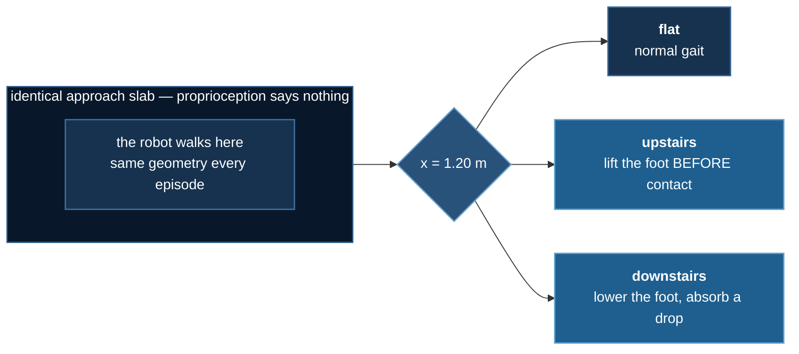

# The ablation that changed two things

:::warning This page was wrong, and the correction is the lesson
This lab originally reported that a depth camera took a robot from
**12.5% to 79%** on a staircase, and concluded that vision was necessary
because *"you cannot feel for a descent."*

An audit found the comparison varied **two** things at once. The missing
control has now been run. The camera is real but smaller than claimed,
and the thesis pointed the **wrong way**: descent is the one terrain
solved perfectly *without* a camera.

The original claim, the error, and the corrected numbers are all below.
Nothing has been quietly edited.
:::

## The task

A two-legged robot walks along a raised plateau. Partway along the ground
stays flat, climbs three steps, or drops three steps. The approach slab
is identical in all three, so from its own joints the robot cannot tell
which is coming.



## The mistake

The first version of this lab compared two robots:

| arm | information | **how it was trained** |
|---|---|---|
| blind | proprioception only | PPO, from scratch, 1.5M steps |
| vision | proprioception **+ depth** | **behaviour cloning from a privileged teacher** |

Those differ in **two** respects, not one. The vision arm does not merely
have a camera — it is imitating a teacher that was handed the terrain
type directly. Crediting the whole gap to the camera assumes the training
method contributed nothing, and nobody checked.

**Behaviour cloning** (BC) means: run a teacher that *was* told the
answer, record what a real robot could have seen paired with what the
teacher did, then train a network to reproduce those actions by ordinary
supervised regression. No reward, no exploration. It is the standard
teacher–student recipe from quadruped locomotion (Lee et al. 2020;
Kumar et al. 2021).

The missing cell is obvious once stated: **a student distilled from the
same teacher, by the same objective, with no camera.**

## Four arms, three seeds each


Fraction of 24 evaluation episodes clearing the terrain, mean of three
seeds.

| arm | flat | **upstairs** | downstairs |
|---|---|---|---|
| blind PPO (the original baseline) | 100% | 12.5% | 54.2% |
| **blind BC** — distilled, no camera | 100% | **45.8%** | **100%** |
| **vision BC** — distilled, with camera | 100% | **88.9%** | 100% |
| privileged PPO (oracle, undeployable) | 100% | 83.3% | 100% |

Read the `flat` and `downstairs` columns first. **Every arm scores 100%,
including the one with no camera.** Whatever the camera is worth, it is
worth nothing there.

### Decomposing the original headline


On `upstairs`, the published 12.5% → 89% was two effects stacked:

- **+33 points from distillation alone** (12.5% → 45.8%), no camera involved
- **+43 points from the camera** (45.8% → 88.9%)

The camera is the larger single contributor — but the original page
credited it with all 76, and roughly 33 of those belonged to the training
method.

:::danger Neither effect is significant at three seeds
Camera: p = 0.098. Distillation: p = 0.221. Both *look* real and neither
is established. The seed spread is large enough that three runs cannot
separate them — the same lesson
[lab 1](./obstacle-hopper#the-result-the-ablation-failed) learned the
hard way.
:::

### The claim that does survive: reliability

| arm, `upstairs` | seeds | mean | sd |
|---|---|---|---|
| blind BC | 71% · **8%** · 58% | 45.8% | **0.331** |
| vision BC | 79% · 88% · 100% | 88.9% | **0.105** |

The blind student's worst seed is **8%**. The vision student's worst is
79%. Vision is **3.2× more consistent**, and its *worst* run beats the
blind arm's *mean*.

"Vision makes climbing reliable" is better supported here than "vision
makes climbing better" — and it is the more useful claim anyway. A
locomotion policy that works on one training run in three is not a
policy.

### The thesis was backwards

The original page argued the lab existed because **you cannot feel for a
descent**. Good intuition; not what the data says.

Descending is solved at **100% by every arm, on every seed, at every
geometry tested** — including a student with no camera at all. The
camera's entire measurable value is in **ascent**, where the foot must be
lifted *before* contact rather than after it.

The intuition fails on the reward's structure rather than the physics:
falling ends the episode, so stepping down cautiously and absorbing the
drop is already near-optimal. Nothing forces anticipation.

## The ablation that proved less than it looked

The original page's strongest-sounding evidence was: blank the camera,
and performance collapses to 0% on every terrain.


That control is invalid, and the figure shows why: **the zeros condition
destroys `flat` too** — a terrain a camera-less student clears 100% of
the time. A control that breaks a task solvable *without* the input is
not measuring information.

The cause is in the encoding. Depth is normalised so `0.0` means **0.8 m**,
the near clip. An all-zeros frame does not say *"no information"*; it says
*"a wall 80 cm from your face"* — a confident reading, in a configuration
the network never saw across 43,102 training frames. It broke the model
rather than starving it.

The right control is the **pixelwise mean of the training set**:
in-distribution by construction, carrying no per-episode information.

| terrain | real depth | training mean | zeros |
|---|---|---|---|
| flat | 100% | 100% | 0% |
| upstairs | 100% | 62% | 0% |
| downstairs | 100% | 100% | 8% |

The mean-image control lands at 62–71% on upstairs, which is where the
*separately trained* blind student lands too. Two different constructions
of "no usable camera" agreeing is the consistency check that says the
control measures what it claims.

## Does it generalise?

Training drew the stair rise from **[0.06, 0.11] m**. This walks it
outside that range:


| rise (m) | 0.05 | 0.07 | 0.09 | 0.11 | 0.13 | 0.15 |
|---|---|---|---|---|---|---|
| | **out** | in | in | in | **out** | **out** |
| upstairs | 92% | 100% | 92% | 92% | **0%** | **58%** |
| downstairs | 100% | 100% | 100% | 100% | 100% | 100% |

Descending is unaffected by geometry it has never seen. Climbing holds
when extrapolating *shallower* and breaks when extrapolating *steeper* —
and does so **non-monotonically**: 0% at 0.13 m, then 58% at 0.15 m.

That reversal is not explained. At twelve episodes a cell it may be
noise, or the rise may interact with gait phase. It is reported rather
than smoothed, because an unexplained non-monotonicity is information
about how narrow the result is.

## What this lab now claims

- Teacher–student distillation closes most of the gap on terrain a blind
  policy struggles with — **including all of descent**.
- A depth camera adds a further large gain on **ascent only**, and makes
  it **far more reliable across seeds**.
- Neither effect is statistically established at n=3.
- Nothing generalises to stairs steeper than those trained on.

What it no longer claims: that vision is *necessary*, that descent
requires anticipation, or that the blanking test demonstrated anything.

This is the **seventh** design in this category where a vision ablation
came back weaker than it first appeared. The pattern is worth stating
plainly: blind proprioceptive locomotion is far more capable than
intuition suggests, and a controlled comparison is the only way to learn
what a sensor is actually worth.

## The failure mode worth taking away

The original result was not a typo or a bad run. It was **a plausible
number, produced by correct code, that nobody controlled**. It agreed
with a good intuition, it came with a figure generated from real run
artifacts, and it passed a test that looked rigorous.

Shipping the scripts guarantees the numbers match what the code
produced. It does not guarantee the *comparison* was the right one. That
gap is where this page went wrong, and it is the gap worth watching in
any ML system: not the models that are obviously broken, but the ones
that look right for a reason nobody tested.

An ablation means something only if it changes **one** thing. This one
changed two, and the direction of the error was the direction of the
hypothesis — exactly when it is hardest to notice.

## Reproducing all of it

```bash
cd 07_physical_ai/03_terrain_vision
uv sync

# the RL half — ~13 min per run on CPU, three seeds per arm
for s in 0 1 2; do
  uv run train_teacher.py                 --seed $s --name v3_priv_s$s  --quiet
  uv run train_teacher.py --no-privileged --seed $s --name v3_blind_s$s --quiet
done

uv run collect.py --episodes 120              # renders the BC dataset once

# the four student arms
for s in 0 1 2; do
  uv run train_student.py            --seed $s --tag student_s$s       --device cuda
  uv run train_student.py --no-depth --seed $s --tag student_blind_s$s --device cuda
done

uv run ablations.py                           # consolidates the arms + held-out sweep
uv run make_figures.py && uv run render.py --all
```

`--no-depth` is the control arm. The three camera conditions (real
depth / training mean / zeros) are measured by `train_student.py` itself
and land in each run's `summary.json`; `ablations.py` collects those into
`runs/results.json` and adds the held-out geometry sweep. Every figure is
read from those files, so nothing here can show a result a run did not
produce.

Re-verify the arms independently, if you want to pay for it:

```bash
uv run ablations.py --only arms      # ~1 h, re-rolls every arm from its checkpoint
uv run ablations.py --only camera    # ~20 min, re-rolls the camera conditions
```

## Hardware

All of it ran on one laptop — RTX 3080 Ti (16 GB), 20-core i9. The
teachers run on the **CPU**, where they are faster; only the students
touch the GPU, at **13.6× ± 0.9** over five repeats. That is the first
GPU win in this category, and it is still not a DeepSpeed case: 193,222
parameters have nothing for ZeRO to shard.

## References

- Schulman et al., [PPO](https://arxiv.org/abs/1707.06347), 2017 ·
  [GAE](https://arxiv.org/abs/1506.02438), 2015
- Lee et al., [Learning quadrupedal locomotion over challenging terrain](https://arxiv.org/abs/2010.11251),
  Science Robotics 2020 — the teacher–student-with-privileged-information template
- Kumar et al., [RMA: Rapid Motor Adaptation](https://arxiv.org/abs/2107.04034), 2021
- Miki et al., [Learning robust perceptive locomotion](https://arxiv.org/abs/2201.08117),
  Science Robotics 2022 — proprioception and exteroception fused
- Agarwal et al., [Legged locomotion in challenging terrains using egocentric vision](https://arxiv.org/abs/2211.07638),
  CoRL 2022
- Agarwal et al., [Deep RL at the Edge of the Statistical Precipice](https://arxiv.org/abs/2108.13264),
  NeurIPS 2021 — why three seeds and a mean are not enough
- Henderson et al., [Deep Reinforcement Learning that Matters](https://arxiv.org/abs/1709.06560), 2018
