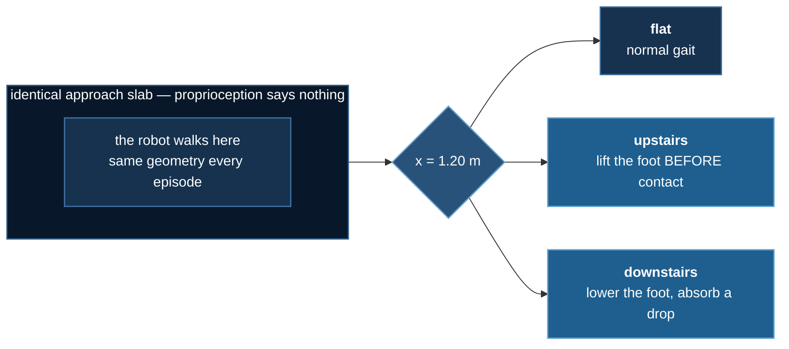
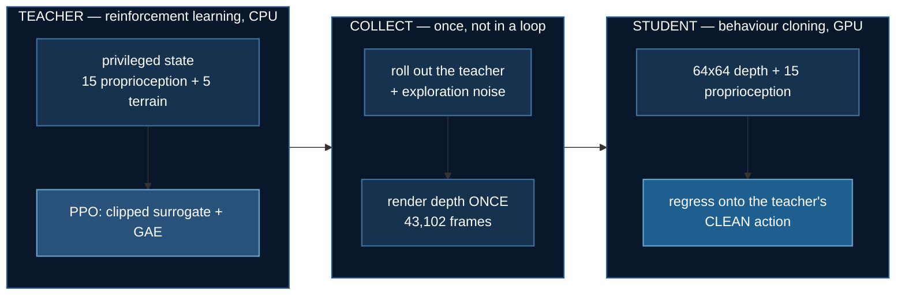

# You cannot feel for a descent

[Lab 1](./obstacle-hopper) gave a hopper the height of the obstacle in
front of it, then took it away. No difference. [Lab 2](./biped-stairs)
gave a biped the rise of each tread, then took it away. No difference.

Both nulls were real, and both reproduce a known result: blind
proprioceptive locomotion is genuinely capable, because **a leg that
touches something can feel it**. Four more designs after those came back
null too. The honest conclusion was not "vision does not help" — it was
that we had not yet built a task where vision is *necessary*.

This lab is that task, and the thing that makes it work is one
asymmetry:

> You cannot feel for a descent. By the time the swinging foot finds
> nothing underneath it, the robot is already falling.


## The design

A two-legged robot walks along a raised plateau. Partway along, the
ground does one of three things.



The approach slab is **identical in all three**, so a robot standing on
it cannot tell from its own joints what is coming. The three demand
incompatible responses. `flat` is the control that proves the other two
are not merely "harder".

## Three arms

| arm | sees | deployable? |
|---|---|---|
| **privileged** | the terrain type and geometry, handed over | no — an oracle |
| **blind** | proprioception only, 15 numbers | yes, and it is the baseline |
| **vision** | proprioception **+ a 64×64 depth image** | yes — the thing being tested |

The privileged arm is a *teacher*: it needs no rendering, so it trains
at full speed. The vision arm is a *student* trained by behaviour
cloning on the teacher's actions. The blind arm is what the student has
to beat.

### The result

Teachers: 3 seeds × 1.5M steps. Vision: one seed, 24 evaluation
episodes per terrain. Fraction of episodes clearing the terrain.

| terrain | privileged | blind | **vision** |
|---|---|---|---|
| flat | 100% | 100% | 100% |
| upstairs | 83% | **12.5%** | **79%** |
| downstairs | 100% | **54.2%** | **100%** |

The camera has **71 points to recover on ascent and 46 on descent**.
Depth recovers most of the first and all of the second, from images
alone, with nothing privileged at deployment.

## Nobody told it to learn flat first


| steps | return | flat | up | down |
|---|---|---|---|---|
| 12k | 125 | 0% | 0% | 0% |
| 197k | 801 | **100%** | 0% | 62% |
| 381k | 1211 | 100% | 50% | **100%** |
| 565k | 1426 | 100% | **100%** | 100% |

Flat, then descent, then ascent. The reward function contains no
curriculum — that ordering is what falls out of the difficulty.

## The objectives, written out

Two different losses run in this lab, and the split is the point: the
teacher is trained by reinforcement learning, the student by supervised
regression onto the teacher's output.



### What the teacher is paid

Dense and deliberately plain — forward velocity, a survival bonus, and a
small penalty on torque:

$$
r_t = \underbrace{\frac{x_t - x_{t-1}}{\Delta t}}_{\text{forward velocity}}
    + \underbrace{1.0}_{\text{alive}}
    - \underbrace{10^{-3}\lVert a_t \rVert^2}_{\text{control cost}}
$$

with $\Delta t = 0.01\,\text{s}$. Nothing in $r_t$ mentions terrain, stairs,
or which foot to lift. The entire curriculum — flat, then descent, then
ascent — emerges from this.

The survival bonus is why the episode must *terminate* on a fall rather
than merely stop paying: at $+1.0$ per step over 600 steps, standing
still is worth 600, which has to be made unavailable rather than merely
unattractive.

### Advantages: GAE

The critic's error at each step, and the exponentially-weighted sum of
those errors:

$$
\begin{aligned}
\delta_t &= r_t + \gamma\,(1 - d_t)\,V(s_{t+1}) - V(s_t) \\[4pt]
\hat{A}_t &= \delta_t + \gamma\lambda\,(1 - d_t)\,\hat{A}_{t+1}
\end{aligned}
$$

with $\gamma = 0.99$, $\lambda = 0.95$, and $d_t$ marking a terminal
transition. The $(1 - d_t)$ factor appears **twice** on purpose — once to
stop the next state's value leaking across an episode boundary, and once
to stop the advantage recursion doing the same. Dropping either produces
advantages that quietly blend two unrelated episodes, which trains to
something mediocre rather than failing.

The two limits are worth knowing, and `tests/test_obstacle_hopper.py`
pins both to $10^{-6}$: at $\lambda = 1$ this collapses to the
Monte-Carlo return, and at $\lambda = 0$ to one-step TD.

### The policy loss: PPO's clipped surrogate

With the importance ratio
$\rho_t(\theta) = \exp\!\big(\log \pi_\theta(a_t \mid s_t) - \log \pi_{\theta_{\text{old}}}(a_t \mid s_t)\big)$:

$$
\mathcal{L}^{\text{policy}}(\theta)
= -\,\mathbb{E}_t\Big[
\min\big(\rho_t \hat{A}_t,\;
\operatorname{clip}(\rho_t,\,1-\epsilon,\,1+\epsilon)\,\hat{A}_t\big)
\Big]
$$

with $\epsilon = 0.2$. The $\min$ is what makes the objective
*pessimistic*: the clip may always make the update worse, never better.
Taking $\max$ instead — an easy slip — yields a loss that still descends
while removing the trust region entirely.

### The student loss

Plain mean squared error onto the teacher's action. Given depth image
$I_t$, proprioception $p_t$, and student $f_\phi$:

$$
\mathcal{L}^{\text{BC}}(\phi)
= \frac{1}{N}\sum_{t=1}^{N}
\big\lVert f_\phi(I_t,\,p_t) - a^{\text{teacher}}_t \big\rVert^2
$$

The label $a^{\text{teacher}}_t$ is the teacher's **clean** action, while
the action actually *executed* during collection carried exploration
noise $a_t = \operatorname{clip}(a^{\text{teacher}}_t + \eta,\,-1,\,1)$,
$\eta \sim \mathcal{N}(0,\,0.15^2)$.

That mismatch is deliberate. The noise is there to put the robot into
states slightly off the ideal line, so the dataset contains *recoveries*;
the label says what the teacher would do **here**, not how it got here.
Train on noise-free trajectories and the student has never seen the
first state it drifts into.

Measured: validation MSE falls $0.1611 \rightarrow 0.0164$ over 40
epochs, a $9.8\times$ reduction and still falling.

### What the camera reports

Depth is clipped to a fixed window and rescaled to $[0, 1]$:

$$
I_t = \frac{\operatorname{clip}(z_t,\,z_{\text{near}},\,z_{\text{far}})
             - z_{\text{near}}}
            {z_{\text{far}} - z_{\text{near}}},
\qquad z_{\text{near}} = 0.8,\; z_{\text{far}} = 3.5
$$

The window is **fixed**, not per-frame. Normalising each frame to its own
$\min$/$\max$ was tried first and destroyed the signal — absolute
distance *is* the information, and per-frame scaling is precisely the
operation that discards it.

## A good score is not evidence

Both previous labs produced convincing animations of policies that
turned out not to be using the information in question. So this lab's
burden of proof is explicit, and all three checks run every time the
student trains.

### Blank the camera


Feed the trained student a black image and re-measure. If it still
scores, it was reading proprioception all along.

| terrain | camera working | camera blanked |
|---|---|---|
| flat | 100% | **0%** |
| upstairs | 79% | **0%** |
| downstairs | 100% | **0%** |

It does not degrade — it collapses.

### Probe the frozen encoder

A single linear layer on the encoder's features, predicting terrain
type: **64.0% against a 34.3% chance baseline.** Terrain is close to
linearly decodable from what the encoder learned, which is what "it has
learned to see" means operationally.

### Report per terrain, never averaged

`flat` is solvable blind. An average across three terrains would have
reported a modest overall gap instead of the 71-point one that is
actually there.

## What the camera receives


Averaged over every frame of each terrain in the training set. The three
mean images differ visibly — the cheapest possible evidence that the
task is not blind-equivalent.

The separation is not subtle: mean depth is **1.86 m looking up a
staircase against 3.03 m looking down one**. That gap is what the
encoder learns, and it is exactly what per-frame normalisation would
have destroyed — see [the camera's rescaling](#what-the-camera-reports).

## The animation, with the camera feed


Every clip carries the 64×64 depth image the policy is **actually
driving on**, from the same call that feeds the network — not a prettier
second render. Watch the staircase resolve into bands as the robot
approaches it.

```bash
uv run render.py --all
```

The honest "before" is `terrain-blind.gif`: a **fully trained** policy
that differs from the student in exactly one respect. An under-trained
policy also falls over, but that shows nothing — every policy falls over
early, camera or not. When the blind policy misses a tread, the camera
is the only available explanation.

## The terrain that argued the other way

A fourth terrain — a gap to leap — was built, trained and **excluded**.
On `hop`, the ablation reversed:

| seed | 0 | 1 | 2 |
|---|---|---|---|
| blind | 1.00 | 1.00 | 1.00 |
| privileged | 0.50 | 1.00 | 0.00 |

The arm that cannot see won, on every seed. That is not noise, it is the
task: you do not need to *see* a gap to clear one, because committing to
a maximal leap works either way. Specialists trained on `hop` alone
scored 0.75 / 0.50 / 0.25.

Including it would have meant publishing a four-terrain average in which
one terrain silently argued the opposite of the other three — which is
precisely the mistake [`11_moe`](../llms/moe-routing) shipped once, a finding
that reversed at world size 2. The terrain stays buildable, stays out of
the measured set, and the negative result is written down.

## Where the GPU finally earns its place

This is the first lab in `07_physical_ai` where a GPU wins:

```
$ uv run train_student.py --bench
  cpu       2860 +/-  145 samples/s
  cuda     38677 +/-  778 samples/s      13.6x +/- 0.9
```

Five repeats each. One timed call is a sample rather than a
measurement, and the first run taken here read 12.9x purely because it
landed at the bottom of a 12.5-14.5x range -- the ratio moves more than
either absolute does, so the absolutes are the number to quote.

Labs 1 and 2 both measured **CPU as faster** — 2.0× and 1.7× — because
their work was MuJoCo stepping rather than arithmetic. The student here
is a convolutional encoder about a hundred times larger, trained
supervised over a fixed dataset with no simulator in the loop.

DeepSpeed is still the wrong tool. **193,222 parameters have nothing for
ZeRO to shard.** "A GPU helps" and "DeepSpeed helps" are different
claims, and this is the one lab in the category where they come apart.

### Why behaviour cloning rather than on-policy RL

Rendering costs **250×**: 7,077 physics steps/s with no camera, 79
frames/s with depth. An on-policy vision run would take eight hours
instead of four minutes.

Behaviour cloning moves that cost out of the loop. The teacher acts on
privileged state at full speed, depth is rendered **once** alongside it,
and the student trains supervised on a fixed dataset — which is also the
only part of the lab with real work for a GPU.

The dataset carries **exploration noise on the executed action** while
the *label* stays the teacher's clean action. A dataset of perfect
trajectories teaches a student nothing about recovering, and the first
time it drifts it has never seen the state it is in.

## The head that nearly broke the data

The robot wears a large BD-1-style head. It is decoration — but making
it decoration took care, because the head is not a decal. It is a rigid
body carrying 19% of the robot's mass **and** the depth camera the whole
lab is about.

MuJoCo derives mass from geom volume, so scaling the head up multiplies
its mass — about 6× here — silently changing the robot that 1.5M
training steps were spent on. Instead every decorative geom is
`density="0" contype="0" conaffinity="0"` and the body carries an
explicit `<inertial>` pinned to the original's measured values.

| | before | after |
|---|---|---|
| head mass | 4.252544 kg | 4.252544 kg |
| total mass | 22.686363 kg | 22.686362 kg |
| depth pixels | — | 0 difference |

The subtler risk is the second row. The camera is mounted **inside that
body**, so decoration reaching into its field of view would put a
constant blob in every depth frame the student ever trains on — while
training still converged and the render looked better than before.

`tests/test_terrain_vision.py` proves geometrically that this cannot
happen. The decoration is rigidly attached to the lens, so if every
vertex of every head geom lies behind the camera's view plane in the
head frame, no head geom can appear in any frame, in any pose, ever — a
guarantee a render comparison cannot give, since it only samples the
poses it happens to try.

That check **failed on its first run**. A neck cylinder reached 1.64 cm
into the view half-space and rendered harmlessly only because MuJoCo's
near clipping plane happened to cut it. Accidental safety is not safety:
widen the field of view later and a grey bar appears across every
training image. The neck was removed.

## Running it

```bash
cd 07_physical_ai/03_terrain_vision
uv sync

uv run vision_env.py                                    # the terrains, untrained
uv run train_teacher.py --name v3_priv_s0               # ~13 min, CPU
uv run train_teacher.py --no-privileged --name v3_blind_s0
uv run collect.py --episodes 120                        # ~9 min, writes 23 MB
uv run train_student.py --device cuda                   # ~2 min + the three checks
uv run train_student.py --bench                         # CPU vs GPU
uv run make_figures.py && uv run render.py --all
```

No downloads: the world is an XML string and the data is generated.

The logic checks need no GPU and no OpenGL, because the camera-occlusion
check is geometric rather than a render comparison:

```bash
uv run tests/test_terrain_vision.py
```

## What this lab does not claim

- **The student is one seed.** The teachers are three per arm. A
  24-episode evaluation moves by one episode for free, so the student's
  per-terrain rates carry corresponding uncertainty.
- **Nothing here has touched hardware.** There is no sim-to-real claim.
- **`up` is not solved.** 79% is a large recovery from 12.5%, not a
  solution.
