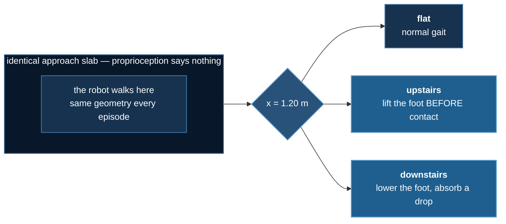

# The ablation that changed two things

:::warning This page was wrong, and the correction is the lesson
This lab originally reported that a depth camera took a robot from
**12.5% to 79%** on a staircase, and concluded that vision was necessary
because *"you cannot feel for a descent."*

An audit found the comparison varied **two** things at once. The missing
control has now been run. The camera is real but smaller than claimed,
and the thesis pointed the **wrong way**: descent is the one terrain
solved perfectly *without* a camera.

The original claim, the error, and the corrected numbers are all below.
Nothing has been quietly edited.
:::

## The task

A two-legged robot walks along a raised plateau. Partway along the ground
stays flat, climbs three steps, or drops three steps. The approach slab
is identical in all three, so from its own joints the robot cannot tell
which is coming.



## The mistake

The first version of this lab compared two robots:

| arm | information | **how it was trained** |
|---|---|---|
| blind | proprioception only | PPO, from scratch, 1.5M steps |
| vision | proprioception **+ depth** | **behaviour cloning from a privileged teacher** |

Those differ in **two** respects, not one. The vision arm does not merely
have a camera — it is imitating a teacher that was handed the terrain
type directly. Crediting the whole gap to the camera assumes the training
method contributed nothing, and nobody checked.

**Behaviour cloning** (BC) means: run a teacher that *was* told the
answer, record what a real robot could have seen paired with what the
teacher did, then train a network to reproduce those actions by ordinary
supervised regression. No reward, no exploration. It is the standard
teacher–student recipe from quadruped locomotion (Lee et al. 2020;
Kumar et al. 2021).

The missing cell is obvious once stated: **a student distilled from the
same teacher, by the same objective, with no camera.**

## Four arms, three seeds each


Fraction of 24 evaluation episodes clearing the terrain, mean of three
seeds.

| arm | flat | **upstairs** | downstairs |
|---|---|---|---|
| blind PPO (the original baseline) | 100% | 12.5% | 54.2% |
| **blind BC** — distilled, no camera | 100% | **45.8%** | **100%** |
| **vision BC** — distilled, with camera | 100% | **88.9%** | 100% |
| privileged PPO (oracle, undeployable) | 100% | 83.3% | 100% |

Read the `flat` and `downstairs` columns first. **Every arm scores 100%,
including the one with no camera.** Whatever the camera is worth, it is
worth nothing there.

### Decomposing the original headline


On `upstairs`, the published 12.5% → 89% was two effects stacked:

- **+33 points from distillation alone** (12.5% → 45.8%), no camera involved
- **+43 points from the camera** (45.8% → 88.9%)

The camera is the larger single contributor — but the original page
credited it with all 76, and roughly 33 of those belonged to the training
method.

:::danger Neither effect is significant at three seeds
Camera: p = 0.098. Distillation: p = 0.221. Both *look* real and neither
is established. The seed spread is large enough that three runs cannot
separate them — the same lesson
[lab 1](./obstacle-hopper#the-result-the-ablation-failed) learned the
hard way.
:::

### The claim that does survive: reliability

| arm, `upstairs` | seeds | mean | sd |
|---|---|---|---|
| blind BC | 71% · **8%** · 58% | 45.8% | **0.331** |
| vision BC | 79% · 88% · 100% | 88.9% | **0.105** |

The blind student's worst seed is **8%**. The vision student's worst is
79%. Vision is **3.2× more consistent**, and its *worst* run beats the
blind arm's *mean*.

"Vision makes climbing reliable" is better supported here than "vision
makes climbing better" — and it is the more useful claim anyway. A
locomotion policy that works on one training run in three is not a
policy.

### The thesis was backwards

The original page argued the lab existed because **you cannot feel for a
descent**. Good intuition; not what the data says.

Descending is solved at **100% by every arm, on every seed, at every
geometry tested** — including a student with no camera at all. The
camera's entire measurable value is in **ascent**, where the foot must be
lifted *before* contact rather than after it.

The intuition fails on the reward's structure rather than the physics:
falling ends the episode, so stepping down cautiously and absorbing the
drop is already near-optimal. Nothing forces anticipation.

## The ablation that proved less than it looked

The original page's strongest-sounding evidence was: blank the camera,
and performance collapses to 0% on every terrain.


That control is invalid, and the figure shows why: **the zeros condition
destroys `flat` too** — a terrain a camera-less student clears 100% of
the time. A control that breaks a task solvable *without* the input is
not measuring information.

The cause is in the encoding. Depth is normalised so `0.0` means **0.8 m**,
the near clip. An all-zeros frame does not say *"no information"*; it says
*"a wall 80 cm from your face"* — a confident reading, in a configuration
the network never saw across 43,102 training frames. It broke the model
rather than starving it.

The right control is the **pixelwise mean of the training set**:
in-distribution by construction, carrying no per-episode information.

| terrain | real depth | training mean | zeros |
|---|---|---|---|
| flat | 100% | 100% | 0% |
| upstairs | 100% | 62% | 0% |
| downstairs | 100% | 100% | 8% |

The mean-image control lands at 62–71% on upstairs, which is where the
*separately trained* blind student lands too. Two different constructions
of "no usable camera" agreeing is the consistency check that says the
control measures what it claims.

## Watch it

One clip per scenario, because the terrains do not behave alike and an
average over them hides the result. Every clip carries the **64×64 depth
image the policy is actually driving on**, from the same call that feeds
the network.

### The controlled comparison


Two behaviour-cloned students, same teacher, same objective. The only
difference is the camera. **This is a selected episode** — across seeds
the blind arm clears 45.8% and the vision arm 88.9%, so this is one of
the roughly half the blind student misses, chosen because it shows the
effect. It is not a typical episode and the clip says so.

### The three terrains


`flat` is the control. A student with no camera clears it 100% of the
time too.


`upstairs` is the only terrain where the camera measurably helps — the
foot has to be lifted *before* contact.


`downstairs` is where the original thesis said vision was essential.
Every arm clears it 100% of the time, camera or not.

### Where it breaks


Rise 0.13 m, outside the training range of 0.06–0.11. The measured clear
rate here is **0%**, and the failure is not a stumble — the gait simply
does not reach the first tread.

### All three, one set of weights


```bash
uv run render.py --all
```


## Does it generalise?

Training drew the stair rise from **[0.06, 0.11] m**. This walks it
outside that range:


| rise (m) | 0.05 | 0.07 | 0.09 | 0.11 | 0.13 | 0.15 |
|---|---|---|---|---|---|---|
| | **out** | in | in | in | **out** | **out** |
| upstairs | 92% | 100% | 92% | 92% | **0%** | **58%** |
| downstairs | 100% | 100% | 100% | 100% | 100% | 100% |

Descending is unaffected by geometry it has never seen. Climbing holds
when extrapolating *shallower* and breaks when extrapolating *steeper* —
and does so **non-monotonically**: 0% at 0.13 m, then 58% at 0.15 m.

That reversal is not explained. At twelve episodes a cell it may be
noise, or the rise may interact with gait phase. It is reported rather
than smoothed, because an unexplained non-monotonicity is information
about how narrow the result is.

## What this lab now claims

- Teacher–student distillation closes most of the gap on terrain a blind
  policy struggles with — **including all of descent**.
- A depth camera adds a further large gain on **ascent only**, and makes
  it **far more reliable across seeds**.
- Neither effect is statistically established at n=3.
- Nothing generalises to stairs steeper than those trained on.

What it no longer claims: that vision is *necessary*, that descent
requires anticipation, or that the blanking test demonstrated anything.

This is the **seventh** design in this category where a vision ablation
came back weaker than it first appeared. The pattern is worth stating
plainly: blind proprioceptive locomotion is far more capable than
intuition suggests, and a controlled comparison is the only way to learn
what a sensor is actually worth.

## The failure mode worth taking away

The original result was not a typo or a bad run. It was **a plausible
number, produced by correct code, that nobody controlled**. It agreed
with a good intuition, it came with a figure generated from real run
artifacts, and it passed a test that looked rigorous.

Shipping the scripts guarantees the numbers match what the code
produced. It does not guarantee the *comparison* was the right one. That
gap is where this page went wrong, and it is the gap worth watching in
any ML system: not the models that are obviously broken, but the ones
that look right for a reason nobody tested.

An ablation means something only if it changes **one** thing. This one
changed two, and the direction of the error was the direction of the
hypothesis — exactly when it is hardest to notice.

---

## Part 2: what it takes to make vision *necessary*

Part 1 found the camera worth a lot on ascent and nothing at all on
flat ground or descent. The obvious next question is not "does vision
help" but **what kind of task makes it indispensable** — and the
honest answer, after four attempts, is that this robot is harder to
blind than expected.

Everything below is shipped and runnable. None of it produced a
publishable positive result, which is the finding.

### Stepping stones

A staircase is **continuous**: the ground is always somewhere under the
foot, so a blind policy can sweep, touch and react. That is why blind
locomotion did so well in part 1, and it reproduces a known result
rather than contradicting one.

Sparse footholds should remove exactly that affordance — between the
stones there is nothing to feel, and a foot placed into a void gets no
second chance. It is the standard benchmark for exteroception being
necessary (Agarwal et al., CoRL 2022; Miki et al., Science Robotics
2022).

```bash
uv run stones_sweep.py --difficulty     # three difficulties, 3 seeds
uv run stones_sweep.py --focus          # the middle cell, 5 seeds, 1.2M steps
```

A one-seed pilot at 400k steps looked decisive:

| difficulty | privileged | blind |
|---|---|---|
| easy | 100% | 100% |
| medium | **75%** | **25%** |
| hard | 0% | 0% |

An inverted-U: information pays only in the middle band. It did not
survive contact with more seeds and longer runs.

| | privileged | blind | gap |
|---|---|---|---|
| 3 seeds, 400k steps | 75% | 42% | +33 (p = 0.094) |
| **5 seeds, 1.2M steps** | **78%** | **85%** | **−8** |

**The effect shrank every time rigour went up, which is the signature
of an effect that was never there.** The 400k runs had not converged —
five of six were still climbing when training stopped, and one was
falling — so their "final" numbers were snapshots taken at arbitrary
points on a rising curve. At 1.2M the curves flatten and the gap
disappears.

Three seeds tie exactly, one favours each arm. There is no information
advantage on stepping stones at this geometry, most likely because a
0.22 m foot can partly bridge a 0.16–0.26 m gap.


A trained policy crossing the sparse footholds. Nothing to feel between
the stones, and it clears them anyway.

### Friction patches — the hazard a depth camera cannot see

The ground stays perfectly flat. What changes is **grip**: patches of
low-friction surface, visually distinct and geometrically identical.
Dust over rock, or ice.

This is the one condition where feeling genuinely cannot substitute for
looking — on a slippery patch the proprioceptive signal *is* the slip,
which is already the failure. It also gives the experiment a negative
control it never had before: **a depth camera should be worth no more
than no camera at all**, because depth cannot see friction. If depth ≈
blind and RGB wins, that is hard to explain as "more inputs train
better".

`vision_env.py` grows an RGB sensor for this (`sensor="rgb"`, 3×64×64).

**The patch is physically real, and proving that took three attempts:**

| push on the torso | grippy | slippery | ratio |
|---|---|---|---|
| 30 N | 0.0002 m | 0.0060 m | **25×** |
| 60 N | 0.0009 m | 0.0194 m | **22×** |
| 100 N | 0.0048 m | 0.0872 m | **18×** |

:::danger MuJoCo takes the MAXIMUM of two contact frictions
The first version of this terrain was completely inert. The patches
were in the scene, correctly named in the contact list, visible in the
render — and the robot slid exactly as far on them as on normal ground.

MuJoCo combines contact friction as the **elementwise maximum** of the
two geoms, and the foot carries μ=0.9 from the default class. So
`max(0.9, 0.06) = 0.9` and the low-friction surface did nothing.
`priority="1"` on the patch geoms makes its parameters win outright.

This is [lab 1's decorative obstacle](./obstacle-hopper#the-bug-that-looked-exactly-like-success)
in a new costume, and it was caught the same way: by pushing the robot
and measuring, not by training a policy and believing the number.
:::

Two further probes were wrong before one was right — the first measured
the torso rotating about the ankle rather than the feet sliding, and the
second used a 220 N push that exceeds *both* friction limits and dragged
the robot across three surfaces at once. All three failures would have
produced a confident null.

**Settled at 2M steps, and it is the fifth null.** The oracle learns the
severe hazard completely — 0% until 0.5M, then 100% and flat for the
last 1.2M steps — so the terrain is genuinely solvable *with* the
information, which is what makes a blind failure interpretable. The
blind arm then does it too:

| eighths of training | 1 | 2 | 3 | 4 | 5 | 6 | 7 | 8 |
|---|---|---|---|---|---|---|---|---|
| privileged | 0% | 0% | 57% | **100%** | 100% | 100% | 100% | 100% |
| blind | 0% | 0% | 13% | 46% | 88% | 99% | 94% | **100%** |

Same ceiling. The only difference is **how long it takes**: privileged
reaches 100% around 0.75M steps, blind around 1.75M. Information bought
**learning speed, not capability** — a 2.3× difference on one seed,
which is a real thread and not yet an established result.


Both arms, same terrain. This is what a measured null looks like: the
policy that was told where the slippery ground is, and the one that was
not, doing the same thing. The HUD's `surface` field is read from the
live contact list rather than from x-position, so it cannot disagree
with the physics — which is exactly how the patch managed to be inert
and look correct for three attempts.

### What five attempts add up to

| design | outcome |
|---|---|
| a gap to leap (`hop`) | blind **won**, 3/3 seeds |
| stepping stones, 3 difficulties | no consistent effect once converged |
| friction patches, mild | both arms 100% |
| friction patches, severe | both arms 100%; privileged only **faster** |
| stairs (part 1) | camera helps on ascent only, p ≈ 0.1 |

**A 6-DOF biped with a locked torso and a dense forward-velocity reward
is extraordinarily hard to blind.** Every hazard built here it
eventually learned to handle by feel — including one with 18–25× less
grip that it cannot possibly see coming.

That is the finding, and it is worth stating as a conclusion rather
than as a series of failures. It is also consistent with the
literature: blind proprioceptive locomotion over continuous terrain is
genuinely strong, and the published cases where exteroception is
*necessary* involve either far more degrees of freedom or hazards that
are unrecoverable in one step.

The most likely culprit is the **reward**, not the terrain. Forward
velocity plus an alive bonus pays for robustness; falling merely ends
the episode, and nothing pays for anticipating. A reward that punishes
the slip itself, or a task where a single misstep cannot be recovered,
may well flip it — but that guess has now been wrong four times, so it
is written here as a hypothesis and not as a plan.

The one live thread is **sample efficiency**. "Information makes
learning faster rather than better" is defensible and measurable, and
it would need 3–5 seeds per arm to publish.

The recurring methodological lesson is narrower and more useful:
**never read the final number off a run whose curve is still moving.**
It invalidated two results in this section before they were published,
and both times the "finding" had the sign the hypothesis predicted.

## Reproducing all of it

```bash
cd 07_physical_ai/03_terrain_vision
uv sync

# the RL half — ~13 min per run on CPU, three seeds per arm
for s in 0 1 2; do
  uv run train_teacher.py                 --seed $s --name v3_priv_s$s  --quiet
  uv run train_teacher.py --no-privileged --seed $s --name v3_blind_s$s --quiet
done

uv run collect.py --episodes 120              # renders the BC dataset once

# the four student arms
for s in 0 1 2; do
  uv run train_student.py            --seed $s --tag student_s$s       --device cuda
  uv run train_student.py --no-depth --seed $s --tag student_blind_s$s --device cuda
done

uv run ablations.py                           # consolidates the arms + held-out sweep
uv run make_figures.py && uv run render.py --all
```

`--no-depth` is the control arm. The three camera conditions (real
depth / training mean / zeros) are measured by `train_student.py` itself
and land in each run's `summary.json`; `ablations.py` collects those into
`runs/results.json` and adds the held-out geometry sweep. Every figure is
read from those files, so nothing here can show a result a run did not
produce.

Re-verify the arms independently, if you want to pay for it:

```bash
uv run ablations.py --only arms      # ~1 h, re-rolls every arm from its checkpoint
uv run ablations.py --only camera    # ~20 min, re-rolls the camera conditions
```

## Hardware

All of it ran on one laptop — RTX 3080 Ti (16 GB), 20-core i9. The
teachers run on the **CPU**, where they are faster; only the students
touch the GPU, at **13.6× ± 0.9** over five repeats. That is the first
GPU win in this category, and it is still not a DeepSpeed case: 193,222
parameters have nothing for ZeRO to shard.

## References

- Schulman et al., [PPO](https://arxiv.org/abs/1707.06347), 2017 ·
  [GAE](https://arxiv.org/abs/1506.02438), 2015
- Lee et al., [Learning quadrupedal locomotion over challenging terrain](https://arxiv.org/abs/2010.11251),
  Science Robotics 2020 — the teacher–student-with-privileged-information template
- Kumar et al., [RMA: Rapid Motor Adaptation](https://arxiv.org/abs/2107.04034), 2021
- Miki et al., [Learning robust perceptive locomotion](https://arxiv.org/abs/2201.08117),
  Science Robotics 2022 — proprioception and exteroception fused
- Agarwal et al., [Legged locomotion in challenging terrains using egocentric vision](https://arxiv.org/abs/2211.07638),
  CoRL 2022
- Agarwal et al., [Deep RL at the Edge of the Statistical Precipice](https://arxiv.org/abs/2108.13264),
  NeurIPS 2021 — why three seeds and a mean are not enough
- Henderson et al., [Deep Reinforcement Learning that Matters](https://arxiv.org/abs/1709.06560), 2018
