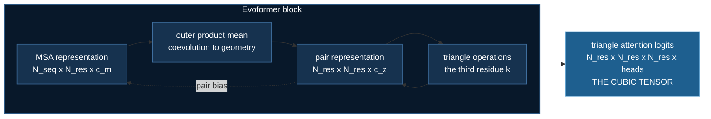

# Evoformer: the memory wall ZeRO cannot move

## The result this architecture produced


Green is the experimental crystal structure. Blue is AlphaFold2's prediction.
Left is CASP14 target **T1037** (a domain of the crAss-like phage RNA
polymerase, PDB `6vr4`) at **90.7 GDT**; right is **T1049** (an adhesin tip,
`6y4f`) at **93.3 GDT**. This is the 2020 result that ended a fifty-year
problem, and the trunk on this page is the part of the model that produced it.

:::info These are AlphaFold2's actual coordinates — and no AlphaFold was run
Both halves of this figure are public files, which is worth knowing:

- the experimental structures come from **RCSB** (`6VR4`, `6Y4F`);
- the predictions come from the **CASP14 prediction archive**, where
  AlphaFold2 competed as **group 427**. The file is literally
  `T1049TS427_1` — submitted model 1.

So the script downloads the atoms DeepMind rendered and superimposes them.
Re-running ColabFold instead would give *a* prediction, not *the* prediction:
different MSAs, no CASP-condition templates, different seeds, and a GDT near
but not equal to the published numbers.

The superposition is PyMOL's `super` (RMSD 0.84 Å for T1037, 0.51 Å for
T1049). The camera is ours — DeepMind's orientation was chosen by hand and
cannot be recovered from the published image. Everything else is theirs.
:::

```bash
uv run scripts/make_casp14_figure.py                     # for the book
uv run scripts/make_casp14_figure.py --bg light          # the published look
uv run scripts/make_casp14_figure.py --frames 48         # smoother
```

It also writes a four-view sheet per target, because a single still can't show
whether the agreement survives rotation:


The stray blue loop with no green beneath it is not an error. AlphaFold2
predicted a terminal segment the crystal never resolved — the model has an
opinion about residues the experiment could not see.

## Where the memory goes

Every other topic in this course has its memory problem in the **parameters**.
Weights, gradients, optimizer state — that is what ZeRO shards, and by now
"it does not fit, raise the stage" is a reflex.

AlphaFold2's trunk breaks the reflex. Its trunk here is about 100,000
parameters and it will still exhaust a 24 GB card, because the thing filling
the card is an **activation** that grows with the cube of the protein length.

$$
\text{pair representation} = O(N_{res}^2 \cdot c_z)
\qquad
\text{triangle attention logits} = O(N_{res}^3 \cdot n_{heads})
$$

Neither is a parameter. No ZeRO stage touches either. Every rank materialises
the cubic tensor in full, every step.

That is why DeepSpeed ships a **kernel** for this model family rather than
another sharding strategy.

## The two tensors



### What the pair representation is a picture of


A real CATH chain on the left, the contact map it produces on the right. The
orange residue walks the chain; the orange lines are every residue it touches
in 3D, and the orange dots are those same contacts in the matrix.

The point is that these are **the same object**. A contact map is not a
summary of a structure — it is very nearly the structure itself, written as a
matrix. The band along the diagonal is the chain touching its own neighbours,
which is trivially true of any chain and therefore carries no information
(which is why the labs exclude it). The off-diagonal blobs are where the fold
brings distant parts of the sequence together, and those are the entire
prediction problem.

```bash
uv run scripts/make_protein_animations.py --only contact-map
```

Printed by `uv run evoformer.py`, at AlphaFold2's real `c_z=128`, 4 heads, bf16:

| N_res | pair rep | triangle logits | ratio |
|---|---|---|---|
| 128 | 4.2 MB | 16.8 MB | 4.0× |
| 256 | 16.8 MB | 134.2 MB | 8.0× |
| 512 | 67.1 MB | 1073.7 MB | 16.0× |
| 1024 | 268.4 MB | 8589.9 MB | 32.0× |

Two of those per block, 48 blocks in AlphaFold2 proper.


Both curves on a log scale, so a straight line is a power law and the steeper
line has the larger exponent. The pair representation (pale) is quadratic; the
triangle attention logits (orange) are cubic. The right-hand panel is the
ratio between them, and it is the part worth watching — it does not settle, it
climbs. At 128 residues the logits cost 4× the pair representation; by 1024
they cost 32×.

That is what makes this a wall rather than a constant. You cannot buy your way
out with a slightly bigger card, because the term that dominates grows eight
times faster per doubling than the one you were budgeting for.

```bash
uv run scripts/make_protein_animations.py --only memory-wall
```

## The three operations

**Triangular multiplicative update** is the cheap one, and it is where the
geometric reasoning happens. To update edge $(i,j)$, look at every third
residue $k$:

$$
z_{ij} \leftarrow \sum_k a_{ik} \cdot b_{jk}
$$

A constraint on $i$–$k$ and a constraint on $j$–$k$ become a constraint on
$i$–$j$. That is a triangle, and it is why the trunk can reason about shapes
it was never shown. O(N³) time, but only **O(N²) memory** — the sum over $k$
contracts as it goes.

**Triangle attention** is the same triangle with $k$ chosen by attention
rather than summed uniformly. The logits cannot be contracted away, so this
one is O(N³) in memory too. This is the wall.

**Outer product mean** is the bridge from evolution to geometry: average the
outer product of MSA columns $i$ and $j$ over all sequences. Positions that
covary across homologs light up. This is the only place the alignment reaches
the pair representation.

## Why MSAs at all

Coevolution. Residues that touch in 3D mutate together, because a mutation at
one must be compensated at the other for the fold to survive. That covariance
is the only evidence AlphaFold has about contacts.

The synthetic data in this lab plants exactly that structure — and ships a
counterexample with none. Measured by `uv run synthetic_msa.py`, using
APC-corrected mutual information, precision at K, base rate **0.014**:

| coupling | prec@K | | depth | prec@K |
|---|---|---|---|---|
| 0.00 | **0.000** | | 1 | 0.077 |
| 0.25 | 0.385 | | 2 | 0.000 |
| 0.50 | 0.923 | | 8 | 0.462 |
| 1.00 | 1.000 | | 32 | 1.000 |


Left: the alignment filling in, one homolog at a time. Middle: APC-corrected
mutual information between every pair of columns, recomputed at each depth.
Right: the contacts that were actually planted.

Watch the middle panel. At two or three sequences it is noise — there are no
statistics to measure. As the depth grows, bright spots sharpen out of the
background and land exactly on the planted contacts. **Nothing about the
query sequence changed**; the only thing that arrived was a population to
compare it against.

```bash
uv run scripts/make_protein_animations.py --only coevolution

# bigger: 128 residues, 1024 sequences. This is the one a GPU accelerates --
# a [128, 128, 20, 20] joint distribution per frame.
uv run scripts/make_protein_animations.py --only coevolution \
    --quality high --device cuda
```

The right-hand column is the one to sit with. At *perfect* coupling, a depth-1
"alignment" is still unlearnable — coevolution is a property of a population,
not of a sequence. **That is why MSAs exist**, and it is why ESMFold dropping
them was a surprising result rather than an obvious one.

## What DeepSpeed does about it

`DS4Sci_EvoformerAttention`, from the DeepSpeed4Science × OpenFold
collaboration, tiles the attention and never materialises the cubic tensor.
Reported at **13× peak memory reduction** for OpenFold, ~15% faster training
and up to 4× faster inference.

```python
from deepspeed.ops.deepspeed4science import DS4Sci_EvoformerAttention
```

It needs CUDA ≥ 11.3, compute capability ≥ 7.0, fp16 or bf16 — there is no
fp32 path — and it JIT-compiles CUTLASS on first call.

```bash
uv run deepspeed --num_gpus=1 train_evoformer_ds.py
uv run deepspeed --num_gpus=1 train_evoformer_ds.py --ds-evoformer-attn
uv run deepspeed --num_gpus=1 train_evoformer_ds.py --deepspeed_config ds_config_z3.json
```

Make all three runs. The third is the important one: ZeRO-3 shards ~100k
parameters and does essentially nothing for peak memory. Seeing the familiar
answer fail is worth more than being told it would.

:::tip Measured on hardware
On 1 × RTX 3080 Ti Laptop (16 GB, compute 8.6), torch 2.11.0+cu128, deepspeed
0.19.7, defaults, three seeds:

| | |
|---|---|
| precision@K | **0.992** (0.992 / 0.980 / 0.999) |
| base rate | 0.013 |
| ZeRO-1 peak | **0.65 GB** |
| ZeRO-3 peak | **0.62 GB** — 4.6%, for 1.5× the communication |

The ZeRO-3 comparison nearly shipped backwards. The two configs initially
differed in more than the stage — ZeRO-1 left `reduce_bucket_size` unset, so
DeepSpeed defaulted it to 500 MB against ZeRO-3's 16 MB — and the comparison
read 1.58 GB vs 0.62 GB, appearing to prove stage 3 saves 2.5×. **If a
controlled experiment has two knobs, it is not a controlled experiment.**
:::

:::note Still unverified: the kernel itself
The **fallback** is verified — the run completes and reports
`FELL BACK (0/4 modules)` rather than claiming success. The kernel's own
memory reduction is not measured, and no number for it appears anywhere in
this course.

The blocker is `nvcc`. The card is compute 8.6 and CUTLASS is uv-installable,
but the PyPI `nvidia-cuda-nvcc-cu12` wheels ship `ptxas` and headers
**without the nvcc driver binary** (checked 12.1 → 12.9), so a root-level CUDA
toolkit install is required. The folder README gives the full recipe for
anyone who has one.
:::

## Two properties the tests assert

Both are the kind that a shape assertion passes and a wrong implementation
survives.

**Residue-permutation equivariance.** Relabel the residues and the contact map
must permute identically. A model reading residue *order* instead of residue
*content* scores well on a fixed ordering and generalises to nothing — and at
training time, order is label order. `02_intermediate/04_groupwise_ranking`
shipped exactly this bug, with a permutation error of 1.5e-01, and only the
property test caught it.

**Non-query MSA row invariance.** The order homologs arrive in carries no
information. Asserted in *both* directions: permuting rows 1.. must change
nothing, and permuting the query row must change something — otherwise a model
that ignores the MSA entirely passes the first half.

And the counterexample that makes the closure check mean something:
`TriangleMultiplicativeUpdate(broken_no_third_index=True)` replaces the sum
over $k$ with an elementwise product. It runs, it trains, it returns the right
shape, and it has no triangle in it. Measured separation: correct
`9.495e-01`, broken `0.000e+00`.

## Watching it actually learn

Every figure above draws a quantity that was computed analytically. This one
runs the real thing:


`EvoformerStack` — the same class the lab trains — doing several hundred real
forward and backward passes, with the predicted contact map captured as it
goes. Left is the prediction, middle is the truth, right is the loss.

Two details that are not decoration:

- **Only long-range pairs are shown.** The near-diagonal band is excluded from
  the loss, so the model is free to output anything there and does. An earlier
  version of this figure displayed the raw prediction, complete with a bright
  diagonal the truth does not have — which reads as "the model is wrong" when
  it actually means "this region was never asked for". Showing an unscored
  region as a prediction is a lie by omission.
- **The loss has a visible step down around 200.** That is the model going
  from predicting the base rate everywhere to actually resolving individual
  contacts.

This is the figure that demonstrates the repository is GPU-ready, because the
work on the card is the repo's own model rather than a rendering trick.

```bash
uv run scripts/make_protein_animations.py --only trunk-refinement
```

It runs without a GPU too — it drops to a smaller protein and fewer steps, and
says so on the figure, so a reduced render can never be mistaken for the full
one.

## Where this sits

Sections 04 and 05 argued that every frontier technique is a memory technique.
ZeRO shards what the model *is*; token compression shrinks what it *looks at*;
STAR memory bounds what it *retains*. Here the currency changes once more:
**the memory is the reasoning itself**, and the only way to shrink it is to
avoid writing it down.

Next: [Pairformer](./pairformer.md) deletes the MSA representation from the
trunk entirely. The interesting part is what does *not* change — the triangle
operations survive byte-for-byte, so the saving is a real 24% at 384 residues
and shrinks to 11% at 1024. A constant, not the asymptote.
