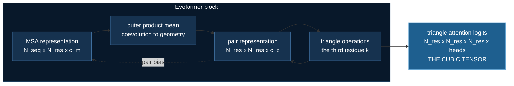

# Evoformer: the memory wall ZeRO cannot move

Every other topic in this course has its memory problem in the **parameters**.
Weights, gradients, optimizer state — that is what ZeRO shards, and by now
"it does not fit, raise the stage" is a reflex.

AlphaFold2's trunk breaks the reflex. Its trunk here is about 100,000
parameters and it will still exhaust a 24 GB card, because the thing filling
the card is an **activation** that grows with the cube of the protein length.

$$
\text{pair representation} = O(N_{res}^2 \cdot c_z)
\qquad
\text{triangle attention logits} = O(N_{res}^3 \cdot n_{heads})
$$

Neither is a parameter. No ZeRO stage touches either. Every rank materialises
the cubic tensor in full, every step.

That is why DeepSpeed ships a **kernel** for this model family rather than
another sharding strategy.

## The two tensors



Printed by `uv run evoformer.py`, at AlphaFold2's real `c_z=128`, 4 heads, bf16:

| N_res | pair rep | triangle logits | ratio |
|---|---|---|---|
| 128 | 4.2 MB | 16.8 MB | 4.0× |
| 256 | 16.8 MB | 134.2 MB | 8.0× |
| 512 | 67.1 MB | 1073.7 MB | 16.0× |
| 1024 | 268.4 MB | 8589.9 MB | 32.0× |

Two of those per block, 48 blocks in AlphaFold2 proper.

## The three operations

**Triangular multiplicative update** is the cheap one, and it is where the
geometric reasoning happens. To update edge $(i,j)$, look at every third
residue $k$:

$$
z_{ij} \leftarrow \sum_k a_{ik} \cdot b_{jk}
$$

A constraint on $i$–$k$ and a constraint on $j$–$k$ become a constraint on
$i$–$j$. That is a triangle, and it is why the trunk can reason about shapes
it was never shown. O(N³) time, but only **O(N²) memory** — the sum over $k$
contracts as it goes.

**Triangle attention** is the same triangle with $k$ chosen by attention
rather than summed uniformly. The logits cannot be contracted away, so this
one is O(N³) in memory too. This is the wall.

**Outer product mean** is the bridge from evolution to geometry: average the
outer product of MSA columns $i$ and $j$ over all sequences. Positions that
covary across homologs light up. This is the only place the alignment reaches
the pair representation.

## Why MSAs at all

Coevolution. Residues that touch in 3D mutate together, because a mutation at
one must be compensated at the other for the fold to survive. That covariance
is the only evidence AlphaFold has about contacts.

The synthetic data in this lab plants exactly that structure — and ships a
counterexample with none. Measured by `uv run synthetic_msa.py`, using
APC-corrected mutual information, precision at K, base rate **0.014**:

| coupling | prec@K | | depth | prec@K |
|---|---|---|---|---|
| 0.00 | **0.000** | | 1 | 0.077 |
| 0.25 | 0.385 | | 2 | 0.000 |
| 0.50 | 0.923 | | 8 | 0.462 |
| 1.00 | 1.000 | | 32 | 1.000 |

The right-hand column is the one to sit with. At *perfect* coupling, a depth-1
"alignment" is still unlearnable — coevolution is a property of a population,
not of a sequence. **That is why MSAs exist**, and it is why ESMFold dropping
them was a surprising result rather than an obvious one.

## What DeepSpeed does about it

`DS4Sci_EvoformerAttention`, from the DeepSpeed4Science × OpenFold
collaboration, tiles the attention and never materialises the cubic tensor.
Reported at **13× peak memory reduction** for OpenFold, ~15% faster training
and up to 4× faster inference.

```python
from deepspeed.ops.deepspeed4science import DS4Sci_EvoformerAttention
```

It needs CUDA ≥ 11.3, compute capability ≥ 7.0, fp16 or bf16 — there is no
fp32 path — and it JIT-compiles CUTLASS on first call.

```bash
uv run deepspeed --num_gpus=1 train_evoformer_ds.py
uv run deepspeed --num_gpus=1 train_evoformer_ds.py --ds-evoformer-attn
uv run deepspeed --num_gpus=1 train_evoformer_ds.py --deepspeed_config ds_config_z3.json
```

Make all three runs. The third is the important one: ZeRO-3 shards ~100k
parameters and does essentially nothing for peak memory. Seeing the familiar
answer fail is worth more than being told it would.

:::note Not yet verified on hardware
The CPU modules and the full logic suite have been run. The GPU path — peak
memory with and without the kernel, throughput, and the ZeRO-3 comparison —
has **not** been measured on the declared 24 GB card, so no numbers for it
appear here. A published figure a reader cannot reproduce costs them a day
debugging a correct setup.
:::

## Two properties the tests assert

Both are the kind that a shape assertion passes and a wrong implementation
survives.

**Residue-permutation equivariance.** Relabel the residues and the contact map
must permute identically. A model reading residue *order* instead of residue
*content* scores well on a fixed ordering and generalises to nothing — and at
training time, order is label order. `02_intermediate/04_groupwise_ranking`
shipped exactly this bug, with a permutation error of 1.5e-01, and only the
property test caught it.

**Non-query MSA row invariance.** The order homologs arrive in carries no
information. Asserted in *both* directions: permuting rows 1.. must change
nothing, and permuting the query row must change something — otherwise a model
that ignores the MSA entirely passes the first half.

And the counterexample that makes the closure check mean something:
`TriangleMultiplicativeUpdate(broken_no_third_index=True)` replaces the sum
over $k$ with an elementwise product. It runs, it trains, it returns the right
shape, and it has no triangle in it. Measured separation: correct
`9.495e-01`, broken `0.000e+00`.

## Where this sits

Sections 04 and 05 argued that every frontier technique is a memory technique.
ZeRO shards what the model *is*; token compression shrinks what it *looks at*;
STAR memory bounds what it *retains*. Here the currency changes once more:
**the memory is the reasoning itself**, and the only way to shrink it is to
avoid writing it down.

Next: [Pairformer](./pairformer.md) deletes the MSA representation from the
trunk entirely. The interesting part is what does *not* change — the triangle
operations survive byte-for-byte, so the saving is a real 24% at 384 residues
and shrinks to 11% at 1024. A constant, not the asymptote.
