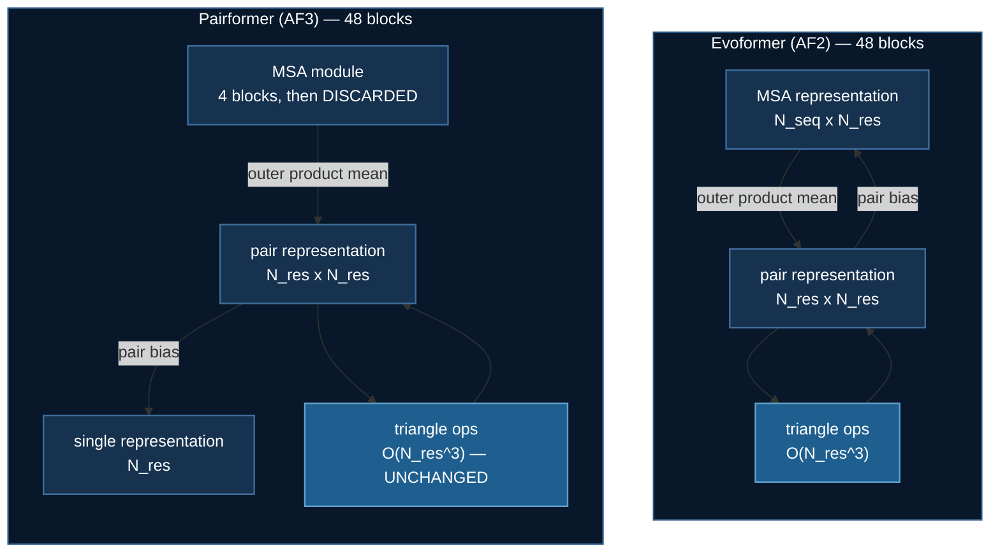

# Pairformer: what AlphaFold3 deleted, and what it did not

[Evoformer](./evoformer.md) established the problem: the AlphaFold2 trunk's
memory is in its **activations**, and the triangle attention logits are
$O(N_{res}^3)$.

AlphaFold3 replaced the Evoformer with the **Pairformer**, and the headline
change is a deletion. The MSA representation is gone from the trunk. What
survives is a single (sequence) representation and the pair representation.

So: did that fix it?

## The number

Per block, at AlphaFold's own widths — $N_{res}=384$, $N_{seq}=128$, bf16.
Printed by `uv run pairformer.py`:

| tensor | Evoformer (AF2) | Pairformer (AF3) |
|---|---|---|
| MSA representation | 6.3 MB | — |
| MSA row attention logits | 151.0 MB | — |
| single representation | — | 0.3 MB |
| pair representation | 37.7 MB | 37.7 MB |
| **triangle attention logits** | **453.0 MB** | **453.0 MB** |
| **TOTAL** | **648.0 MB** | **491.0 MB** |

A real **24.2%** saving. And note where it comes from — not the MSA
representation itself, which is 6.3 MB, but its *row attention logits*, a
$[N_{seq}, h, N_{res}, N_{res}]$ tensor worth 151 MB. AF3's replacement
operation has no query–key product at all.

Then look at the bottom row. **Identical.** The Pairformer runs the same four
triangle operations the Evoformer does.

## The lesson

| $N_{res}$ | AF2 total | AF3 total | AF3 saving | cubic share of AF3 |
|---|---|---|---|---|
| 128 | 39.8 MB | 21.1 MB | **47.1%** | 79.6% |
| 256 | 222.3 MB | 151.2 MB | 32.0% | 88.8% |
| 512 | 1417.7 MB | 1141.2 MB | 19.5% | 94.1% |
| 1024 | 9948.9 MB | 8859.2 MB | **11.0%** | 97.0% |

At 128 residues the deletion halves the trunk. At 1024 it is worth 11%,
because the term it competes with grows eight times faster per doubling.

:::tip The transferable part
**A constant-factor architectural saving loses to an asymptote, always,
eventually.** $O(N_{res}^3)$ before, $O(N_{res}^3)$ after. Deleting the MSA
representation removed a large constant; it did not touch the exponent.
:::

Which means `DS4Sci_EvoformerAttention` matters *just as much* to AF3-class
models as to AF2-class ones. The kernel's name says "Evoformer" and does not
tell you that.

## What actually changed

| | Evoformer | Pairformer |
|---|---|---|
| carries | $m[N_{seq}, N_{res}]$, $z$ | $s[N_{res}]$, $z$ |
| MSA in the trunk | yes, 48 blocks | **no** |
| MSA module | — | 4 blocks, then discarded |
| MSA row attention | gated self-attention | **removed** |
| triangle operations | out, in, start, end | *unchanged* |

**Pair-weighted averaging** (AF3 Algorithm 10) is what replaced row-wise gated
self-attention. Each MSA row is averaged along the residue axis using weights
read off the pair representation:

$$
w_{ij} = \mathrm{softmax}_j\big(\mathrm{Linear}(z_{ij})\big),
\qquad
m_{si} \leftarrow g_{si} \odot \sum_j w_{ij}\, v_{sj}
$$

The MSA never computes its own query–key product — so there is no
$[N_{seq}, N_{res}, N_{res}]$ attention map, and the 151 MB line vanishes.

## How the deletion is verified

`MSAModule.forward` returns **only** the pair representation. That return type
*is* the architecture.

But a signature can promise the MSA is gone while a block quietly rebuilds
something $N_{seq}$-shaped inside, so `tests/test_pairformer.py` registers
forward hooks on every submodule of the trunk and checks the shape of all 106
tensors it actually allocates. None carries an $N_{seq}$ axis — and the MSA
module's 12 tensors *do*, which stops the first check being satisfied by a
model that ignores the alignment entirely.

That pairing is the house pattern: assert the property **and** assert that
something which lacks it is measurably different.

## Two folders, on purpose

`02_evoformer` and `03_pairformer` are separate folders even though
CONTRIBUTING says a *family* of methods belongs in one folder behind a flag.
The exception is argued on the repository's own terms: `04_reward_model`,
`05_dpo` and `07_online_dpo` are separate because their **memory profiles
differ**, and that is precisely what differs here.

The price is that the triangle operations are written twice. A fix to one copy
and not the other would be silent, so each folder's suite re-asserts
permutation equivariance, MSA row invariance and triangle closure
independently rather than assuming the sibling covers them.

:::tip Measured on hardware — the saving is real, and it shrinks
Activation memory only, 6 trunk blocks : 1 MSA-module block, batch 1,
N_seq=64, on 1 × RTX 3080 Ti Laptop:

| $N_{res}$ | Evoformer | Pairformer | AF3 saving |
|---|---|---|---|
| 32 | 120.7 MB | 50.1 MB | **58.5%** |
| 64 | 380.9 MB | 225.4 MB | 40.8% |
| 128 | 1511.4 MB | 1145.4 MB | 24.2% |
| 192 | 3795.2 MB | 3142.5 MB | 17.2% |
| 256 | 7531.4 MB | 6589.4 MB | **12.5%** |

Monotonically decreasing, as the analytic table predicts.

**The block ratio inverts this if you get it wrong.** Measured at 1 trunk
block for both, AF3 *loses* — −1.2% at 256 residues — because the MSA module
carries its own triangle operations, so the Pairformer runs 6 triangle ops to
the Evoformer's 4 and the module is 100% overhead instead of the real models'
8%. A per-block analytic claim and a whole-model measurement disagree in sign
at a 1:1 ratio.
:::

:::note Still unverified: the kernel itself
The **fallback** is verified — the run completes and reports
`FELL BACK (0/4 modules)` rather than claiming success. The kernel's own
memory reduction is not measured, and no number for it appears anywhere in
this course.

The blocker is `nvcc`. The card is compute 8.6 and CUTLASS is uv-installable,
but the PyPI `nvidia-cuda-nvcc-cu12` wheels ship `ptxas` and headers
**without the nvcc driver binary** (checked 12.1 → 12.9), so a root-level CUDA
toolkit install is required. The folder README gives the full recipe for
anyone who has one.
:::
