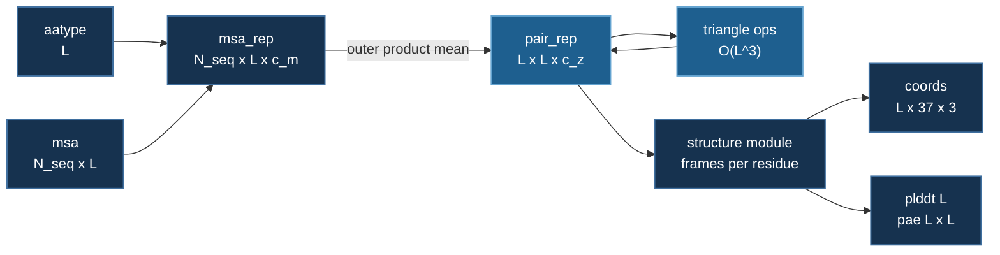

# What goes in, what comes out

Before any of the architecture pages, the contract. Everything in this section
is a variation on one signature:

```python
fold(aatype[L], msa[N_seq, L]) -> coords[L, 37, 3], plddt[L], pae[L, L]
```

A sequence and a pile of related sequences go in. Atom positions and a
confidence estimate come out. The rest is how.

## The inputs are small

Take a 100-residue protein with 256 homologs found by the alignment search:

```python
L     = 100     # residues in the protein you want to fold
N_seq = 256     # homologous sequences the MSA search turned up

aatype        = int32[L]            # the sequence: 0..19, one per residue
msa           = int32[N_seq, L]     # the alignment. row 0 IS aatype
deletion_mat  = float32[N_seq, L]   # insertions each homolog carried
residue_index = int32[L]            # 0,1,2... with gaps where a chain breaks
```

That is about **200 KB**. Templates, when used, add structural coordinates of
related proteins — `float32[N_templ, L, 37, 3]` — and are optional.

Note that `msa` is **not a sequence**. It is an unordered *set* of sequences,
and the model is deliberately invariant to the order they arrive in. That
invariance is a property the test suite asserts, not an accident.

## The internals are not small

```python
c_m, c_z, c_s = 256, 128, 384       # AlphaFold2's real widths

msa_rep  = float32[N_seq, L, c_m]   # 256 x 100 x 256   ->  26 MB
pair_rep = float32[L, L, c_z]       # 100 x 100 x 128   ->   5 MB
single   = float32[L, c_s]          # 100 x 384         ->  0.2 MB
```

`pair_rep` is the one to notice, and it is the reason this section exists.

It holds an entry for every **pair** of residues, and unlike an attention
matrix it is not discarded after use — it is carried and refined through all
48 blocks. It is the model's running hypothesis about which residues touch
which, and the coordinates at the end are essentially read out of it.

Reasoning over pairs costs `O(L²)`. Reasoning over *triples* of positions —
which is what the triangle operations do — costs `O(L³)`:

```python
tri_logits = float32[L, L, L, n_heads]   # 100^3 x 4  ->  16 MB, transiently
```

Sixteen megabytes at 100 residues. Eight and a half **gigabytes** at 1,024.

## The outputs

```python
final_atom_positions = float32[L, 37, 3]   # every atom, in Angstroms
final_atom_mask      = bool[L, 37]         # which of the 37 slots are real

# the structure module's native form, before expanding to atoms:
backbone_rotation    = float32[L, 3, 3]    # a rigid frame per residue
backbone_translation = float32[L, 3]       # which is the CA position
torsion_angles       = float32[L, 7, 2]    # side chains, as (sin, cos)

plddt = float32[L]       # per-residue confidence, 0-100
pae   = float32[L, L]    # pairwise aligned error, in Angstroms
```

The `37` is a fixed slot layout covering every atom any amino acid can have.
Glycine has no side chain and tryptophan has a large one, so the mask records
which slots are real for each residue. A compact `[L, 14, 3]` alternative
exists and is what [the structure module](./structure-module.md) uses.

## This is not a sequence-to-sequence model

A reasonable first guess, and worth correcting because the difference drives
everything else.

Sequence-to-sequence means the model *generates* an output whose length it
decides, usually one token at a time. AlphaFold does none of that:

- the output length is **fixed by the input** — `L` in, `L` out, always;
- nothing is autoregressive — every residue is updated in parallel on every
  pass, and AlphaFold3's diffusion head denoises all atoms at once;
- the output is not a sequence. It is geometry.

The nearest familiar analogy is per-token regression — like named-entity
tagging, except each position's "label" is a point in ℝ³. But even that
undersells it, because of `pair_rep`: the trunk is not sequence-to-sequence,
it is **sequence-to-pairwise**. An ordinary transformer builds `L × L`
attention matrices too, but transiently. This one keeps its pairwise state
and refines it, which is a different kind of model and a different cost
profile.

## Where each page picks up

| page | the tensor it is about |
|---|---|
| [ESM-2](./esm2.md) | `aatype[L]` alone — no MSA, no geometry. The one true sequence model here |
| [Evoformer](./evoformer.md) | `msa_rep` **and** `pair_rep`, and what `tri_logits` costs |
| [Pairformer](./pairformer.md) | the same, with `msa_rep` deleted from the trunk |
| [Structure module](./structure-module.md) | `pair_rep` → `backbone_rotation`, `backbone_translation` |



## The one thing to carry forward

Look at the two lists again. The inputs are a couple of hundred kilobytes. The
parameters of the trunk this course builds number about a hundred thousand.
Neither is what fills a GPU.

What fills it is `pair_rep` and `tri_logits` — **activations**, sized by the
length of the protein rather than the size of the model. That is an unusual
place for the cost to live, and it is why the next page's answer to "it does
not fit" is not the one you would reach for first.
