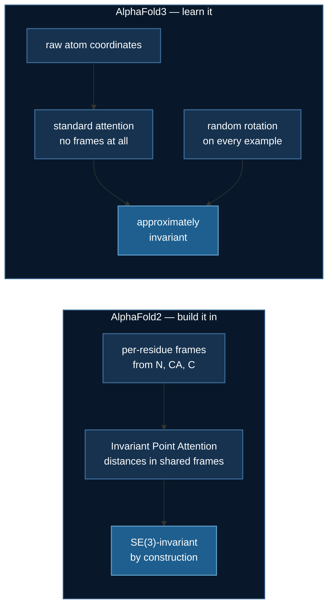

# Structure module: a symmetry you can prove, or one you learn

[Evoformer](./evoformer.md) and [Pairformer](./pairformer.md) produce a pair
representation — the model's hypothesis about which residues touch. This page
turns that into coordinates, and the interesting part is a decision AlphaFold3
made that AlphaFold2 did not.

A protein has no preferred position or orientation, so a model predicting
coordinates must satisfy

$$
\text{predict}(R\mathbf{x} + \mathbf{t}) = R\,\text{predict}(\mathbf{x}) + \mathbf{t}
$$

for every rotation $R$ and translation $\mathbf{t}$. There are two ways to get
that, and they are not equally verifiable.

## Measured

`uv run structure.py`, error relative to the molecule's own size, three seeds,
float64:

| head | equivariance error | guaranteed? |
|---|---|---|
| `ipa` | **3.6e-16** | **yes — by construction** |
| `diffusion` | 4.5e-02 | no — must be learned |
| `mlp` | 2.7e-01 | no — and not trying |

IPA's figure is float noise. **Invariant Point Attention** compares points
only after mapping them into per-residue local frames, and the distance
between two points in a shared frame cannot change when the whole molecule
moves:

$$
\text{logit}_{ij} = \frac{q_i \cdot k_j}{\sqrt{c}} + b_{ij}
- \frac{\gamma}{2}\sum_p \left\| T_i(\mathbf{q}^p_i) - T_j(\mathbf{k}^p_j) \right\|^2
$$

The third term is the guarantee. Apply a global transform and every point
moves with its frame, so every distance — and therefore the output — is
unchanged. Arithmetic, not training.

## Does the augmentation work?

AlphaFold3 removed IPA and recovers the symmetry by randomly rotating every
training example. Measured on 1 × RTX 3080 Ti, equivariance taken from the
**trained** model:

| arm | FAPE | vs do-nothing | equivariance |
|---|---|---|---|
| `--head ipa` | **1.7972** | **+18.8%** | **1.086e-15** |
| `--head diffusion` | 2.2785 | −3.0% | 5.075e-02 |
| `--head diffusion --augment` | 2.2917 | −3.6% | **7.807e-03** |
| `--head mlp` | 2.2662 | −2.4% | 3.335e-01 |

**Yes — 5.1e-02 → 7.8e-03, a 6.5× reduction.** AF3's strategy is real.

**And no — it is still thirteen orders of magnitude from IPA.** A guarantee
holds on inputs you never tested. A learned symmetry holds on inputs that
resemble the ones you did, and degrades quietly elsewhere, which a held-out
split drawn from the same distribution cannot detect.

:::caution Scope this one carefully
Only IPA beats the do-nothing baseline here, and that is partly an artefact of
the lab. This setup gives the head **no** sequence and **no** pair features —
`s` and `z` are zeros — so geometry is the only signal, and reading geometry
is exactly what IPA can do and plain attention cannot. Inside a full
AlphaFold the trunk supplies features the other heads could use. This is a
statement about this lab, not about AF2 versus AF3.
:::

## So why did AlphaFold3 give up the guarantee?

Generality, not carelessness. IPA needs a residue frame built from N, CA and
C atoms. AlphaFold3 predicts ligands, ions, nucleic acids and modified
residues — most of which have no backbone and therefore no frame to build.
Dropping the architectural guarantee is what let the model treat everything
as atoms.

**A symmetry you can prove, against a model that can represent more things.**
Neither choice is obviously right, which is why both shipped.

## The loss has to be invariant too

Frame-Aligned Point Error compares predicted and true coordinates *inside each
residue's own frame*, so a globally rotated but otherwise perfect prediction
costs nothing. A plain RMSD would punish it, and the model would burn capacity
learning an arbitrary orientation.

That distinction is sharper than it looks. Transforming prediction **and**
truth together leaves a raw RMSD unchanged too — both move the same way. The
property that separates them is transforming the **prediction alone**: FAPE
ignores it, RMSD does not. The first version of this course's test got that
wrong and passed on a sabotage that replaced FAPE with RMSD.

## Three attempts at the data

`--data synthetic` builds backbones from helices and strands. It took three
tries, and the failures teach more than the success:

| generator | improvement over do-nothing |
|---|---|
| random walk, 3.8 Å steps | **+1.0%** |
| helix/strand, N and C at fixed global offsets | **−0.7%** |
| helix/strand, N and C in each residue's local frame | **+18.8%** |
| *real CATH backbones* | *+33.1%* |

A random walk has nothing to denoise *toward* — the true positions are
themselves random, so +1.0% is near the information-theoretic ceiling, not a
weak model. And structure in the CA trace was not enough: with N and C at
constant global offsets every frame pointed the same way, carrying no local
information, and the model did worse than nothing.
